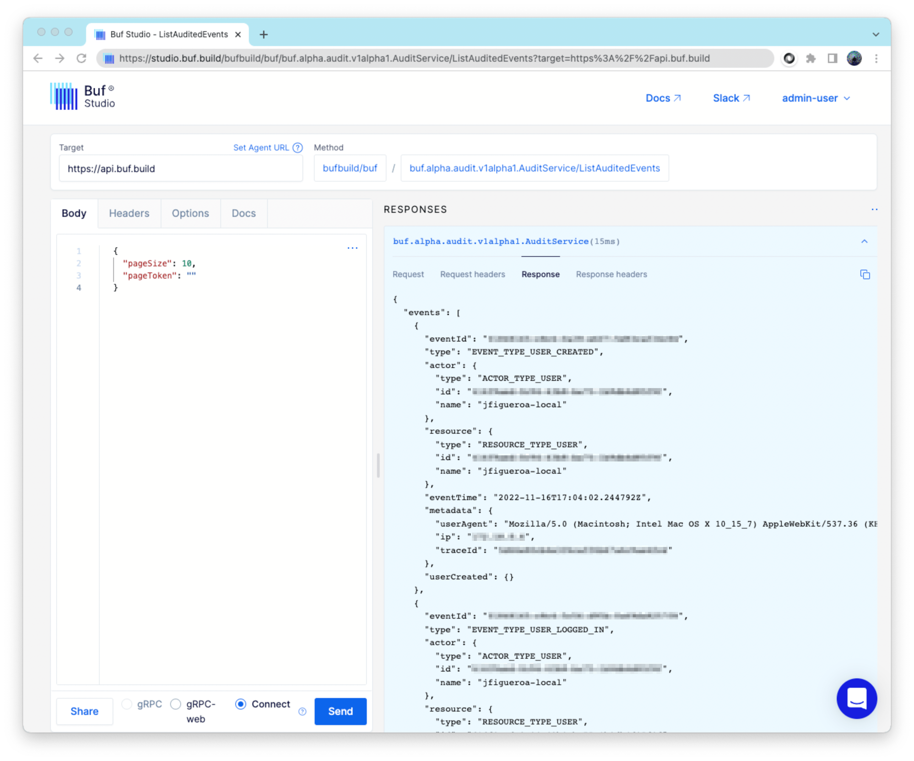

---

head:
  - - link
    - rel: "canonical"
      href: "https://bufbuild.ru/docs/bsr/admin/instance/audit-logs/"
  - - link
    - rel: "prev"
      href: "https://bufbuild.ru/docs/bsr/admin/instance/managed-modules/"
  - - link
    - rel: "next"
      href: "https://bufbuild.ru/docs/bsr/admin/instance/webhooks/"
  - - meta
    - property: "og:title"
      content: "Audit logs - Buf Docs"
  - - meta
    - property: "og:image"
      content: "https://buf.build/docs/assets/images/social/bsr/admin/instance/audit-logs.png"
  - - meta
    - property: "og:url"
      content: "https://bufbuild.ru/docs/bsr/admin/instance/audit-logs/"
  - - meta
    - property: "og:type"
      content: "website"
  - - meta
    - property: "og:image:type"
      content: "image/png"
  - - meta
    - property: "og:image:width"
      content: "1200"
  - - meta
    - property: "og:image:height"
      content: "630"
  - - meta
    - property: "twitter:title"
      content: "Audit logs - Buf Docs"
  - - meta
    - property: "twitter:image"
      content: "https://buf.build/docs/assets/images/social/bsr/admin/instance/audit-logs.png"
  - - meta
    - name: "twitter:card"
      content: "summary_large_image"

---

# Audit logs

::: warning
This feature is only available on the Pro and Enterprise plans.
:::

Your private BSR instance records certain events and actions and allows administrators to query them. This allows administrators to satisfy security, traceability, accountability, policy, and compliance needs, among others.

## Audit events

Each audited event answers the question of _what_ happened, _when_ it happened, _who_ did the action, _which_ resource was affected, and sometimes includes an additional payload and metadata. An audited event looks like this:

```protobuf
message Event {
  // Unique id of the audited event.
  string event_id = 1;
  // Type of the audited event. It specifies "what" happened.
  EventType type = 2;
  // Actor of the audited event. It specifies "who" did it.
  Actor actor = 3;
  // Resource of the audited event. It specifies "which resource" was affected.
  Resource resource = 4;
  // Time of the audited event. It specifies "when" it happened.
  google.protobuf.Timestamp event_time = 5;
  // Metadata about the audited event. It specifies additional details about the audited event.
  EventMetadata metadata = 6;
  oneof payload {
    // ... specific payload details depending on the event type.
  }
}
```

::: tip Note
See the [audit API docs](https://buf.build/bufbuild/buf/docs/e32e91a7a3a14c9db9f7f25989f6d1c8:buf.alpha.audit.v1alpha1#buf.alpha.audit.v1alpha1.Event) for details about the supported payloads.
:::

For both Actors and Resources, each one holds its `Type`, `ID` and `Name`, making the payload of the event sometimes unnecessary.Actor types are either `User` events or `System` events. If the actor is a User, which is true in most scenarios, the metadata include its `User Agent`, `IP` and internal `Trace ID` for further investigation and debugging.`Resource` types can be one of `User`, `Organization`, `Organization Member`, `Repository`, `Repository Contributor`, `Repository Commit`, or `Plugin`.Currently, the BSR audits most events that result in mutations to the data it manages. That includes changes to resources like Users, Organizations, and Repository permissions to name a few. The complete list of audited events, associated payloads, and their respective type specifications can be found in the [BSR's schema documentation](https://buf.build/bufbuild/buf/docs/e32e91a7a3a14c9db9f7f25989f6d1c8:buf.alpha.audit.v1alpha1#buf.alpha.audit.v1alpha1.EventType). Treat it as a living document, since it grows to keep pace with new BSR features as they're released.For more in-depth descriptions of each event type, see the [event details section](#audit-event-details).

## Querying audit events

An [administrator](../user-lifecycle/#admin-users) can access the BSR's audit logs by using the [`ListAuditedEvents` RPC](https://buf.build/bufbuild/buf/docs/e32e91a7a3a14c9db9f7f25989f6d1c8:buf.alpha.audit.v1alpha1#buf.alpha.audit.v1alpha1.AuditService.ListAuditedEvents). This endpoint currently supports filtering events by time period and result pagination.

## Audit event details

### User events

These events have a `User` as an affected resource.

<div class="joplin-table-wrapper"><table><tbody><tr><th>Event</th><th>Details</th></tr><tr><td>User Created</td><td>User creates an account in the BSR server.</td></tr><tr><td>User Deactivated</td><td>BSR admin accounts are able to deactivate Users’ accounts. In that scenario, an <code>UserDeactivated</code> event is logged.</td></tr><tr><td>User Deleted</td><td>Depending on the BSR instance configuration, Users might be able to self-delete their accounts. BSR administrators can also force-delete BSR users. In both scenarios, the user deletion event is logged.</td></tr><tr><td>User Logged In</td><td>BSR logs a <code>UserLoggedIn</code> event in three scenarios:<ol><li>User authenticated/logged in via SAML (their account is auto provisioned in the system).</li><li>User logged in via SSO (OAuth/OIDC) and already had a registered account.</li><li>User logged in via SSO (OAuth/OIDC) and then registers an account (we only log the event if the user follows through with the account registration).</li></ol></td></tr><tr><td>User Logged Out</td><td>User manually logs out of the server.</td></tr></tbody></table></div>

### Organization events

These events have either an `Organization` or an `Organization Member` as an affected resource. BSR Organizations can have multiple members, with different access roles.

| Event                            | Resource            | Details                                                                                                                        |
| -------------------------------- | ------------------- | ------------------------------------------------------------------------------------------------------------------------------ |
| Organization Created             | Organization        | An Organization was created in the BSR.                                                                                        |
| Organization Deleted             | Organization        | An Organization was deleted from the BSR.                                                                                      |
| Organization Member Added        | Organization Member | A User was added to an Organization with a certain role. The Organization details and new role are logged.                     |
| Organization Member Removed      | Organization Member | A User was removed from an Organization. The Organization details and old role are logged.                                     |
| Organization Member Role Changed | Organization Member | A User that's already an Organization Member was set a different role. The Organization details, old and new roles are logged. |

### Repository events

These events have either a `Repository`, `Repository Contributor`, or `Repository Commit` as the affected resource. BSR repositories can have multiple contributors, with different access roles. BSR repositories have public or private visibility.

| Event                               | Resource               | Details                                                                                                                                                  |
| ----------------------------------- | ---------------------- | -------------------------------------------------------------------------------------------------------------------------------------------------------- |
| Repository Created                  | Repository             | A Repository was created in the BSR. The Owner details and visibility are logged.                                                                        |
| Repository Deleted                  | Repository             | A Repository was deleted from the BSR. The Owner details and visibility are logged.                                                                      |
| Repository Visibility Changed       | Repository             | A Repository changed its visibility in the BSR. The Owner details, old visibility and new visibility are logged.                                         |
| Repository Commit Pushed            | Repository Commit      | A Repository Commit was pushed to the BSR. The Owner and Repository details, along with the label name (if any) are logged.                              |
| Repository Contributor Added        | Repository Contributor | A User was added to a Repository with a certain role. The Owner and Repository details, and Contributor new role are logged.                             |
| Repository Contributor Removed      | Repository Contributor | A User was removed from a Repository. The Owner and Repository details, and Contributor old role are logged.                                             |
| Repository Contributor Role Changed | Repository Contributor | A User that's already a Repository Contributor was set a different role. The Owner and Repository details, and Contributor old and new roles are logged. |

### Plugin events

These events have a `Plugin` as the affected resource.

| Event          | Details                            |
| -------------- | ---------------------------------- |
| Plugin Created | A Plugin was created in the BSR.   |
| Plugin Deleted | A Plugin was deleted from the BSR. |
