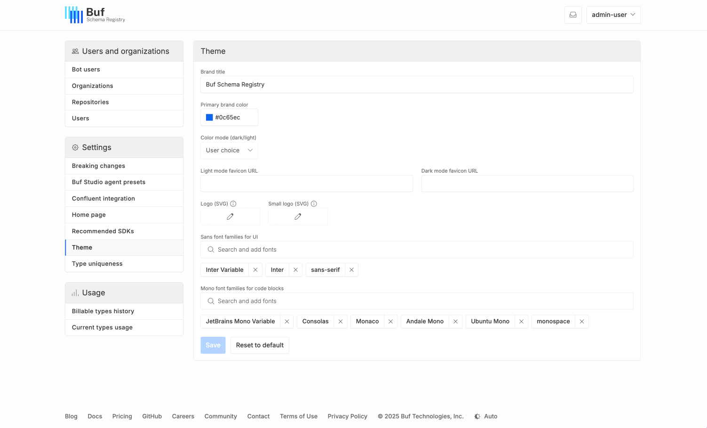
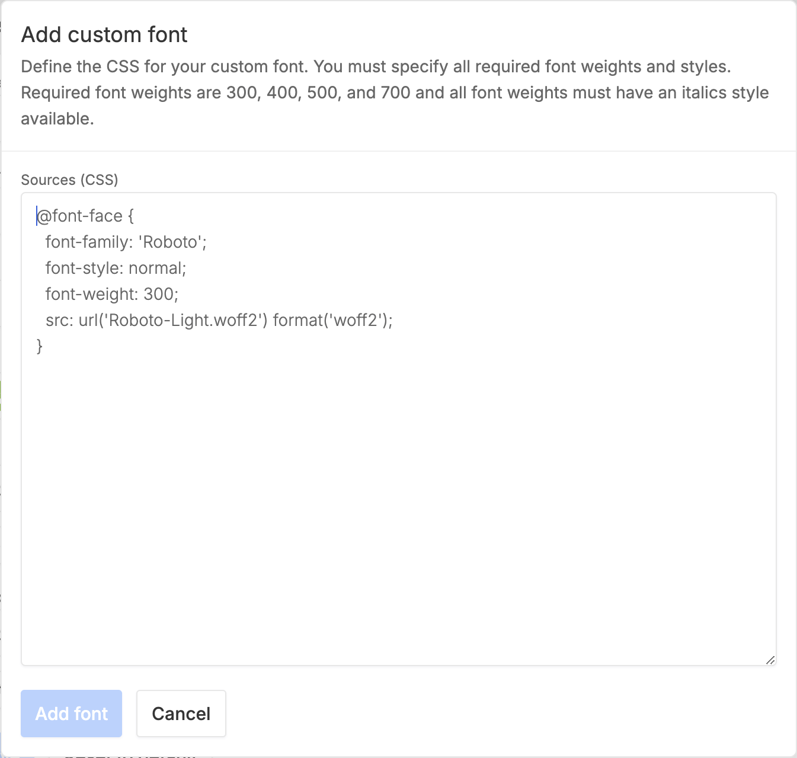

---

head:
  - - link
    - rel: "canonical"
      href: "https://bufbuild.ru/docs/bsr/admin/instance/customize-appearance/"
  - - link
    - rel: "prev"
      href: "https://bufbuild.ru/docs/bsr/admin/instance/bot-users/"
  - - link
    - rel: "next"
      href: "https://bufbuild.ru/docs/bsr/admin/instance/customize-homepage/"
  - - meta
    - property: "og:title"
      content: "Customize appearance - Buf Docs"
  - - meta
    - property: "og:image"
      content: "https://buf.build/docs/assets/images/social/bsr/admin/instance/customize-appearance.png"
  - - meta
    - property: "og:url"
      content: "https://bufbuild.ru/docs/bsr/admin/instance/customize-appearance/"
  - - meta
    - property: "og:type"
      content: "website"
  - - meta
    - property: "og:image:type"
      content: "image/png"
  - - meta
    - property: "og:image:width"
      content: "1200"
  - - meta
    - property: "og:image:height"
      content: "630"
  - - meta
    - property: "twitter:title"
      content: "Customize appearance - Buf Docs"
  - - meta
    - property: "twitter:image"
      content: "https://buf.build/docs/assets/images/social/bsr/admin/instance/customize-appearance.png"
  - - meta
    - name: "twitter:card"
      content: "summary_large_image"

---

# Customize BSR appearance

::: warning
This feature is only available on the Pro and Enterprise plans.
:::

You can customize several aspects of your private instance's appearance to match other internal tools or your branding:

- **Brand color:** Apply your brand colors to links, buttons, toggles, highlighting, and other UI elements. The BSR also derives lighter and darker colors for UI elements, so we recommend staying away from extremes to maintain accessibility.
- **Default color mode:** Allow users to select their preferred color profile (light, dark, auto), or force light or dark mode across the entire instance.
- **Custom logo and favicons:** Replace Buf's logo with your company's logo in the header and favicons.
- **Font families:** Override or extend the default fonts for UI text and code blocks.

To customize your BSR's appearance, go to **Admin panel > Theme**:

## Changing fonts

For both font options, the panel displays the currently chosen fonts in order from left to right, following the behavior of the `font-family` CSS property.

- To remove a font from the list, click on the **X** next to its name.
- To add a font, click into the search bar. You can either add a font from the list or manually define a custom font:

  
