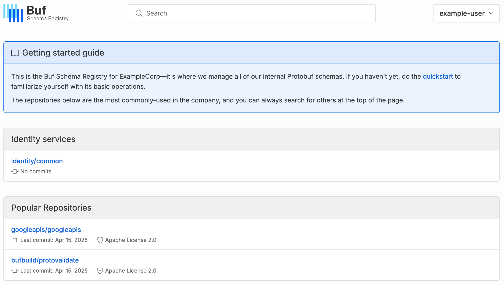

# Customize the BSR homepage

This feature is only available on the Pro and Enterprise plans.

By default, a private instance Buf Schema Registry (BSR) homepage displays the same content as the [public BSR](https://buf.build). As a BSR instance admin, you can customize this page to make it more specific to your overall organization's needs:

- **Hide the user's information sidebar:** The sidebar makes it convenient for users to navigate to organizations and repositories they are part of, but on instances where only admins are creating orgs/repos, the sidebar can be hidden to make room for other content (like the "Getting started" guide and/or custom groups of organizations and repositories) mentioned below.
- **Add a "Getting started" guide to the top of the page:** Help orient your users to the aspects of the BSR you want them to focus on with custom Markdown-styled content.
- **Choose whether to display popular repositories:** The BSR recommends a short list of commonly-referenced repositories, but you can hide it if desired.
- **Create custom groups of orgs and repos:** Point users of your instance toward the repositories and/or organizations that are most important.

To customize your BSR instance's homepage, go to **Admin panel > Home page** and add or edit sections as needed:Once you're done, go to the homepage or your instance to confirm it's what you want. This example adds a "Getting started" guide, turns off the user sidebar, adds a custom group, and moves it above the **Popular Repositories** group:
