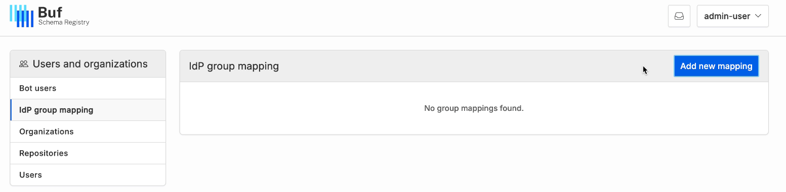
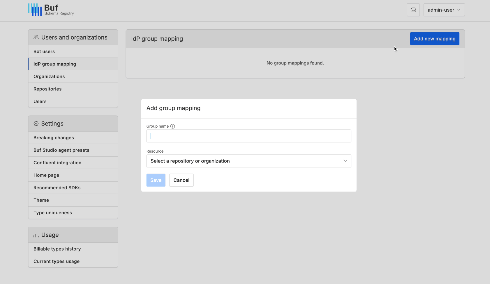
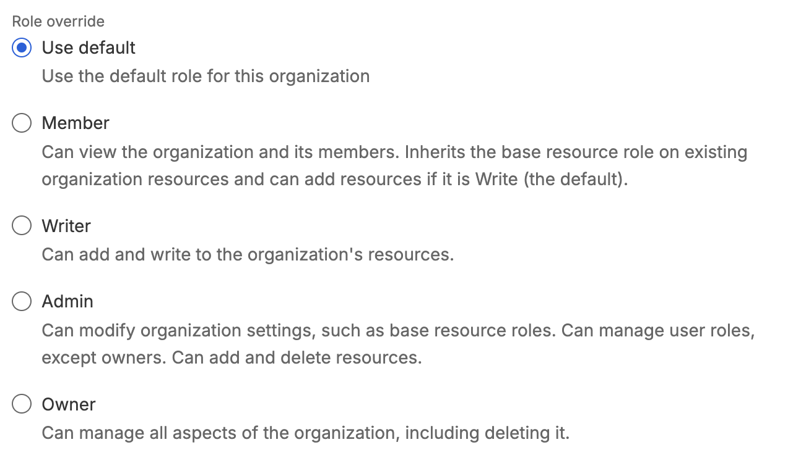
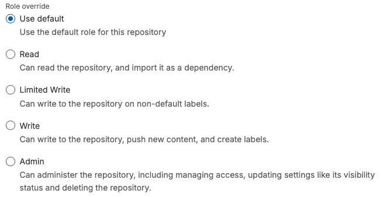
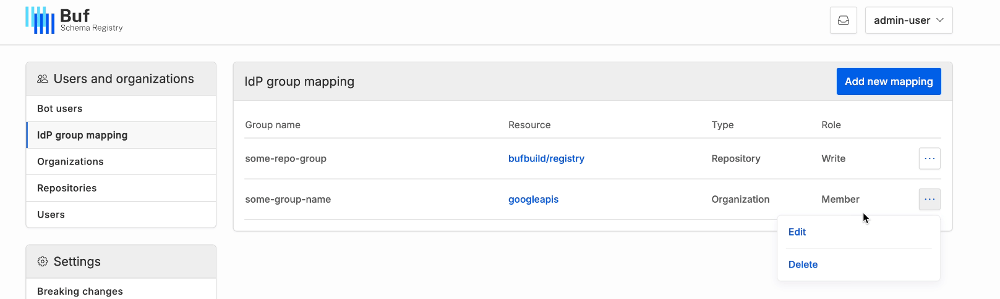
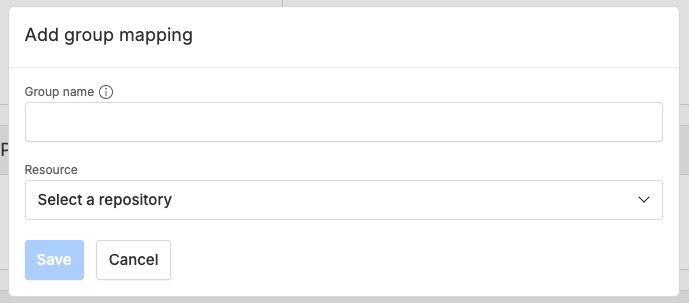
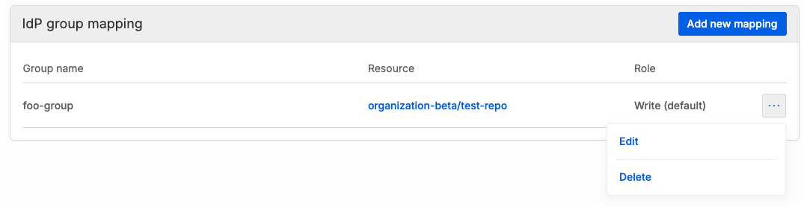

# Manage user access with IdP groups

::: warning
This feature is only available on the Pro and Enterprise plans.
:::

IdP group mapping allows you to manage membership in BSR organizations and repositories via security groups in your IdP, so it works seamlessly with your existing access controls:

- Users are granted access based on IdP group membership, with a default [role](../../roles/) that you can choose.
- The BSR automatically enrolls and un-enrolls users as members as your IdP groups change, and resolves differences between groups and manually-assigned access levels.

## Prerequisites

- Your BSR instance uses SSO for user provisioning.
- You can provide an OIDC claim or a SAML assertion that contains the user’s groups — Buf will need to configure your instance before you can map groups. Contact your Buf representative or [Support](../support/) for setup.
  - For OIDC, if your IdP broadcasts a `UserInfo` endpoint, you can configure the BSR to pull it from there. Otherwise, it must be part of the ID token.
  - SCIM isn't required for this feature, but if it's enabled and you're using it to push groups to the BSR, your IdP must be configured to provide the OIDC claim/SAML assertion.
- If you filter which groups the BSR is aware of, only map to those groups. Mapping to a group the BSR can't see has no effect.

::: warning Warning
Once this is configured, all user tokens from the IdP must contain group information. If you're using SAML, any user for whom groups information isn't provided will be unable to login to the BSR. If you're using OIDC, their groups will be treated as empty and they will lose access to the mapped organizations and repositories.
:::

## BSR administrators

BSR admins can map IdP groups to both organizations and repositories through the BSR Admin panel.

### Map an IdP group to a resource

To map a group to a resource:

1.  Log into the BSR as an admin and navigate to the Admin panel via the dropdown under your username in the top right corner.
2.  Select **IdP group mapping** in the left side menu.

    

3.  Click on the **Add new mapping** button, enter the name of a group from your identity provider, then select a resource to associate with the group.

    

4.  You can optionally choose to override the default [role](../../roles/#organization-roles). You can edit this selection after the mapping has been created.

    OrganizationsRepositories

    {tab}

    

    {tab}

    

5.  Click **Save**.
6.  Ask your employees to logout/login for changes to take effect.

### Unmap an IdP group from a resource

1.  Log into the BSR as an admin and navigate to the Admin panel via the dropdown under your username in the top right corner.
2.  Select **IdP group mapping** in the left side menu.
3.  Click the three dots next to the mapping, and select **Delete**.

    

Members don't need to logout or login when a group is removed — they're removed from the organization or repository immediately.

## Organization administrators

Organization admins can map IdP groups to repositories that are owned by the organization through the organization's **Settings** page.

### Map an IdP group to a repository

To map a group to a repository:

1.  Go to the owning organization's **Settings** page at `https://buf.build/ORGANIZATION/settings/general`.
2.  Click on the **Add new mapping** button under the **IdP group mapping** section, enter the name of a group from your identity provider, then select a repository to associate with the group.

    

3.  You can optionally choose to override the default resource role. You can edit this selection after the mapping has been created.

    

4.  Click **Save**.
5.  Ask your employees to logout/login for changes to take effect.

### Unmap an IdP group from a repository

1.  Go to the owning organization's **Settings** page at `https://buf.build/ORGANIZATION/settings/general`.
2.  Click the three dots next to the mapping, and select **Delete**.

    

Members don't need to logout or login when a group is removed — they're removed from the repository immediately.

## Resolution of different access levels

If a user has different access levels over an organization or repository based on group memberships and manual overrides via the BSR web app, the access level resolves at runtime to the highest available. The BSR tracks the complete set of roles that apply, so if a mapping is changed or a user's group membership changes, the BSR only removes that specific role. The user retains their roles from other groups and those given manually.
