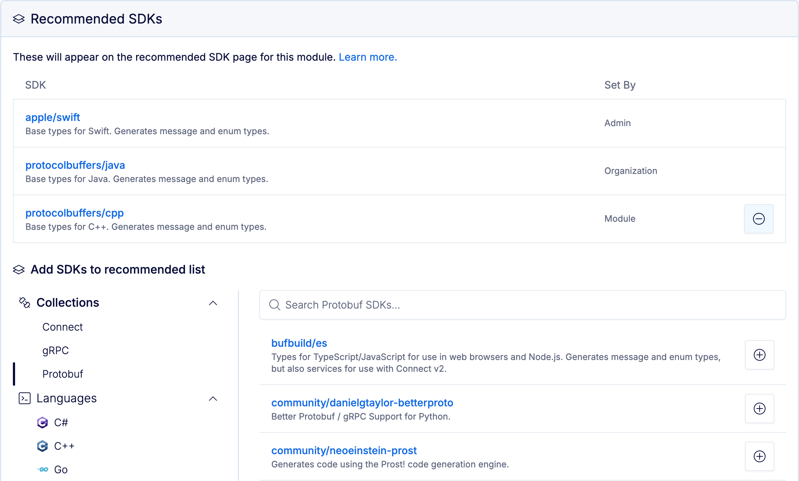

# Recommended SDKs

This feature is only available on the Pro and Enterprise plans.

The Buf Schema Registry (BSR) allows admins to recommend generated SDKs at their respective levels to help guide schema consumers toward preferred plugins. Recommended SDKs are eagerly generated, so they're always up to date with the repository's latest commit. If generation fails, the BSR displays a warning to consumers, allowing them to easily copy and share the SDK link with admins to help get the issue fixed.This guide shows admins at each level (BSR instance, organization, and repository) how to set up recommended SDKs. The admin panel is the same for each level, but is found in different areas of the BSR depending on the level:

- **BSR instance admin**Go to the **Recommended SDKs** page in your admin panel at `https://BSR_INSTANCE/admin/recommended-sdks`.
- **Organization admin**Go to the organization settings page at `https://BSR_INSTANCE/ORGANIZATION/settings/general` and scroll down to the **Recommended SDKs** section.
- **Repository admin**Go to the repository settings page at `https://BSR_INSTANCE/ORGANIZATION/REPOSITORY/settings` and scroll down to the **Recommended SDKs** section.

You can use the collections and languages filters to browse the available plugins for generating SDKs. To add an SDK, click the **+** sign at the right of its row. The panel shows which SDKs have been recommended at the current admin level and higher.To remove a generated SDK from the recommended list, click the **–** sign at the right of its row. You can only remove generated SDKs set at the admin level you're currently on.

## Recommended SDK hierarchy

Recommended SDKs exist at each admin level independently and don't interact with each other:

- When you recommend a plugin at the repository level, it's only recommended for that repository.
- If the same plugin is recommended at a higher level, it's recommended for all repositories under that level.
- If the plugin is then removed from recommended at the higher level, the repository level recommendation still exists.

## Related docs

- [Generated SDKs overview](../../../generated-sdks/overview/)
