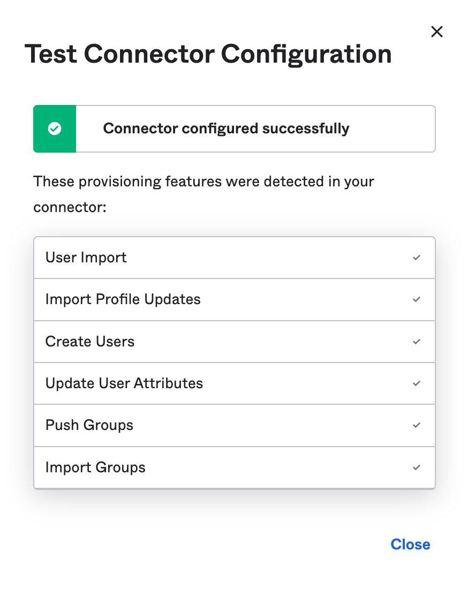
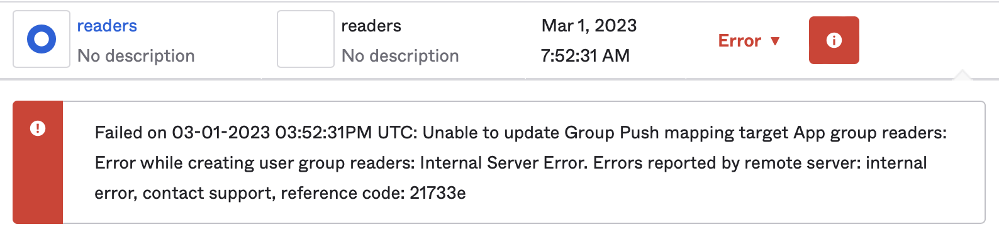

---

head:
  - - link
    - rel: "canonical"
      href: "https://bufbuild.ru/docs/bsr/admin/instance/scim/okta-saml/"
  - - link
    - rel: "prev"
      href: "https://bufbuild.ru/docs/bsr/admin/instance/scim/azure-saml/"
  - - link
    - rel: "next"
      href: "https://bufbuild.ru/docs/bsr/admin/instance/scim/faq/"
  - - meta
    - property: "og:title"
      content: "Okta - SAML - Buf Docs"
  - - meta
    - property: "og:image"
      content: "https://buf.build/docs/assets/images/social/bsr/admin/instance/scim/okta-saml.png"
  - - meta
    - property: "og:url"
      content: "https://bufbuild.ru/docs/bsr/admin/instance/scim/okta-saml/"
  - - meta
    - property: "og:type"
      content: "website"
  - - meta
    - property: "og:image:type"
      content: "image/png"
  - - meta
    - property: "og:image:width"
      content: "1200"
  - - meta
    - property: "og:image:height"
      content: "630"
  - - meta
    - property: "twitter:title"
      content: "Okta - SAML - Buf Docs"
  - - meta
    - property: "twitter:image"
      content: "https://buf.build/docs/assets/images/social/bsr/admin/instance/scim/okta-saml.png"
  - - meta
    - name: "twitter:card"
      content: "summary_large_image"

---

# Okta - SAML

::: warning
This feature is only available on the Pro and Enterprise plans.
:::

SCIM for Okta supports the following SCIM resources:

- Users (mapped directly to BSR Users)
- Groups (not directly represented in the BSR, but can be added to BSR Organizations by name to manage Organization membership)

The steps below must be carried out by users with administrative privileges in your Okta account.

## Prerequisites

- Setup ([Pro](../../setup-pro/) | [Enterprise](../../setup-enterprise/)) needs to be complete.
- You need to know your private BSR instance's domain name (for example, `example.buf.dev` or `buf.example.com`) for the steps below.

## Enable SCIM provisioning

1.  Sign in to your Okta organization.
2.  Navigate to **Applications** > **Applications** and click on your BSR application.
3.  Navigate to the **General** tab and click **Edit** in the **App Settings** pane.
4.  Check **SCIM** and click **Save**.
5.  Okta may take some time to propagate the change. When it's enabled, you should see a new **Provisioning** tab in your application.

## Configure the SCIM connector

1.  In your Okta application, navigate to the **Provisioning** tab.
2.  Under the **SCIM Connection** pane, click **Edit** and enter the following information:
    - **SCIM connector base URL**: `https://buf.example.com/scim/v2`
    - **Unique identifier field for users**: `userName`
    - **Supported provisioning actions**: Check off the following:
      - Push New Users
      - Push Profile Updates
    - If you want to push groups, also check the following:
      - Import New Users and Profile Updates
      - Push Groups
      - Import Groups
    - **Authentication Mode**: `HTTP Header`
    - **Authorization**: enter the SCIM token you created earlier
3.  Click **Test Connector Configuration**. You should see the following screen (an **X** shows for those you haven't checked — this is expected):

    

4.  Click **Save**.
5.  Click the **To App** side tab.
6.  Click **Edit** and enable the following options:
    - Create Users
    - Update User Attributes
    - Deactivate Users
7.  Click **Save**.
8.  In the **Attribute Mappings** section below, ensure the following attribute mappings are set. Unmap all other attributes.

    | Attribute    | Value                                                                                                             |
    | ------------ | ----------------------------------------------------------------------------------------------------------------- |
    | `userName`   | Configured in Sign On settings (should be mapped to Email)                                                        |
    | `givenName`  | `user.firstName`                                                                                                  |
    | `familyName` | `user.lastName`                                                                                                   |
    | `email`      | `user.email`                                                                                                      |
    | `emailType`  | `(user.email != null && user.email != "") ? 'work' : ''`  (specified only if `user.email` isn't null or empty) |

## Provision users

If you had previously assigned this Okta application to users before enabling SCIM, you need to provision those existing users to the BSR. Okta tries to match the users to existing users within the BSR, and this should succeed without error. Follow the steps below to do this.

1.  In your Okta application, navigate to the **Assignments** tab.
2.  You should see warnings for all the existing users. Click **Provision User**, click **OK** to the confirmation prompt.
3.  A toast appears indicating that the provisioning job was queued. You can navigate to **Dashboard** > **Tasks** (https://yourog.okta.com/admin/tasks) to view any background tasks that Okta is running, as well as any errors that come up.

If you encounter any errors provisioning users, see the [relevant part of the FAQ](../faq/#how-do-i-resolve-a-failed-user-provision). If you are unable to resolve those issues, contact [Support](https://support.buf.build) or your Buf representative.

## Push groups

The BSR uses any IdP-provided groups in combination with [automated organization provisioning](../../user-lifecycle/#autoprovisioning) to automatically manage users' memberships to BSR Organizations.

1.  In your Okta application, navigate to the **Push Groups** tab.
2.  Click **Refresh App Groups** to pull the latest groups from the BSR. You may have to wait a few moments for it to complete.
3.  Under **Push Groups**, chose the relevant group selection criteria. Once a group has been selected, you see one of two options:

    - If the BSR already knows about the group, Okta indicates that a match was found.
    - If the BSR doesn't know about the group, Okta allows you to either link to another group in the BSR, or create a new one. In most cases, you want to create a new group.

4.  Click **Save**.
5.  Okta now attempts a Group Push. If it encounters an error, it's shown directly next to the group (see screenshot below). If this happens, contact [Support](https://support.buf.build) or your Buf representative to resolve the error and try again.

    
