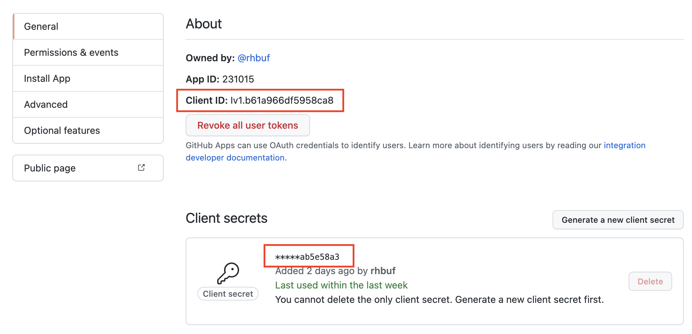
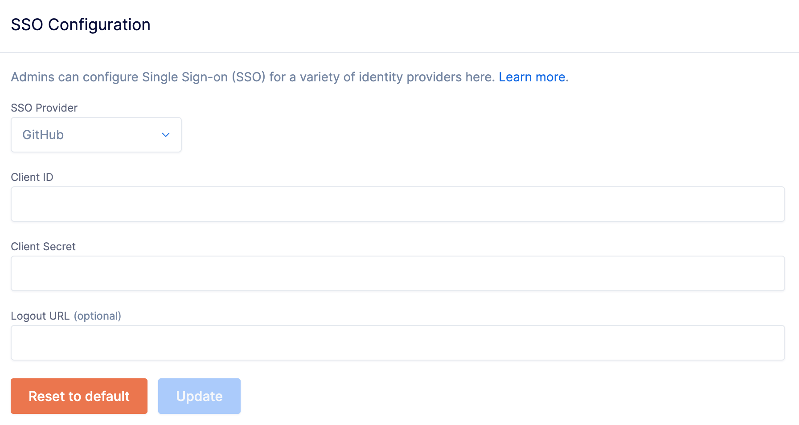

# GitHub - OAuth2

This feature is only available on the Pro and Enterprise plans.

Buf's SSO integration supports the following SAML features:

- Identity Provider (IdP)-initiated SSO
- Service Provider (SP)-initiated SSO
- Just-in-Time (JIT) user provisioning

The steps below must be carried out by a GitHub administrator for your organization. These instructions can be followed alongside the [Creating a GitHub App guide](https://docs.github.com/en/developers/apps/building-github-apps/creating-a-github-app).

## Prerequisites

- Setup ([Pro](../../setup-pro/) | [Enterprise](../../setup-enterprise/)) needs to be complete.
- You need to know your private BSR instance's domain name (for example, `example.buf.dev` or `buf.example.com`) for the steps below.

## Create an SSO GitHub App

::: tip NoteThis GitHub App is only used for SSO and is separate from the Buf GitHub App used for CI/CD integration.

:::

1.  Sign in to your GitHub organization at `https://github.com/organizations/YOUR_GITHUB_ORG/settings/apps`.
2.  Click the **New GitHub App** button.

## Configure GitHub App

Only configure what's listed here.

- Set the **GitHub App name** to something like "Buf Schema Registry" or "Buf". This should be something meaningful to your users.
- Set the **Homepage URL** to `https://buf.example.com`—this varies depending on your installation.
- Ensure that **Expire user authorization tokens** is selected.
- Under **Identifying and authorizing users**, set the **Callback URL** to `https://buf.example.com/oauth2/callback`
  - Sign-in redirect URIs should be `https://buf.example.com/oauth2/callback`
  - Sign-out redirect URIs should be `https://buf.example.com/logout`
- Under **Webhook** make sure that **Active** isn't selected.
- Under **User permissions** ensure that **Email addresses** is set to **Read-only**, no other permissions are needed.
- Click **Create GitHub App** to create the app.
- Click **Generate a new Client Secret**.Copy the client ID and client secret so you can use them to update your BSR instance's SSO configuration.

## Update SSO configuration

To set up or update your BSR instance's SSO configuration:

1.  Go to the **SSO Configuration page** at `http://BSR_INSTANCE/<ORGANIZATION>/pro-settings`.
2.  From the **SSO Provider** dropdown, choose **GitHub**.
3.  Enter your client ID, client secret, and an optional logout URL.
4.  Click **Update**.

## Next steps

- View the [User lifecycle](../../user-lifecycle/) page to understand how users are provisioned.
