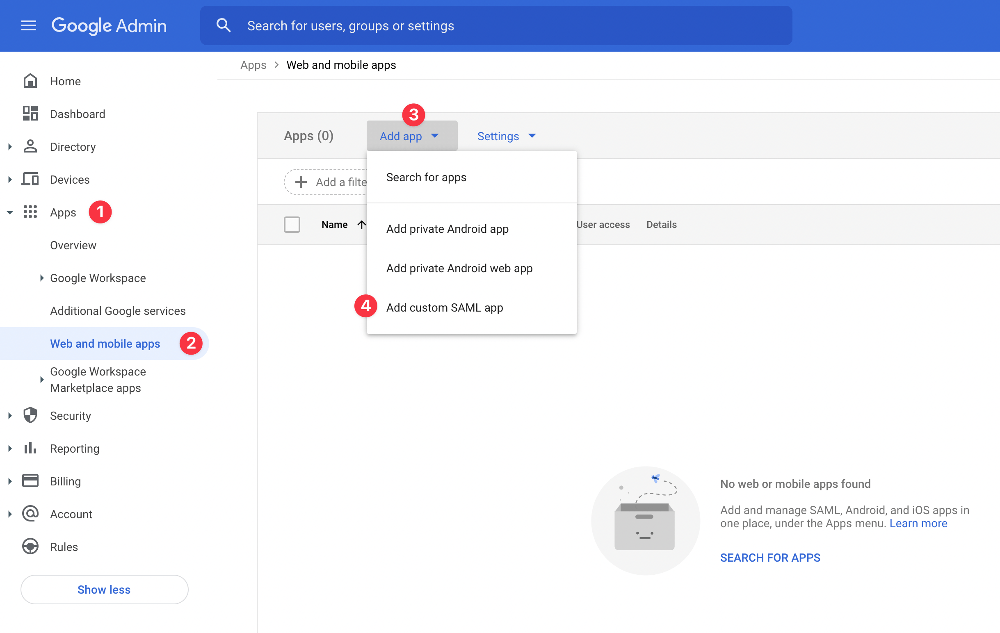
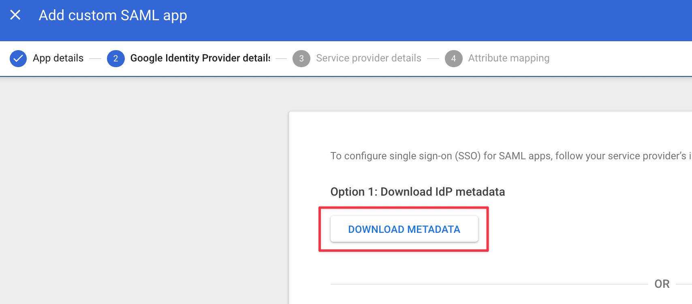
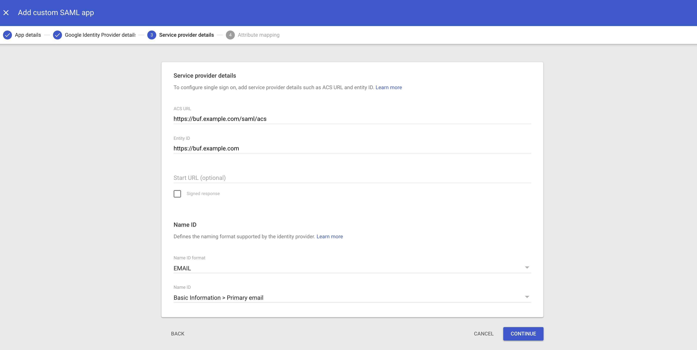
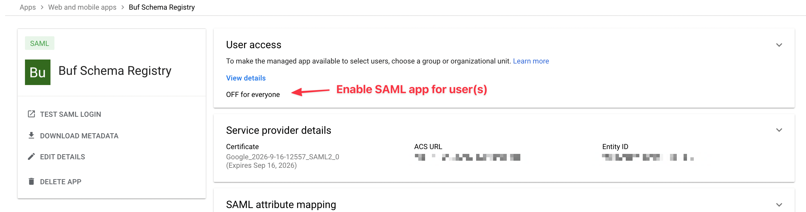
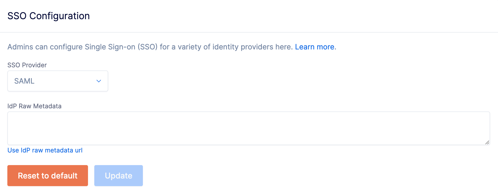

---

head:
  - - link
    - rel: "canonical"
      href: "https://bufbuild.ru/docs/bsr/admin/instance/sso/google-saml/"
  - - link
    - rel: "prev"
      href: "https://bufbuild.ru/docs/bsr/admin/instance/sso/github-oauth2/"
  - - link
    - rel: "next"
      href: "https://bufbuild.ru/docs/bsr/admin/instance/sso/okta-oidc/"
  - - meta
    - property: "og:title"
      content: "Google - SAML - Buf Docs"
  - - meta
    - property: "og:image"
      content: "https://buf.build/docs/assets/images/social/bsr/admin/instance/sso/google-saml.png"
  - - meta
    - property: "og:url"
      content: "https://bufbuild.ru/docs/bsr/admin/instance/sso/google-saml/"
  - - meta
    - property: "og:type"
      content: "website"
  - - meta
    - property: "og:image:type"
      content: "image/png"
  - - meta
    - property: "og:image:width"
      content: "1200"
  - - meta
    - property: "og:image:height"
      content: "630"
  - - meta
    - property: "twitter:title"
      content: "Google - SAML - Buf Docs"
  - - meta
    - property: "twitter:image"
      content: "https://buf.build/docs/assets/images/social/bsr/admin/instance/sso/google-saml.png"
  - - meta
    - name: "twitter:card"
      content: "summary_large_image"

---

# Google - SAML

This feature is only available on the Pro and Enterprise plans.

Buf's SSO integration supports the following SAML features:

- Identity Provider (IdP)- initiated SSO
- Service Provider (SP)- initiated SSO
- Just-in-Time (JIT) user provisioning

The steps below must be carried out by a Google Workspace administrator for your organization.

## Prerequisites

- Setup ([Pro](../../setup-pro/) | [Enterprise](../../setup-enterprise/)) needs to be complete.
- You need to know your private BSR instance's domain name (for example, `example.buf.dev` or `buf.example.com`) for the steps below.

## Add SAML app to Google Admin

1.  Sign in to the [Google Admin console](https://admin.google.com) for your organization.
2.  In the sidebar menu, click **Apps (1)** > **Web and mobile apps (2)**.
3.  Click **Add app (3)** > **Add custom SAML app (4)**.

1.  On the following screen, name the custom SAML app something like "Buf Schema Registry" or "Buf". This should be something meaningful to your users. Also add a description and icon if you prefer.
2.  Click **Continue**.

### Download Google Identity Provider details

1.  Click the **DOWNLOAD METADATA** button. This downloads a file to your computer, usually called `GoogleIDPMetadata.xml`, which you'll need later in the setup process.
2.  Click **Continue**.

### Add service provider details

1.  In the **Service provider details** screen, enter:

    - **ACS URL**: `https://buf.example.com/saml/acs`
    - **Entity ID**: `https://buf.example.com` (**Make sure to remove the trailing slash that's added by the form**)
    - **Name ID format**: `EMAIL`
    - **Name ID**: `Basic Information > Primary email`

    Buf provisions users Just-in-Time based on the email address — **make sure you've configured the Name ID correctly**.

2.  Click **Continue**.
3.  On the **Attribute mapping** screen, leave the attributes section empty and click **Finish**.

### Enable user access

Once you've finished configuring the SAML app, enable it for your users. It's OFF for everyone by default.

## Update SSO configuration

To set up or update your BSR instance's SSO configuration:

1.  Go to the **SSO Configuration page** at `http://<BSR_SERVER>/<ORGANIZATION>/pro-settings`.
2.  From the **SSO Provider** dropdown, choose **SAML**.
3.  Click the **Use IdP raw metadata instead** link.
4.  Copy and paste the contents of the IdP metadata XML file you downloaded earlier into the **IdP Raw Metadata** text box.
5.  Click **Update**.
