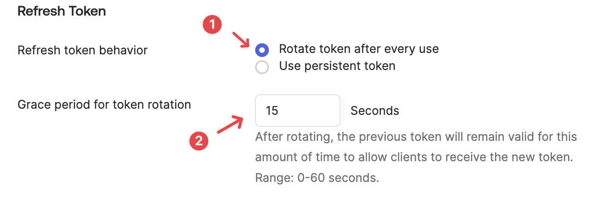

# Okta - OIDC

::: warning
This feature is only available on the Pro and Enterprise plans.
:::

Buf's SSO integration supports the following OIDC features:

- Service Provider (SP) initiated SSO
- Just-in-Time (JIT) user provisioning

The steps below must be carried out by an Okta administrator for your organization.

## Prerequisites

- Setup ([Pro](../../setup-pro/) | [Enterprise](../../setup-enterprise/)) needs to be complete.
- You need to know your private BSR instance's domain name (for example, `example.buf.dev` or `buf.example.com`) for the steps below.

## Set up application

1.  Sign in to your Okta organization.
2.  Navigate to **Applications** > **Applications** and click **Create App Integration**.
3.  For **Sign-in method**, select **OIDC - OpenID Connect**.
4.  For **Application type**, select **Web Application**.

### Configure OIDC

1.  Under **General Settings**, give the integration an App name like "Buf Schema Registry" or "Buf". This should be something meaningful to your users.
2.  Under **Grant type**, make sure to check **Refresh Token**.

    

3.  Next, provide the callback URL. This depends on the domain you provided.

    - Sign-in redirect URIs are `https://buf.example.com/oauth2/callback`
    - Sign-out redirect URIs are `https://buf.example.com/logout`

    Support for logout will be available in an upcoming release, but we suggest configuring this now so it works seamlessly when enabled. If you require [Application Single Logout](https://help.okta.com/en/prod/Content/Topics/Apps/Apps_Single_Logout.htm), contact [Support](https://support.buf.build) or your Buf representative.

    

    Note that Buf provisions users Just-in-Time based on the email address.

4.  In the **Assignments** section, select which users or groups of users should have access to this Buf instance.

## Update SSO configuration

To set up or update your BSR instance's SSO configuration:

1.  Go to the Settings page for your OIDC integration.

    

2.  In another tab, go to the **SSO Configuration page** at `http://<BSR_SERVER>/<ORGANIZATION>/pro-settings`.
3.  From the **SSO Provider** dropdown, choose **OIDC**.
4.  Copy and paste the client ID, client secret, and the issuer URL (the Okta domain from your OIDC settings) and enter an optional logout URL.
5.  Click **Update**.

    

## Configure Token Refresh

1.  Go to the Settings page for your OIDC integration and click **Edit**.
2.  Scroll down to the **Refresh Token** section.
3.  Select **Rotate token after every use** and make sure the **Grace period for token rotation** is set to 15s. The important part is to make sure this value isn't set to 0.
4.  Click **Save**.

    

## Next steps

- View the [User lifecycle](../../user-lifecycle/) page to understand how users are provisioned.
