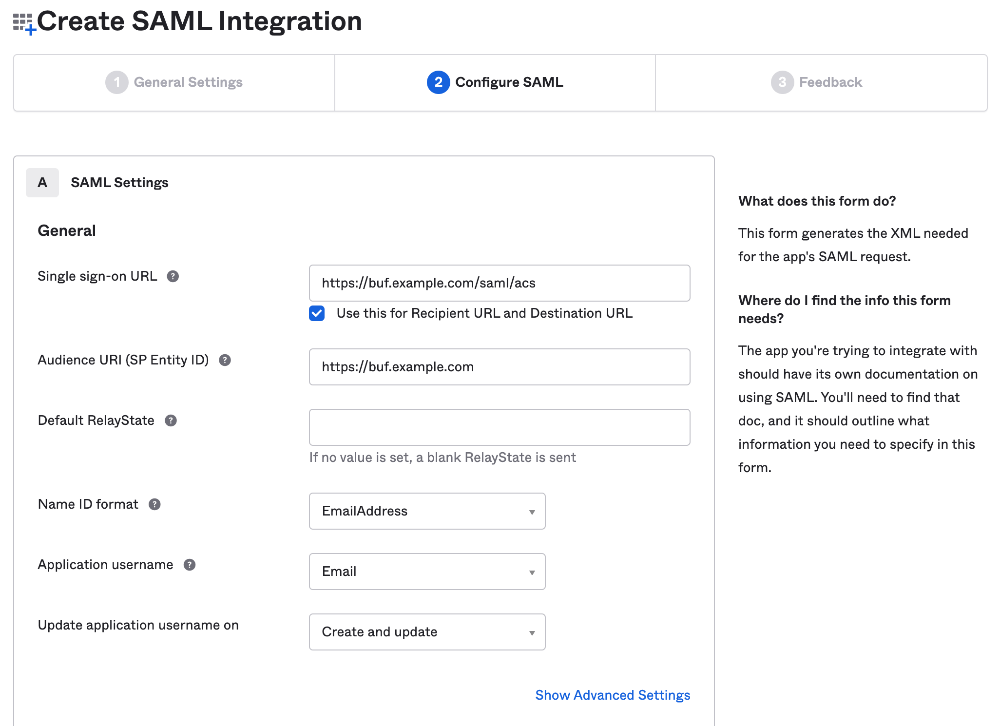
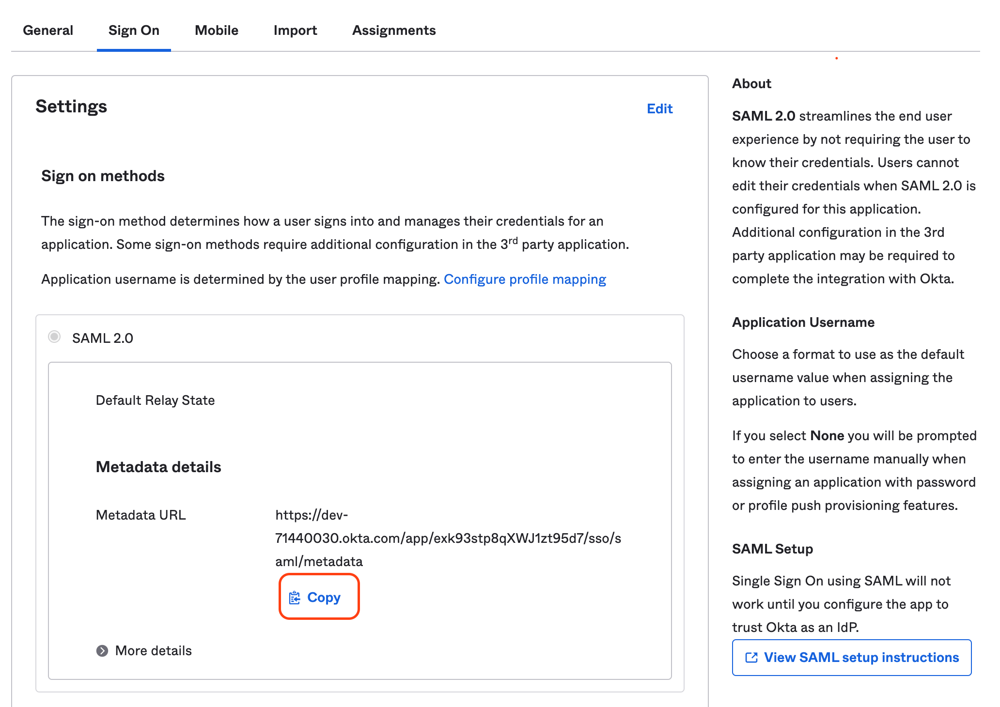
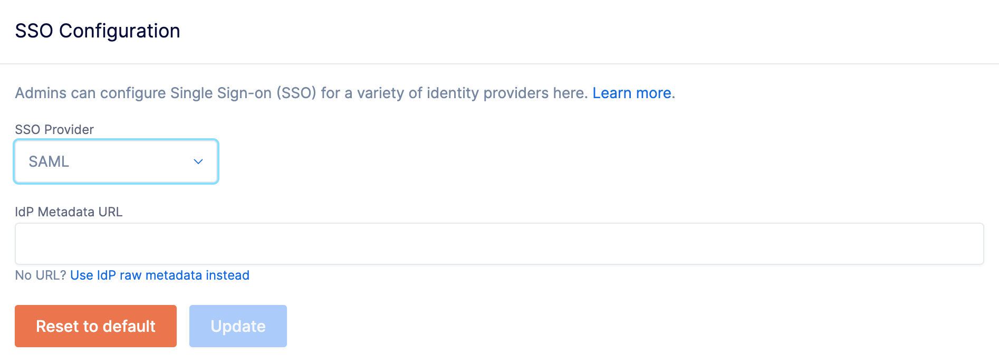

# Okta - SAML

::: warning
This feature is only available on the Pro and Enterprise plans.
:::

Buf's SSO integration supports the following SAML features:

- Identity Provider (IdP)-initiated SSO
- Service Provider (SP)-initiated SSO
- Just-in-Time (JIT) user provisioning
- SCIM 2.0 user and group provisioning

The steps below must be carried out by an Okta administrator for your organization.

## Prerequisites

- Setup ([Pro](../../setup-pro/) | [Enterprise](../../setup-enterprise/)) needs to be complete. You need to know your private BSR instance's domain name (for example, `example.buf.dev` or `buf.example.com`) for the steps below.

## Set up application

1.  Sign in to your Okta organization.
2.  Navigate to **Applications** > **Applications** and click **Create App Integration**.
3.  For **Sign-in method**, select **SAML 2.0** and click **Next**.
4.  Under **General Settings**, give the integration an App name like "Buf Schema Registry" or "Buf". This should be something meaningful to your users.

### Configure SAML

1.  Set **Single sign on URL** to `https://buf.example.com/saml/acs`.
2.  Set **Audience URI (SP Entity ID)** to `https://buf.example.com`.
3.  For **Name ID format** and **Application username**, select `EmailAddress` and `Email`, respectively.

Buf provisions users Just-in-Time based on the email address — **make sure you've configured the Name ID correctly**.

We recommend keeping the Okta defaults under **Advanced Settings**. However, if your organization has additional requirements, such as Single Logout (SLO) or adding Assertion Encryption, contact [Support](https://support.buf.build) or your Buf representative.

### Get metadata URL

Buf supports fetching dynamic configuration directly from the publicly hosted Okta Metadata URL.

1.  Navigate to the Buf application.
2.  Click the **Sign On** tab and look for **Identity Provider Metadata**. This is a public URL Okta provides for you to share with your Service Provider.
3.  Copy the Metadata URL to use for configuring your BSR instance.

    

## Update SSO configuration

To set up or update your BSR instance's SSO configuration:

1.  Go to the **SSO Configuration page** at `http://<BSR_SERVER>/<ORGANIZATION>/pro-settings`.
2.  From the **SSO Provider** dropdown, choose **SAML**.
3.  Enter the Metadata URL in the **IdP Metadata URL** text box.

    

4.  Click **Update**.
