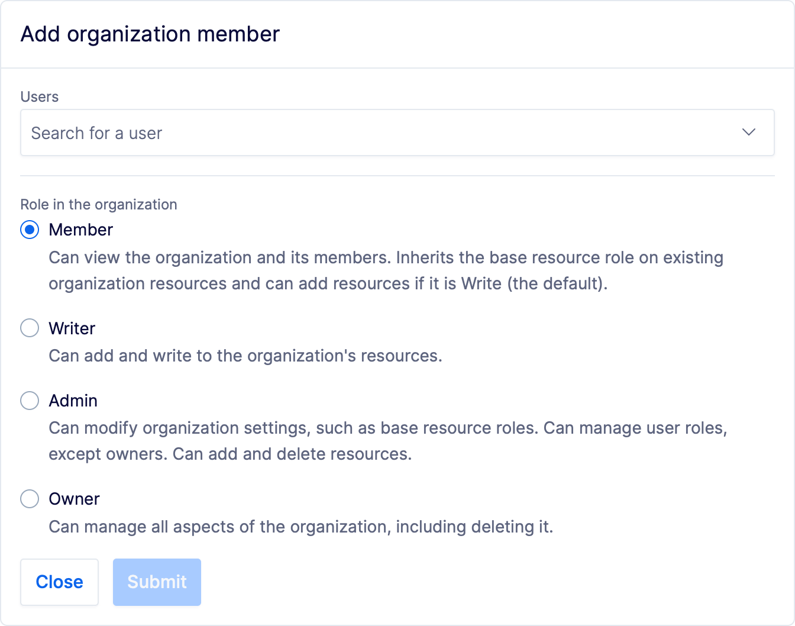

---

title: "Manage members and roles - Buf Docs"

head:
  - - link
    - rel: "canonical"
      href: "https://bufbuild.ru/docs/bsr/admin/manage-members/"
  - - meta
    - property: "og:title"
      content: "Manage members and roles - Buf Docs"
  - - meta
    - property: "og:url"
      content: "https://bufbuild.ru/docs/bsr/admin/manage-members/"
  - - meta
    - property: "twitter:title"
      content: "Manage members and roles - Buf Docs"

---

# Manage members and roles

An organization member is a BSR user who can access your BSR organization's resources. Once designated, they can push modules to any of the organization's repositories and import them as a dependency.

## Add a member

To add a member to an organization, [sign in](https://login.buf.build/) to the Buf Schema Registry, navigate to the organization's **Settings** page, and then select **Add member**.When adding a member to an organization, keep a few important things in mind:

- Members must already have an active Buf account.
- The organization's owners and admins can add members, who then have the organization's [base resource role](#base-resource-roles).
- The base resource role is `Write` by default, but is configurable by owners and admins.

## Remove a member

You may need to manually remove a member from a BSR organization—for example, if a user's credentials are compromised or they leave the company and you're not managing members via SAML or SSO.To remove a member:

1.  In the public BSR at buf.build, go to the organization you want to remove the member from:`https://buf.build/YOUR_ORG/members`
2.  Click on the settings icon for the user and choose **Remove user**.
3.  Confirm the removal.

If you're on a private BSR instance, you also need to deactivate the user:

1.  Go to the instance-level user directory:`https://BSR_INSTANCE/admin/users`
2.  Click the options button for the user and select **Deactivate User**.
3.  Confirm the deactivation.

::: tip NoteWe recommend using [bot users](../instance/bot-users/) for all automation tasks.

:::

## Member roles

Every user that's part of an organization has an explicit role. Users are unable to modify their own role. If you need to lower your access, have another organization user perform this action or leave the organization and request to be re-added with the desired role.

### Member

- Can view the organization and its members.
- Inherits the [base resource roles](#base-resource-roles) on existing organization resources (the default is `Write`).

### Writer

- Can view the organization and its members.
- Can add resources such as [repositories](../../repositories/) and [plugins](../../remote-plugins/custom-plugins/).
- Inherits `Write` roles over existing organization resources, regardless of the organization's [base resource roles](#base-resource-roles).

This role is especially useful with CI pipelines. For example, you could set the organization base roles to `Read` and configure a bot user to push to a BSR repository on merge.If you're on a Pro or Enterprise plan, see [Bot users](../instance/bot-users/) for specifics related to bot users on your private BSR instance.

### Admin

- Can modify organization settings, such as [base resource roles](#base-resource-roles).
- Can add and delete resources such as [repositories](../../repositories/) and [plugins](../../remote-plugins/custom-plugins/).
- Can manage user roles, except owners.

### Owner

- Users that require unrestricted access to the organization, its settings, and all resources owned by the organization.
- Can add and delete resources such as [repositories](../../repositories/) and [plugins](../../remote-plugins/custom-plugins/).
- Can delete organization. You must delete all resources such as repositories and plugins before deleting the organization.

You can also assign more granular member rights ("Read", "Limited Write", "Write", "Admin") on BSR repositories. For more information see the [repository documentation](../../repository/configure/).

## Base resource roles

Base roles apply to all members of the organization. You can elevate the base role individually for the organization members, and add outside collaborators with an arbitrary role. Every organization has a set of base resource roles that apply to all members of the organization. The default roles:

| Repository |
| :--------- |
| Write      |

Organization owners can modify the base resource roles depending on the requirements of the organization. These roles are configurable on the organization settings page.

### Base repository role

- `Read`: Can read the repository and import it as a dependency.
- `Limited Write`: Can write to [non-default labels](../../repositories/#default-label). Can't write to the default label.
- `Write`: Can create and write to repositories, such as by pushing new content or creating labels.
- `Admin`: Can administer the repository, including managing access, updating settings like visibility status, and deleting the repository.

## Related docs

- Learn about [commits and labels](../../commits-labels/)
