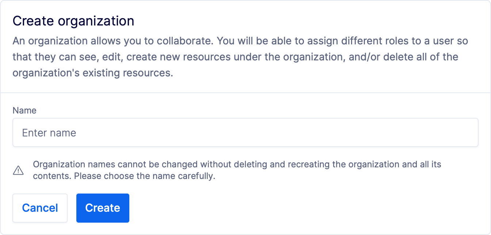

---

head:
  - - link
    - rel: "canonical"
      href: "https://bufbuild.ru/docs/bsr/admin/manage-organizations/"
  - - link
    - rel: "prev"
      href: "https://bufbuild.ru/docs/bsr/admin/user-account/"
  - - link
    - rel: "next"
      href: "https://bufbuild.ru/docs/bsr/admin/manage-repositories/"
  - - meta
    - property: "og:title"
      content: "Manage organizations - Buf Docs"
  - - meta
    - property: "og:image"
      content: "https://buf.build/docs/assets/images/social/bsr/admin/manage-organizations.png"
  - - meta
    - property: "og:url"
      content: "https://bufbuild.ru/docs/bsr/admin/manage-organizations/"
  - - meta
    - property: "og:type"
      content: "website"
  - - meta
    - property: "og:image:type"
      content: "image/png"
  - - meta
    - property: "og:image:width"
      content: "1200"
  - - meta
    - property: "og:image:height"
      content: "630"
  - - meta
    - property: "twitter:title"
      content: "Manage organizations - Buf Docs"
  - - meta
    - property: "twitter:image"
      content: "https://buf.build/docs/assets/images/social/bsr/admin/manage-organizations.png"
  - - meta
    - name: "twitter:card"
      content: "summary_large_image"

---

# Manage organizations

An organization allows you to collaborate with others on a shared set of Protobuf files. Once you've set up the organization, you can add other Buf users as members and assign [roles](../roles/) to them. Depending on the role, they may have specific permissions to change the organization itself and the underlying resources.

## Create an organization

To create a new organization:

1.  [Sign in](https://login.buf.build/) to the Buf Schema Registry.
2.  Click on **Show all** under the **Your organization** section.
3.  Select **Create Organization**.

When setting up a new organization, there are a few important things to keep in mind:

- The organization name must be unique and between 3 and 32 characters in length. It can only contain lowercase letters, numbers, or hyphens (-).
- You can add an organization URL in the repository settings later.
- You can also provide a description of the organization, which can be up to 350 characters in length, and provide an organization logo to make the org memorable and identifiable.

WarningOrganization names can't be changed without deleting and recreating the organization and all of its contents. Choose the name carefully.

## Delete an organization

Deleting the organization is a permanent action, and can't be undone. You must first delete all repositories and plugins owned by the organization.

## Manage members

BSR users can be members of both organizations and [repositories](../manage-repositories/#add-member), and have access privileges to each based on their [role](../roles/). You can use the BSR web app to manage members of your organizations and repositories.

### Add a member

Organization members with the `Owner` or `Admin` role can add members. When adding a member to an organization, keep in mind:

- The member must already have an active Buf account.
- Once added, the member has the organization's base resource role for each resource type unless given higher access.

To add a member:

1.  Go to the organization's **Members** page at `https://buf.build/ORGANIZATION/members`
2.  Select **Add member**.
3.  Search for the user by username and choose their organization role.
4.  Click **Submit**.

### Remove a member

You may need to manually remove a member from a BSR organization — for example, if a user's credentials are compromised or they leave the company and you're not managing members via SAML or SSO. The organization must always have at least one `Owner`.To remove a member:

1.  Go to the organization's **Members** page at `https://buf.build/ORGANIZATION/members`
2.  Click on the settings icon for the user and choose **Remove user**.
3.  Confirm the removal.

If you're on a private BSR instance, you also need to deactivate the user:

1.  Go to the BSR instance user directory at `https://buf.build/admin/users`
2.  Click the options button for the user and select **Deactivate User**.
3.  Confirm the deactivation.
