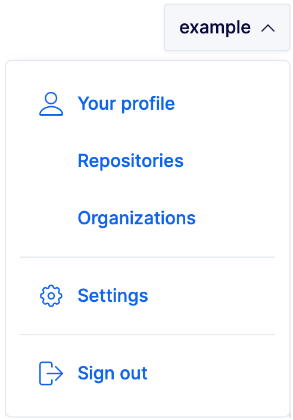
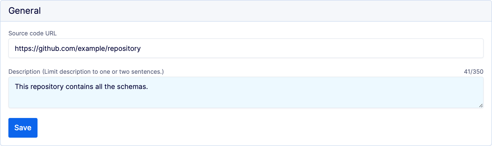
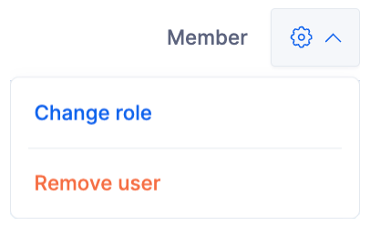

---

head:
  - - link
    - rel: "canonical"
      href: "https://bufbuild.ru/docs/bsr/admin/manage-repositories/"
  - - link
    - rel: "prev"
      href: "https://bufbuild.ru/docs/bsr/admin/manage-organizations/"
  - - link
    - rel: "next"
      href: "https://bufbuild.ru/docs/bsr/admin/roles/"
  - - meta
    - property: "og:title"
      content: "Manage repositories - Buf Docs"
  - - meta
    - property: "og:image"
      content: "https://buf.build/docs/assets/images/social/bsr/admin/manage-repositories.png"
  - - meta
    - property: "og:url"
      content: "https://bufbuild.ru/docs/bsr/admin/manage-repositories/"
  - - meta
    - property: "og:type"
      content: "website"
  - - meta
    - property: "og:image:type"
      content: "image/png"
  - - meta
    - property: "og:image:width"
      content: "1200"
  - - meta
    - property: "og:image:height"
      content: "630"
  - - meta
    - property: "twitter:title"
      content: "Manage repositories - Buf Docs"
  - - meta
    - property: "twitter:image"
      content: "https://buf.build/docs/assets/images/social/bsr/admin/manage-repositories.png"
  - - meta
    - name: "twitter:card"
      content: "summary_large_image"

---

# Manage repositories

A Buf Schema Registry (BSR) [repository](../../repositories/) represents a module’s commits, labels, and label histories, and can be owned by either users or organizations. This page shows how to create and manage your repositories and their properties. All instructions assume that you have a [Buf account](../user-account/) and are logged in to the BSR.

## Create a repository

When setting up a new repository, keep the following in mind:

- **You can't rename a Buf Schema Registry repository once it's created, nor can you change the owner.**
- The repository name must be unique within the owner's namespace (either a user or organization), and meet these format requirements:
  - must be between 2 and 100 characters
  - must only contain lowercase letters, digits, or hyphens
  - must begin with a lowercase letter
  - can't end with a hyphen
  - can't include profanity or a [reserved name](#reserved-names)

Once you've created the repository, you can begin pushing to it. To create a new repository:

1.  Go to the user dropdown and click **Repositories**.
2.  Click **Create repository**.
3.  In the popup that appears, give the repository a name and set its visibility. See the [Repository concepts](../../repositories/#visibility) page for more detail about visibility settings.
4.  Click **Create**.

## Change repository settings

You must have the `Admin` or `Owner` role for the repository to perform the following operations. If the repository is owned by an organization, you may inherit these roles from the organization.

### Add metadata

You can add metadata to your repository that displays in the repository list of any user who has access:

- a source URL that links your BSR repository to its corresponding repository in your version control system (helpful for tracing the origin of changes if you're pushing to the BSR using CI/CD workflows)
- a description of up to 350 characters

To add metadata:

1.  Go to the repository **Settings** page: `https://buf.build/{organization}/{repository}/settings`
2.  In the **General** section, add the source URL and/or the description and click **Save**.

### Change default label

When you create a repository, it has a default label of `main`, for parity with most version control systems. Subject to certain [restrictions](../../repositories/#name-change-restrictions), you can change the default to point to a different label.To change the default label pointer:

1.  In the BSR, navigate to your repository, select **Settings**, then go to the **Change default label** section.
2.  Start typing in the **Select new label** box—it provides type-ahead results to help you filter all of the available labels.
3.  Select the label you want to use and press **Enter**. If none of the restrictions apply, the default label changes.

::: tip NoteIf the label you want to switch to is archived, you must first unarchive it by pushing again with that label.

:::

### Change visibility

You can change the visibility of BSR repositories.

- In the BSR, navigate to your repository, select **Settings**, then **Change Visibility**.
- From the command line (you must be logged in from your terminal):

  ::: info Change a repository's visibility

  ```console
  $ buf beta registry repository update <{REMOTE}/{OWNER}/{REPOSITORY}> --visibility [public,private]
  ```

  :::

  The `--visibility` flag must be either `private` or `public`.

You can decide who gets to see your repository by picking whether it's public or private. When you create one, you get to choose which one you want.

- A public repository can be seen by anyone who has access to the instance. For repositories on https://buf.build, this means it can be seen by anyone on the internet. For private customer instances, it means it can only be seen by anyone authenticated on the instance unless you disable authentication for public moduldes.
- A private repository is only viewable by you and the people you give permission to.

### Add a member

Managing members is only allowed for repositories that are owned by a BSR organization. To add a direct access member (one who doesn't belong to the parent organization):

1.  Go to the repository's **Settings** page at `https://buf.build/ORGANIZATION/REPOSITORY/settings`
2.  In the **Manage access** section, click **Add direct access members**.
3.  Use the search box to find the user you want to add, set their access to the resource role you want, and click **Add**.

### Change member access

To change a user's access level or remove their access to the repository:

1.  Go to the repository's **Settings** page at `https://buf.build/ORGANIZATION/REPOSITORY/settings`
2.  In the **Direct access** section, select the user whose access you want to change or remove.
3.  Click the settings icon at the right of the user's row and choose which operation to perform from the dropdown.
4.  Confirm the operation.

### Deprecate or undeprecate

You can deprecate BSR repositories to indicate to others that depending on this repository is no longer recommended. The Buf CLI warns any user who runs `buf dep update` on a module that depends on a deprecated repository.

- In the BSR, deprecate or undeprecate a repository from its **Settings** page.
- From the command line (you must be logged in from your terminal):

  ::: info Deprecate a repository

  ```console
  $ buf beta registry repository deprecate <{REMOTE}/{OWNER}/{REPOSITORY}> [--message <deprecation message>]
  ```

  :::

  ::: info Undeprecate a repository

  ```console
  $ buf beta registry repository undeprecate <{REMOTE}/{OWNER}/{REPOSITORY}>
  ```

  :::

## Delete a repository

WarningDeleting a repository will immediately and permanently break the build of all modules that depend on it. **This action can't be undone.**

To delete a repository, go to the repository's **Settings** page, then click **Delete repository**.

## Reserved names

The following names are reserved terms and can't be used as repository names:

- curated-plugin
- curated-plugins
- member
- members
- module
- modules
- organisation
- organisations
- organization
- organizations
- plugin-set
- plugin-sets
- plugin
- plugins
- pluginset
- pluginsets
- pro-settings
- registries
- repositories
- repository
- setting
- settings
- team
- teams
- template
- templates
- user
- users
