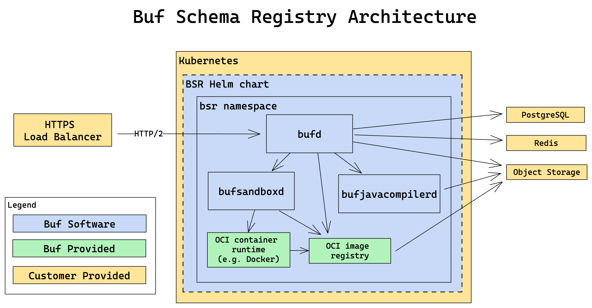

# Architecture

On-prem deployments of the BSR are effectively air-gapped from Buf. No sharing of data or analytics occurs without manual action by the customer.

Here is a simplified architecture diagram for the Buf Schema Registry (BSR):

## Dependencies

- **PostgreSQL** (version 14+): Stores application data such as users, organizations, repositories, and commit references
- **Redis** (version 6+): Caches compiled modules and other performance-enhancing data
- **S3-compatible storage** or **Azure Blob Storage**: Persists BSR [modules](../../../../cli/modules-workspaces/) as binary representations of a set of Protobuf files

### External dependencies

The following images can be mirrored internally, if desired:

- **[library/registry](https://hub.docker.com/_/registry)**: OCI Image Registry that holds container images for [remote plugins](../../../remote-plugins/overview/).

## Main components

### bufd

- The main [API](https://buf.build/bufbuild/buf/docs/main:buf.alpha.registry.v1alpha1) used by the frontend app and Buf CLI
- Provides the ability to remotely generate code from modules using **bufsandboxd**
- [Remote package](../../../generated-sdks/overview/) APIs to support pulling generated code using package managers in several languages (for example **npm install**, **go get**)
- [buf studio](../../../studio/), a browser tool that allows developers to create, edit and send gRPC and connect messages to arbitrary servers

### bufsandboxd

- Provides a sandboxed environment where images from the registry can be executed to generate code

### bufjavacompilerd

- Receives Kotlin and Java plugin generated code, which it compiles and packages into artifacts (jar, sources jar, pom) to be served via the maven repository
