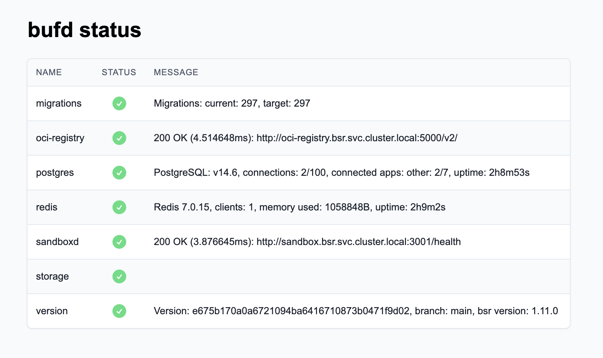

---

head:
  - - link
    - rel: "canonical"
      href: "https://bufbuild.ru/docs/bsr/admin/on-prem/observability/"
  - - link
    - rel: "prev"
      href: "https://bufbuild.ru/docs/bsr/admin/on-prem/configuration/"
  - - link
    - rel: "next"
      href: "https://bufbuild.ru/docs/bsr/admin/on-prem/architecture/"
  - - meta
    - property: "og:title"
      content: "Observability - Buf Docs"
  - - meta
    - property: "og:image"
      content: "https://buf.build/docs/assets/images/social/bsr/admin/on-prem/observability.png"
  - - meta
    - property: "og:url"
      content: "https://bufbuild.ru/docs/bsr/admin/on-prem/observability/"
  - - meta
    - property: "og:type"
      content: "website"
  - - meta
    - property: "og:image:type"
      content: "image/png"
  - - meta
    - property: "og:image:width"
      content: "1200"
  - - meta
    - property: "og:image:height"
      content: "630"
  - - meta
    - property: "twitter:title"
      content: "Observability - Buf Docs"
  - - meta
    - property: "twitter:image"
      content: "https://buf.build/docs/assets/images/social/bsr/admin/on-prem/observability.png"
  - - meta
    - name: "twitter:card"
      content: "summary_large_image"

---

# Observability

Observability is the ability to measure the internal states of a system by examining its outputs. Monitoring incoming calls, error scenarios, and traces is critical to ensure a robust system is running properly.

The rules and dashboards can be downloaded as a single zip file from the [Release notes](#release-notes) section below.

### Prometheus rules

Buf provides a set of Prometheus [alerting rules](https://prometheus.io/docs/prometheus/latest/configuration/alerting_rules/) and [recording rules](https://prometheus.io/docs/prometheus/latest/configuration/recording_rules/) for monitoring the health of your BSR instance.

- `prometheus-slo-rpc-rules.yaml`: Provides alerting rules and recording rules for all RPC endpoints.
- `prometheus-slo-http-rules.yaml`: Provides alerting rules and recording rules for all HTTP endpoints.
- `prometheus-slo-registry-rules.yaml`: Provides alerting rules and recording rules for language registry endpoints that serve [Generated SDKs](../../../generated-sdks/overview/).

### Grafana dashboards

To import the dashboards, follow [Grafana's instructions](https://grafana.com/docs/grafana/latest/dashboards/build-dashboards/import-dashboards/). The Prometheus recording rules are required to use the dashboards, since their precomputed metrics are necessary to establish the SLO window on the dashboards.

- `grafana-slo-rpc-dashboard.json` is for monitoring all RPC traffic with the capability to group by `cluster`, `rpc_service`, and/or `rpc_method`.
- `grafana-slo-http-dashboard.json` is for monitoring all HTTP traffic with the capability to group by `cluster`.
- `grafana-slo-registry-dashboard.json` is for monitoring language registry endpoints that serve [Generated SDKs](../../../generated-sdks/overview/).

## Dashboards

The dashboards included with the BSR expose its overall health and can aid in identifying and diagnosing operational issues. Several charts and components on the dashboards are described in more detail below.


### Service level objectives

Each dashboard is primarily defined in terms of service level objectives (SLOs).

Each dashboard has a success rate and latency objective, and the dashboards keeps track of when those objectives are met or missed. The success rate objective is currently 99.5% for all dashboards, and the latency objectives can be viewed in the `config` panel of the dashboards. Generally, the dashboards consider a request failed if it returns an unsuccessful error code (for example 5xx or the Connect RPC equivalent) or if it exceeds its latency target.

### Filters

Filters can be set to restrict the set of data the dashboard operates on. Setting `cluster` is important for sites with multiple BSR clusters. Other filters can be set based on which SLO dashboard is being used:

- **slo-http:** `cluster`
- **slo-rpc:** `cluster`, `rpc_method`, and `rpc_service`
- **slo-registry:** `cluster` and `request_type`

### High level information

The first two rows of the dashboard contain high level information to quickly provide the current operational status of the BSR.

#### First row boxes

The Availability, Error Budget, Slow Requests, Failed Requests, and Requests boxes display aggregate counts that give a high level overview of what's happening with the BSR over the trailing SLO evaluation window.

#### SLO table

This panel lists each grouping that has been observed and its availability. The lowest availability pairs are listed first to call out any parts of the BSR that may be having issues.

#### Error budget percentage

This panel shows the aggregate (based on filters) error budget burn down for the BSR. Each point on this chart shows the error budget used up over the trailing SLO evaluation window.

### Other dashboard components

Most of the other dashboard panels have titles that explain exactly what they're displaying and should be self-explanatory — others are clarified below.

#### Firing alerts

Any alerts that are firing are visible in this panel.

#### Config

Internal configuration for the dashboard. Currently can't be changed by end users.

#### Availability

Availability of the instance based on 5xx responses over a trailing 4 week window.

## Alerts

Alerts are configured for every grouping on the dashboard in each deployed BSR cluster. Each grouping has an error budget based on an availability objective of 99.5% over the previous four weeks. An alert fires if a given method returns errors at a rate that threatens the 99.5% objective. There are two classes of alerts defined by how rapidly they notify of errors.

**High priority alerts** respond swiftly, signalling immediate threats to the system. For these alerts to fire, 50% of the error budget must be consumed in the last hour and the method needs to have received at least 10 requests in that period.

**Low priority alerts** are designed for longer durations, capturing potential issues without responding to minor fluctuations. For these alerts to fire, 10% of the error budget must be consumed in the last 24 hours and the method needs to have had at least 10 requests in that period.

Simply put, if errors accumulate too quickly within the past one hour or 24 hours, alerts are triggered.

### Diagnosing alerts

When an alert fires, it's accompanied by specific labels to aid in your investigation: `cluster`, `rpc_method`, `rpc_service` and `request_type`, depending on which dashboard is being viewed. These labels highlight the affected areas, helping you pinpoint the problem's origin.

### Navigating the dashboard

Once an alert is triggered:

1.  **Firing Alerts Panel:** Here, you can view all active alerts, including the one that notified you.
2.  **Error Rate Diagram:** Look for spikes in this chart, giving you a visual representation of when and where issues arose.
3.  **Drill Down:** Use the provided labels (`cluster`, `rpc_method`, `request_type` and `rpc_service`) to refine your search in the dashboard and focus on the affected areas.

By following these steps and utilizing the dashboard, you can swiftly identify, understand, and address any issues in your system.

## Status page

To help verify that the BSR is working correctly, we expose a status page to BSR admins at `https://BSR_INSTANCE/-/status`. It's also accessible on port 3003 on each bufd pod without authentication, at `http://<bufd pod ip>:3003/-/status`.



### JSON

The BSR status page also outputs JSON at the `/-/status/json` URL:

```json
{
  "overall_status": "healthy",
  "results": [
    {
      "name": "migrations",
      "status": "healthy",
      "message": "Migrations: current: 297, target: 297"
    },
    {
      "name": "oci-registry",
      "status": "healthy",
      "message": "200 OK (3.201933ms): http://oci-registry.bsr.svc.cluster.local:5000/v2/\n"
    },
    {
      "name": "postgres",
      "status": "healthy",
      "message": "PostgreSQL: v14.6, connections: 3/100, connected apps: other: 3/8, uptime: 3h40m37s"
    },
    {
      "name": "redis",
      "status": "healthy",
      "message": "Redis 7.0.15, clients: 2, memory used: 1061120B, uptime: 3h40m47s"
    },
    {
      "name": "sandboxd",
      "status": "healthy",
      "message": "200 OK (3.335016ms): http://sandbox.bsr.svc.cluster.local:3001/health\n"
    },
    {
      "name": "storage",
      "status": "healthy"
    },
    {
      "name": "version",
      "status": "healthy",
      "message": "Version: e675b170a0a6721094ba6416710873b0471f9d02, branch: main, bsr version: 1.11.0"
    }
  ]
}
```

---

## Release notes

## v1.4.0

**_Release Date:_** 2024-04-14 | **_Minimum BSR version:_** v1.3.0

- An [Availability](#availability) (SLA) panel has been added to each SLO Dashboard.

[Download v1.4.0 rules and dashboards](../../../../assets/on-prem/bsr-observability-v1.4.0.zip)

---

Expand to see previous releases

## v1.3.1

**_Release Date:_** 2024-03-19 | **_Minimum BSR version:_** v1.3.0

- The observability dashboards and alerts have been updated to fix a bug where an incorrect histogram bucket was being used.

[Download v1.3.1 rules and dashboards](../../../../assets/on-prem/bsr-observability-v1.3.1.zip)

## v1.3.0

**_Release Date:_** 2023-12-05 | **_Minimum BSR version:_** v1.3.0

- The SLO alerting threshold for slow requests has been decreased from 250s to 75s, in an effort to be more responsive to slow requests. Additionally, the histogram buckets for HTTP metrics have been adjusted so they're now in parity with RPC metrics.

[Download v1.3.0 rules and dashboards](../../../../assets/on-prem/bsr-observability-v1.3.0.zip)

---

## v1.2.0

**_Release Date:_** 2023-10-03 | **_Minimum BSR version:_** v1.1.0

- This release includes new SLO Dashboards for non-RPC endpoints to give visibility into the entire BSR as a whole. There are now separate dashboards to monitor all HTTP requests and Registry requests.

[Download v1.2.0 rules and dashboards](../../../../assets/on-prem/bsr-observability-v1.2.0.zip)

---

## v1.1.0

**_Release Date:_** 2023-08-28 | **_Minimum BSR version:_** v1.0.4

- Enabled alerting for SLO dashboard
- Adds _high-priority_ alerts with **severity=page** label for high error rate incidents **ErrorBudgetBurn**
- Adds _low-priority_ **ErrorBudgetBurn** alerts with **severity=warning** label for low error rate incidents

[Download v1.1.0 rules and dashboards](../../../../assets/on-prem/bsr-observability-v1.1.0.zip)

---

## v1.0.0

**_Release Date:_** 2023-07-14 | **_Minimum BSR version:_** v1.0.2

- Initial version of Grafana dashboards and Prometheus recording rules

[Download v1.0.0 rules and dashboards](../../../../assets/on-prem/bsr-observability-v1.0.0.zip)
