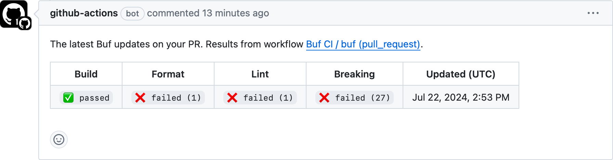

---

head:
  - - link
    - rel: "canonical"
      href: "https://bufbuild.ru/docs/bsr/ci-cd/github-actions/"
  - - link
    - rel: "prev"
      href: "https://bufbuild.ru/docs/bsr/ci-cd/setup/"
  - - link
    - rel: "next"
      href: "https://bufbuild.ru/docs/bsr/remote-plugins/overview/"
  - - meta
    - property: "og:title"
      content: "GitHub Action - Buf Docs"
  - - meta
    - property: "og:image"
      content: "https://buf.build/docs/assets/images/social/bsr/ci-cd/github-actions.png"
  - - meta
    - property: "og:url"
      content: "https://bufbuild.ru/docs/bsr/ci-cd/github-actions/"
  - - meta
    - property: "og:type"
      content: "website"
  - - meta
    - property: "og:image:type"
      content: "image/png"
  - - meta
    - property: "og:image:width"
      content: "1200"
  - - meta
    - property: "og:image:height"
      content: "630"
  - - meta
    - property: "twitter:title"
      content: "GitHub Action - Buf Docs"
  - - meta
    - property: "twitter:image"
      content: "https://buf.build/docs/assets/images/social/bsr/ci-cd/github-actions.png"
  - - meta
    - name: "twitter:card"
      content: "summary_large_image"

---

# GitHub Action

The [buf-action](https://github.com/bufbuild/buf-action) GitHub Action makes it easy to run the [Buf CLI](https://buf.build) within a workflow to check for [build](../../../reference/cli/buf/build/), [lint](../../../lint/overview/), [format](../../../format/style/), and [breaking change](../../../breaking/overview/) errors, and automatically [publish schema changes](../../module/publish/) to the [Buf Schema Registry (BSR)](https://buf.build/product/bsr).

## Prerequisites

If you're publishing schema changes, the Buf GitHub Action requires a BSR [authentication token](../../authentication/#create-a-token). Authenticating with the BSR is required for both the "push" and "archive label" steps.To authenticate with the BSR, set the `token` parameter to the [BSR token](../../authentication/#create-a-token). We recommend storing the `token` value as a [GitHub secret](https://docs.github.com/en/actions/security-guides/encrypted-secrets).

## Setup

To use the Buf GitHub Action, create a new `.github/workflows/buf-ci.yaml` file in your repository with the following content:

::: info .github/workflows/buf-ci.yaml

```yaml
name: Buf CI
on:
  push:
  pull_request:
    types: [opened, synchronize, reopened, labeled, unlabeled]
  delete:
permissions:
  contents: read
  pull-requests: write
jobs:
  buf:
    runs-on: ubuntu-latest
    steps:
      - uses: actions/checkout@v4
      - uses: bufbuild/buf-action@v1
        with:
          token: ${{ secrets.BUF_TOKEN }}
          # Change setup_only to true if you only want to set up the Action and not execute other commands.
          # Otherwise, you can delete this line--the default is false.
          setup_only: false
          # Optional GitHub token for API requests. Ensures requests aren't rate limited.
          github_token: ${{ secrets.GITHUB_TOKEN }}
```

:::

## Default behavior

With the default configuration above, the Action does the following:

- On a pull request, it runs all checks (`buf build`, `buf lint`, `buf format`, and `buf breaking`) and posts a summary comment on the PR.
- When you push a Git commit, tag, or branch to GitHub, it [pushes named modules to the BSR](../../module/publish/) using `buf push`.
- When you delete a Git branch or tag, it archives the corresponding label on the BSR.

### Summary comment

The Action reports the status of the most recent checks in a comment on each pull request.To disable the comment, set the `comment` parameter to `false` and remove the `pull_request: write` permission because it's no longer required.

```diff
name: Buf CI
on:
  push:
  pull_request:
    types: [opened, synchronize, reopened, labeled, unlabeled]
  delete:
permissions:
  contents: read
- pull-requests: write
jobs:
  buf:
    runs-on: ubuntu-latest
    steps:
      - uses: actions/checkout@v4
      - uses: bufbuild/buf-action@v1
        with:
          token: ${{ secrets.BUF_TOKEN }}
+         pr_comment: false
```

## Configuration

You can further configure the Action (including skipping checks, pointing to a custom BSR domain, pinning to a specific Buf CLI version, and more) by adding additional parameters to the `buf-ci.yaml` file:

```yaml
- uses: bufbuild/buf-action@v1
  with:
    <Parameter>: <value>
```

See the unified Action's GitHub Repository for the [complete list of parameters](https://github.com/bufbuild/buf-action?tab=readme-ov-file#configuration) and [example files](https://github.com/bufbuild/buf-action/tree/main/examples) for the most common use cases.

## Related docs

- See the [complete list of parameters](https://github.com/bufbuild/buf-action?tab=readme-ov-file#configuration) and [example files](https://github.com/bufbuild/buf-action/tree/main/examples) in the `buf-action` GitHub repository
- To migrate from the previous individual Buf GitHub Actions, read the [migration guide](../../../migration-guides/migrate-to-buf-action/)
