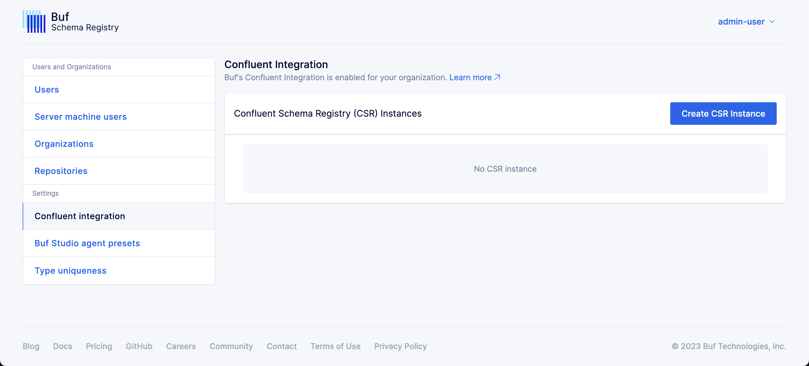
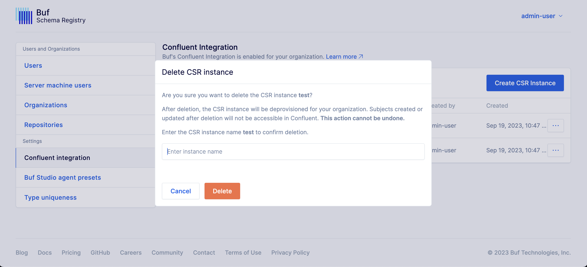

---

head:
  - - link
    - rel: "canonical"
      href: "https://bufbuild.ru/docs/bsr/csr/manage-instances/"
  - - link
    - rel: "prev"
      href: "https://bufbuild.ru/docs/bsr/csr/overview/"
  - - link
    - rel: "next"
      href: "https://bufbuild.ru/docs/bsr/csr/manage-schemas/"
  - - meta
    - property: "og:title"
      content: "Manage Confluent Schema Registry instances - Buf Docs"
  - - meta
    - property: "og:image"
      content: "https://buf.build/docs/assets/images/social/bsr/csr/manage-instances.png"
  - - meta
    - property: "og:url"
      content: "https://bufbuild.ru/docs/bsr/csr/manage-instances/"
  - - meta
    - property: "og:type"
      content: "website"
  - - meta
    - property: "og:image:type"
      content: "image/png"
  - - meta
    - property: "og:image:width"
      content: "1200"
  - - meta
    - property: "og:image:height"
      content: "630"
  - - meta
    - property: "twitter:title"
      content: "Manage Confluent Schema Registry instances - Buf Docs"
  - - meta
    - property: "twitter:image"
      content: "https://buf.build/docs/assets/images/social/bsr/csr/manage-instances.png"
  - - meta
    - name: "twitter:card"
      content: "summary_large_image"

---

# Manage Confluent Schema Registry instances

::: warning
This feature is only available on the Enterprise plan.
:::

Instances are the top-level namespace of the BSR's Confluent Schema Registry integration, which can be used to group related schemas. All users within your BSR have read access to all configured instances and their registered schemas.

## Create an instance

Only BSR administrators can create a Confluent Schema Registry instance. To create an instance:

1.  Log into the BSR as an administrator and navigate to the Admin panel via the dropdown under your username in the top right corner.
2.  Select **Confluent integration** in the left side menu.

    

3.  Click the **Create CSR Instance** button, then input a unique name and click **Create**.

    

4.  After you create the instance, note the name and URL for when you register schemas and configure clients.

    

## Delete an instance

::: warning Warning
Deleting an instance is permanent. All subjects and schemas registered to the instance are immediately removed and inaccessible from the Confluent Schema Registry's API.
:::

Only BSR administrators can delete a Confluent Schema Registry instance. To delete an instance:

1.  Log into the BSR as an administrator and navigate to the Admin panel via the dropdown under your username in the top right corner.
2.  Select **Confluent integration** in the left side menu.
3.  Click the three dots next to the instance, and select **Delete CSR instance**.

    

4.  Confirm the deletion by entering the instance name and clicking **Delete**.

    
