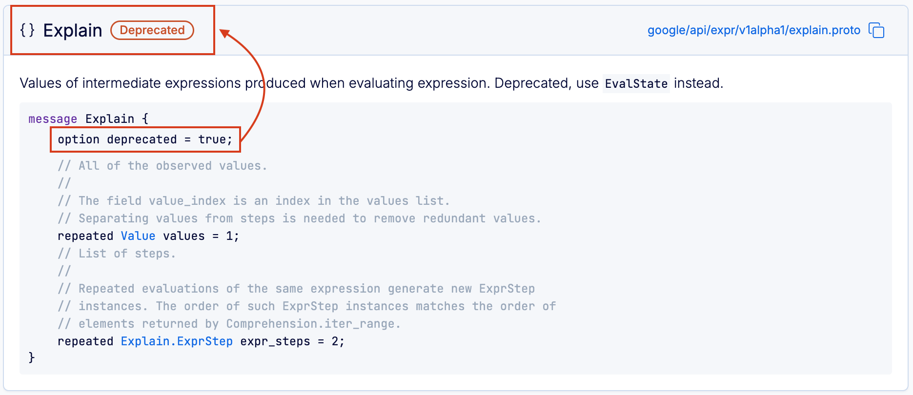

# Adding documentation

When you're sharing schemas across teams, consumers need access to documentation so they can understand and use APIs effectively. The BSR automatically generates documentation from your Protobuf comments with every push to the BSR, and makes it searchable and easy to navigate. This page documents how to add module-level documentation, which Protobuf options the documentation includes, and formatting syntax options.

## Module documentation

Most documentation comes directly from Protobuf comments, but you should also describe your modules so others can understand their functionality.

To create module documentation, add a `README.md` file and push it to the BSR along with your Protobuf files. If you already have a `README.md` and want to have a different documentation file for the BSR than your source control, name the file `buf.md` instead. When both files are present, the BSR displays `buf.md` instead of `README.md`.

Because documentation is part of your module, any updates to either `README.md` or `buf.md` create new commits in the BSR. You can put the documentation at either the module level or the workspace root. Modules within the workspace without their own documentation fall back to the workspace `README.md` file.

In this example, the module at `proto/weatherapi` displays its own `README.md` file, and the module at `proto/units` displays the workspace `README.md` file.

```text{9,14}
workspace_root
├─ buf.yaml
├─ proto
│  └─ acme
│     ├─ weatherapi
│     │  └─ v1
│     │     ├─ api.proto
│     │     ├─ calculate.proto
│     │     └─ README.md  # Module-level documentation
│     └─ units
│        └─ v1
│           ├─ imperial.proto
│           └─ metric.proto
└─ README.md  # Workspace-level documentation
```

## Package documentation

When sharing packages, it's useful to provide an overview of the package. You can do so by adding comments above the `package` directive in your `.proto` files:

::: info pet.proto

```protobuf
syntax = "proto3";

// This package represents all information needed to represent a pet for sale in the store.
package pet.v1;
```

:::


Comments on the package directive aren't merged across files. Files are parsed alphabetically, and only the first file with a non-empty comment is displayed in the generated documentation.

## Annotated Protobuf options

The BSR renders annotated Protobuf options in source code style. For the `deprecated` option, it also displays a notice in the header of each deprecated entity:



The complete list of Protobuf's built-in options is available in the [`descriptor.proto`](https://github.com/protocolbuffers/protobuf/blob/main/src/google/protobuf/descriptor.proto#L431) specification. The list below includes all Protobuf options that the BSR renders documentation for when annotated.

- **Message options** - `deprecated`
- **Field options**
  - `deprecated`
  - `packed`
  - `ctype`
  - `jstype`
  - `lazy`
  - `unverified_lazy`
  - `weak`
  - `uninterpreted_option`
- **Enum options**
  - `allow_alias`
  - `deprecated`
  - `uninterpreted_option`
- **EnumValue options**
  - `deprecated`
  - `uninterpreted_option`
- **Service options**
  - `deprecated`
  - `uninterpreted_option`
- **Method options**
  - `deprecated`
  - `idempotency_level`
  - `uninterpreted_option`

### Custom options

Custom options are also supported and rendered in the generated documentation. The official [Protobuf docs](https://protobuf.dev/programming-guides/proto3/#customoptions) show how to create and apply custom options in your `.proto` file — the sample below shows the `.proto` file and the resulting documentation:

::: info main/options/v1/options.proto

```protobuf
syntax = "proto3";

package main.options.v1;

extend google.protobuf.EnumValueOptions {
  string country_code_abbrv = 2000;
}

enum CountryCode {
  COUNTRY_CODE_UNSPECIFIED = 0;
  COUNTRY_CODE_INDIA = 1 [(country_code_abbrv) = "IND"];
  COUNTRY_CODE_UNITED_KINGDOM = 2 [(country_code_abbrv) = "GBR"];
  COUNTRY_CODE_UNITED_STATE_OF_AMERICA = 3 [(country_code_abbrv) = "USA"];
}
```

:::


## Formatting syntax

The module documentation and package documentation, including Protobuf type definitions and comments, support the following syntax for formatting.

- [CommonMark](https://commonmark.org/help/): Standardized common features of Markdown.
- [GitHub Flavored Markdown](https://github.github.com/gfm/): Markdown extension developed by GitHub, including additional features like task lists and tables.
- [Mermaid](https://mermaid.js.org/intro/syntax-reference.html): Tool for diagramming and charting. Start the code block with ` ```mermaid `.
