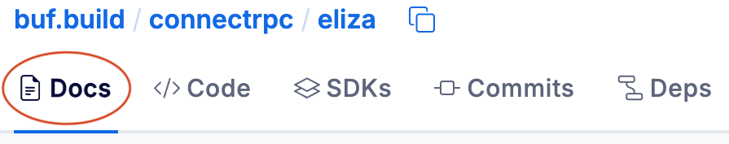
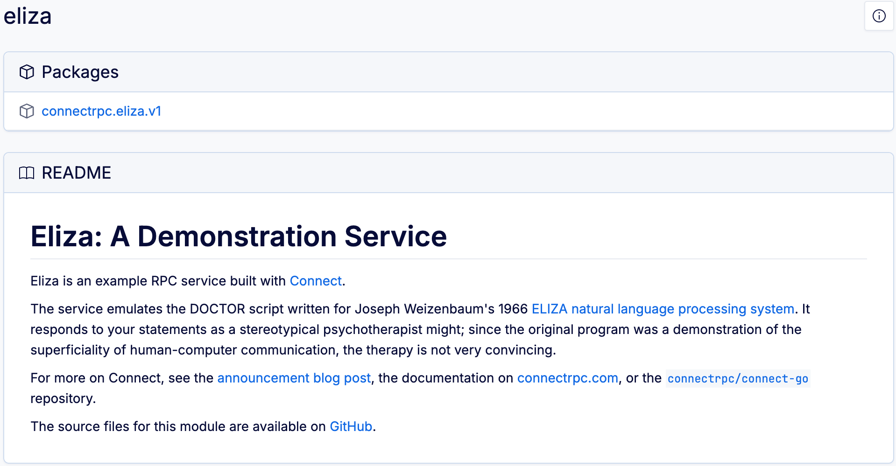
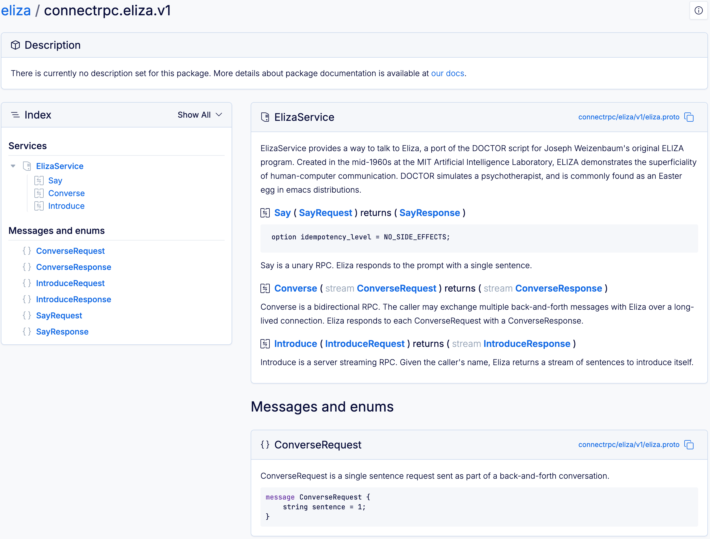

# Schema documentation – Overview

The Buf Schema Registry (BSR) enables five types of documentation for your schemas:

- Source code with navigation
- Module documentation (as a `README.md` file you can include in the module)
- Package documentation (as a code comment above the `package` declaration in your `.proto` files)
- API reference documentation for their [generated SDKs](../../generated-sdks/sdk-documentation/#api-reference)
- Getting started guide for their [generated SDKs](../../generated-sdks/sdk-documentation/)

This page covers the three types that are directly included in a module.

## Source code documentation

The BSR generates documentation for each module, enabling anyone to view the module's `.proto` files in with an organized UI and navigate easily between them. It also allows schema publishers to add module and package information to provide additional context and usage details.

To view the documentation for any BSR module, go to its **Docs** tab:

To click around an example, see the [`connectrpc/eliza` module](https://buf.build/connectrpc/eliza).

### Diff schemas

You can do a diff of the schema between any two commits or labels in a BSR repository:

1.  Go to the repository's **Commits** tab and click the **Compare** button.
2.  Choose the labels or enter the commit IDs you want to compare.
3.  The BSR displays the diff for each file in the module, including the `README` and `LICENSE`.

## Module documentation

When you first go to the module documentation, there are links into each of its packages, and any module documentation that the schema owner has provided.

## Package documentation

When you click into a package, you see the package docs at the top, an index of the entities categorized by field type on the left, and the entities themselves in the same order on the right:

Clicking in the index takes you to the referenced item, and you can quickly navigate from the docs to the Protobuf file by clicking the filename on the right side of each entity. Each entity's header also has a unique anchor tag that you can click to copy, enabling you to share a link to the exact item.
