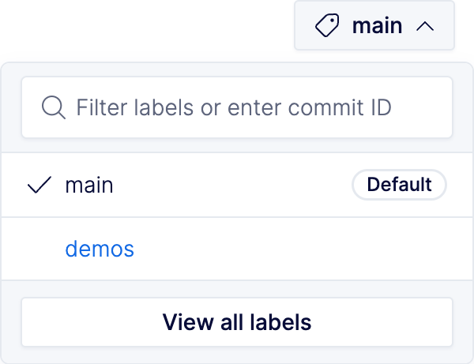

---

title: "Cargo - Buf Docs"

head:
  - - link
    - rel: "canonical"
      href: "https://bufbuild.ru/docs/bsr/generated-sdks/cargo/"
  - - meta
    - property: "og:title"
      content: "Cargo - Buf Docs"
  - - meta
    - property: "og:url"
      content: "https://bufbuild.ru/docs/bsr/generated-sdks/cargo/"
  - - meta
    - property: "twitter:title"
      content: "Cargo - Buf Docs"

---

# Cargo

The Buf Schema Repository (BSR) provides generated SDKs for Rust in the form of a Crate registry. You can consume generated SDKs from modules and plugins using `cargo`. It generates SDKs automatically when you push schema changes, which eliminates the need to manage a Protobuf toolchain or generate code locally.

## Setup

`cargo` is configured to use [crates.io](https://crates.io) by default. To use Buf's Cargo registry, you must configure it in your `.cargo/config.toml` file:

::: info .cargo/config.toml

```toml
[registries.buf]
index = "sparse+https://buf.build/gen/cargo/"
credential-provider = "cargo:token"
```

:::

You then need to configure a token for the registry. See the [Authentication](../../authentication/#create-a-token) page for instructions on creating a token, then run:

```console
$ cargo login --registry buf "Bearer {token}"
```

## Installing generated SDKs

To install a generated SDK, use `cargo add` and reference the SDK name. For example, to install the [`connectrpc/eliza`](https://buf.build/connectrpc/eliza) Protobuf module using the [`community/neoeinstein-prost`](https://buf.build/community/neoeinstein-prost) plugin, run this command:

```console
$ cargo add --registry buf connectrpc_eliza_community_neoeinstein-prost
```

See the [names and versions](#names-versions) section for syntax specifics.

## Eager generation

Unlike our other generated SDKs, which generate SDKs lazily, the BSR eagerly generates Rust crates to populate the checksum of the generated crate in the package index. Once you've run `cargo add` on a crate, future pushes to the default label for the crate's repository automatically generate SDKs.To eagerly generate a version for a particular label or commit, go to the module you want to generate for, then choose a label from the dropdown or enter a commit ID:Future pushes to the label automatically generate SDKs.

## Names and versions

The BSR Cargo registry has a special syntax for SDK names:

```text
{moduleOwner}_{moduleName}_{pluginOwner}_{pluginName}
```

For example, the SDK name `connectrpc_eliza_community_neoeinstein-prost` contains code for the [`connectrpc/eliza`](https://buf.build/connectrpc/eliza) module using the [`community/neoeinstein-prost`](https://buf.build/community/neoeinstein-prost) plugin.

### Versions

To discover SDK versions for the Cargo registry, browse a repository's generated SDK page, which has installation instructions and an interactive UI for selecting SDK versions.

### Full syntax

```text
{pluginVersion}-{commitTimestamp}-{commitShortName}.{pluginRevision}
```

As an example:

```text
0.3.1-20240523144506-ce529d32d80c.1
```

That represents:

- Plugin version: `0.3.1`
- Plugin revision: `1`
- Commit timestamp: `20240523144506`
- Commit short name: `ce529d32d80c`

If you need a more specific version than the latest, such as needing to install a specific plugin version, you can use the [`buf registry sdk version`](../../../reference/cli/buf/registry/sdk/version/) command.The BSR supports [commits on labels](../../../cli/modules-workspaces/#referencing-a-module). This feature enables you to push unreleased Protobuf file changes and consume generated code without affecting the [default label](../../repositories/#default-label).Only commits that are on the default label at the time they're pushed to the BSR have populated timestamps. Timestamps on commits pushed to other labels are set to `00000000000000` to easily distinguish them as changes in labels that are still in development.

## Available plugins

For a full list of supported plugins, navigate to the [BSR plugins page](https://buf.build/plugins) and search for Rust.To learn more about how these plugins are packaged and distributed, go to the [bufbuild/plugins repository](https://github.com/bufbuild/plugins). If you find a useful plugin that you think should be added, [file an issue](https://github.com/bufbuild/plugins/issues/new/choose).

## Related docs

- Try the [generated SDKs tutorial](../tutorial/) to learn how to generate SDKs from the BSR.
