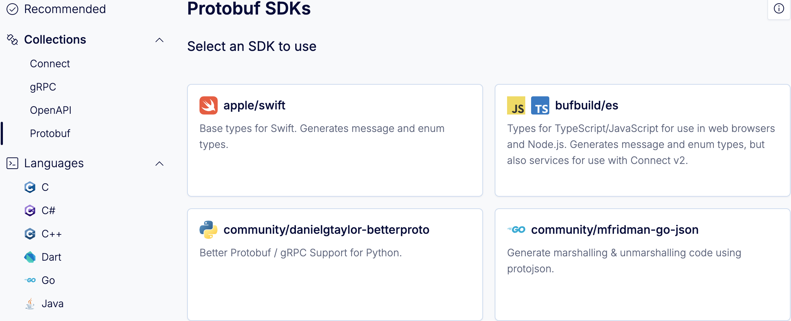
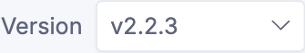
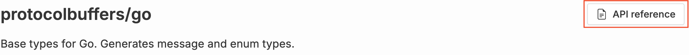

---

head:
  - - link
    - rel: "canonical"
      href: "https://bufbuild.ru/docs/bsr/generated-sdks/tutorial/"
  - - link
    - rel: "prev"
      href: "https://bufbuild.ru/docs/bsr/generated-sdks/overview/"
  - - link
    - rel: "next"
      href: "https://bufbuild.ru/docs/bsr/generated-sdks/user-documentation/"
  - - meta
    - property: "og:title"
      content: "Tutorial - Buf Docs"
  - - meta
    - property: "og:image"
      content: "https://buf.build/docs/assets/images/social/bsr/generated-sdks/tutorial.png"
  - - meta
    - property: "og:url"
      content: "https://bufbuild.ru/docs/bsr/generated-sdks/tutorial/"
  - - meta
    - property: "og:type"
      content: "website"
  - - meta
    - property: "og:image:type"
      content: "image/png"
  - - meta
    - property: "og:image:width"
      content: "1200"
  - - meta
    - property: "og:image:height"
      content: "630"
  - - meta
    - property: "twitter:title"
      content: "Tutorial - Buf Docs"
  - - meta
    - property: "twitter:image"
      content: "https://buf.build/docs/assets/images/social/bsr/generated-sdks/tutorial.png"
  - - meta
    - name: "twitter:card"
      content: "summary_large_image"

---

# Import and use generated SDKs – Tutorial

The Buf Schema Registry (BSR) generates SDKs that contain code generated from Protobuf schemas (stored as Buf modules) and plugins. They can be installed as dependencies using popular package managers like Cargo, Go, Gradle, Maven, NPM, pip, and Swift Package Manager, enabling you to easily consume Protobuf APIs without manually generating code or interacting with the schemas directly. For example, mobile or web teams who don't directly own Protobuf schemas can use generated SDKs to consume Protobuf APIs from other teams.This tutorial shows how to depend on the generated SDK for the `connectrpc/eliza` module using NPM. The process is similar for other SDKs.

## Prerequisites

- [Create a Buf account](https://buf.build/signup), if you haven't already
- [Sign in to the BSR](https://buf.build/login)

## Select generated SDKs

Usually, you'll have a direct URL for the module you want to use, either from the schema owner or your internal documentation. You can also search for its repository if you know the name.

1.  In the search bar at the top of the BSR, enter `connectrpc/eliza`. A dropdown of results appears—click **connectrpc/eliza** to go to the repository.
2.  Click the **SDKs** tab to see the categories of generated SDKs:
3.  Click on the JavaScript icon—a gallery of JavaScript-compatible plugins appears. Then click **bufbuild/es** to choose the `bufbuild/es` plugin. The install instructions for the plugin display.

::: tip Recommended SDKsIf you're on a private BSR instance, you may see a "Recommended" category in addition to the ecosystem collections and languages. The SDKs in this category have been recommended by the instance, organization, or module admins as the preferred ones to use.If a recommended SDK has a build issue, it displays an error message and provides a share link so you can copy the SDK URL and notify the module admin.

:::

Each SDK has a different set of instructions depending on the language and the ecosystem. Some plugins provide multiple package manager options, each in a separate tab. For plugins where generated SDKs aren't available, the installation instructions provide an archive download link—see the [Downloading an archive](#download-archive) section for more details about archives.Some SDKs also have the option to create an authorization token. If you choose to create one from this screen, it appends it to the command for you to copy. Otherwise, add a token you already have in place of `{token}`.If the plugin has dependencies installed as part of the SDK, they're listed in a **Dependencies** section below the installation instructions.Follow the provided installation instructions to install the SDK. Some SDKs also provide a "Getting started" guide to help you integrate further.

## Change the module version or label

The BSR defaults to providing SDKs at the latest module and plugin versions unless otherwise specified. To pin SDKs to a specific module version, click the dropdown in the top right of the **SDKs** tab and choose a commit or label:Notice that when you make these changes, the installation command updates to reflect the new version:

```console
$ npm install @buf/connectrpc_eliza.bufbuild_es@2.2.2-20230822171018-8b8b971d6fde
```

This syntax identifies the plugin version first, then the exact commit in the repository that the `demo` label represents.

## Change the plugin version

You can pin the SDK to a specific plugin version by going to the **Version** dropdown at the top of the **Installation instructions** section:

## View API reference documentation

Along with the install instructions, the BSR generates API reference documentation—it currently supports Go and TypeScript, with more languages to follow. The API reference is always in sync with the plugin version and module commit specified by the SDK, and is presented in the way that's standard for each language. Click the **API reference** button at the top right of the SDK to view it.If the API reference for the SDK hasn't been generated before, the BSR displays a "Docs Generating" banner—otherwise, it displays a link to the reference's root directory. Click through to a package, and it shows its import statement and links to each of the package's descendants. You can then navigate around the documentation as needed.

## Download an archive

Similarly to generated SDKs, the BSR allows you to download an archive that contains the output of code generation for a combination of any module and Protobuf plugin. This enables you to transform your pre-validated Protobuf schemas into other formats such as JSON Schema or BigQuery for use in later processing steps. You can use the archive with your native package manager, CI/CD workflows, or data pipelines.To generate an archive, you can either:

- Choose a plugin and download from the BSR UI, or
- Download from the BSR API directly using `curl`

### Download from the BSR UI

To generate and download an archive from the BSR:

1.  Choose your module and plugins from the **SDK** tab.
2.  Click the **Download archive** button at the top right of the SDK section.
3.  From the dropdowns, choose the version of the plugin and the file format you want to use when generating the archive. You have the option of zip or tarball archives.
4.  Click **Download** to download the archive, or copy the URL to use with `curl`.

### Download with the BSR API

To download an archive directly from the BSR API using `curl`, you need to construct a command with the module, plugin, and reference information:

::: info Syntax

```bash
$ curl -nsSOJL https://BSR_INSTANCE/gen/archive/MODULE_OWNER/MODULE_NAME/PLUGIN_OWNER/PLUGIN_NAME/REFERENCE.FILE_EXT

# Examples
curl -nsSOJL https://buf.build/gen/archive/connectrpc/eliza/bufbuild/bufbuild/es/latest.tar.gz
curl -nsSOJL https://buf.build/gen/archive/connectrpc/eliza/bufbuild/bufbuild/es/main.tar.gz
curl -nsSOJL https://buf.build/gen/archive/connectrpc/eliza/bufbuild/bufbuild/es/fc19856dc93042e290c9197d39a2beca.tar.gz
curl -nsSOJL https://buf.build/gen/archive/connectrpc/eliza/bufbuild/bufbuild/es/v1.2.3-fc19856dc930.tar.gz
```

:::

The URL contains these elements:

- _BSR_INSTANCE_ is the domain name of your BSR instance. (Default: `buf.build`)
- _MODULE_OWNER_ is the owner of the module.
- _MODULE_NAME_ is the name of the module.
- _PLUGIN_OWNER_ is the owner of the plugin.
- _PLUGIN_NAME_ is the name of the plugin.
- _REFERENCE_ must be one of the following:
  - `latest`: uses the most recent versions of both the module (on its default label) and the plugin.
  - [label name](../../commits-labels/#labels): uses the latest commit for the given label and the most recent plugin version
  - commit ID: uses the explicit BSR module commit and the most recent plugin version. The commit must be the full module commit name.
  - a full version reference, in the format `vX.Y.Z-commit.N`. Here, `X.Y.Z` represents the plugin version, `commit` refers to the module's shortened commit name (12 characters), and `N` refers to the plugin revision number. This format is commonly used when you want complete control over generation, allowing you to pin to a specific module commit and plugin version.
- _FILE_EXT_ is the file extension of the archive. This can be either `tar.gz` or `zip`.

Hitting this endpoint always returns a 302 redirect to the download URL, so clients must handle the redirect independently.

## Related docs

- Read the [generated SDKs overview](../overview/)
- View the language guides for more detail about manual installation and versioning syntax:
  - [Cargo](../cargo/)
  - [CMake](../cmake/)
  - [Go packages](../go/)
  - [Maven/Gradle](../maven/)
  - [NPM](../npm/)
  - [NuGet](../nuget/)
  - [Python](../python/)
  - [Swift Package Manager/Xcode](../swift/)
- **Admins:** To learn how to set up recommended SDKs, go to the [admin manual](../../admin/instance/recommended-sdks/)
