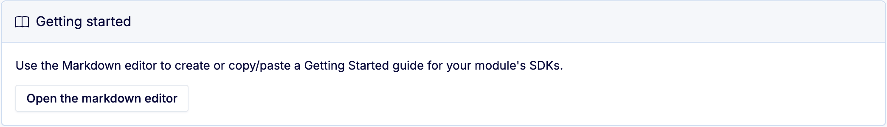
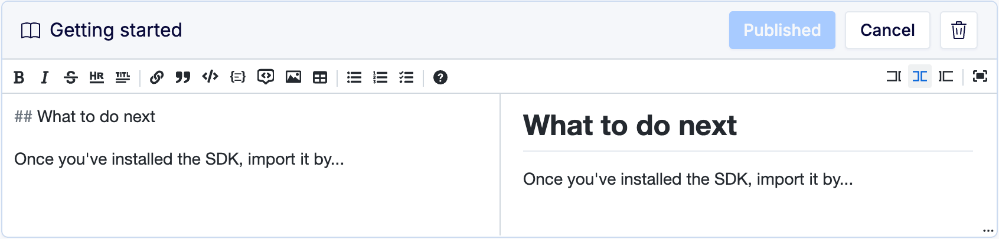
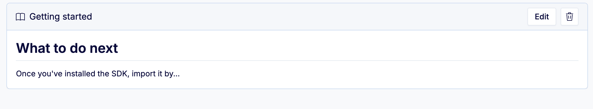

# User documentation

Generated SDKs provide setup and install documentation for themselves. They also generate their own [API reference documentation](../tutorial/#api-reference) for Go and TypeScript.In addition, the BSR allows anyone with the correct permissions to add a "Getting started" guide to an SDK page to help end users integrate further. The guide is an open-text Markdown editor and can be edited inline. Access to the editor is limited to BSR instance admins and anyone with the [`Owner` or `Admin` role](../../admin/manage-members/#member-roles) in the organization that owns the repository the SDK is generated from.

## Adding a guide

If no user documentation exists for the SDK, the end user doesn't see the editor, but anyone with access can see it and click into it to begin a guide:Once you click the **Open the markdown editor** button, the editor opens with an empty editor on the left and a preview on the right. Start typing or paste in your text and the preview adjusts:If you're writing in the editor, you can either input Markdown directly or use the WYSIWYG buttons to format your text and add images and tables. Image URLs must be publicly addressable—the editor doesn't allow you to upload images.When you're done editing the text, click **Publish** and the editor closes. The guide is immediately visible to anyone who goes to that SDK page:

## Editing or deleting a guide

You can edit the guide at any time by clicking **Edit**. Make your changes and click **Publish** to publish the revision.To remove the guide, click the trash can icon at the top right of the editor.

WarningThe SDK getting started guide isn't a version-controlled resource. When its content is changed, older versions can't be recovered.

## Related docs

- Learn how to create [module documentation](../../documentation/create-docs/)
