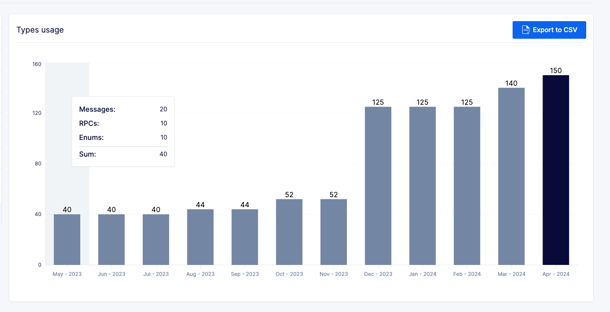

---

title: "Overview - Buf Docs"

head:
  - - link
    - rel: "canonical"
      href: "https://bufbuild.ru/docs/bsr/"
  - - meta
    - property: "og:title"
      content: "Overview - Buf Docs"
  - - meta
    - property: "og:url"
      content: "https://bufbuild.ru/docs/bsr/"
  - - meta
    - property: "twitter:title"
      content: "Overview - Buf Docs"

---

# Buf Schema Registry (BSR)

Welcome to the **Buf Schema Registry (BSR)**! This overview covers what the BSR is and the challenges it aims to solve within the Protobuf ecosystem. If you just want to see the BSR in action with code examples, check out the [BSR quickstart](quickstart/).

## What's the BSR?

The BSR stores and manages Protobuf files as versioned [modules](../cli/modules-workspaces/) so that individuals and organizations can consume and publish their APIs without friction.The BSR comes with a browseable UI, dependency management, API validation, versioning, generated documentation, and an extendable plugin system that powers remote code generation.

### BSR goals

- **Centralized registry:** The BSR is the source of truth for tracking and evolving your Protobuf APIs. A centralized registry enables you to maintain compatibility and manage dependencies, while enabling your clients to consume APIs reliably and efficiently. Having a centralized, Protobuf-aware, registry has the added benefit of protecting against broken builds.
- **Dependency management:** The BSR _finally_ introduces dependency management to the Protobuf ecosystem. You can now declare, resolve and use hosted BSR modules as dependencies in your projects. Put simply, **you don't need to copy your `.proto` file dependencies around anymore**. The Buf CLI interacts directly with the BSR to fetch your dependencies, (analogous to `npm` for Node.js, `pip` for Python, `cargo` for Rust, and Go modules in Go).
- **UI and documentation:** The BSR offers complete documentation for your Protobuf files through a browseable UI with syntax highlighting, definitions, and references.
- **Remote plugins:** The Buf team manages hosted Protobuf plugins that can be referenced in [`buf.gen.yaml`](../configuration/v2/buf-gen-yaml/#plugins) files. Code generation takes place remotely on the BSR and generated source code is written out to disk.
- **Generated SDKs:** The BSR exposes generated artifacts through managed software repositories you fetch like any other library with tools you already know: `go get`, `npm install`, `mvn`, or `gradle`.

### Why the BSR?

You're probably wondering why adopting the Buf Schema Registry (BSR) is an improvement over your existing Protobuf workflows. We've highlighted available features above, but let's break down how the BSR aims to solve existing problems.**The Protobuf ecosystem deserves build guarantees**Traditional workflows push Protobuf files to version control systems, but these systems lack Protobuf-awareness and thus consumers often waste time working with Protobuf files that don't compile. Yes, some organizations add checks to catch broken Protobuf files, but these are error-prone and don't scale well because _each_ repository needs to be configured, setup and maintained.Since the BSR is a Protobuf-aware registry, it prevents Protobuf files that don't compile from being pushed to the origin in the first place. Your consumers can have confidence that Protobuf files consumed from the BSR aren't broken and can compile. Everyone in the ecosystem benefits because compilation guarantees are pushed from the individual to the BSR.**Generated documentation for all**Sadly, readily consumable _and_ up-to-date documentation is rarely available for Protobuf files. Some organizations setup workflows to generate documentation, but this is yet another manual step that has to be configured and maintained. Furthermore, much of the tooling and plugins are unsupported and generate incomplete documentation.The BSR comes built-in with [generated documentation](documentation/overview/). You get live documentation for every commit to the BSR. Which means live and up-to-date documentation for latest and historic commits. Even better, the documentation the BSR provides has syntax highlighting, definitions, and references.**Keeping Protobuf files synced**Every organization that adopts Protobuf needs to solve distribution, whether internally across teams or externally exposed to the public. Protobuf files are usually checked into repositories, often dispersed, and it becomes challenging to keep Protobuf files synced across projects. API drift is a common issue and even worse, forked Protobuf repositories accidentally get consumed by downstream dependents (instead of the upstream). It's a mess.The BSR solves this by offering a centralized registry to store all your Protobuf files, simplifying the process of publishing and consuming. By making the BSR the single source of truth, it's possible to power developer workflows and business processes around Protobuf without worrying _how_ to keep everything in-sync.**Client SDKs shouldn't be an afterthought**Define. Generate. Consume.Defining a Protobuf-based API enforces a contract between producer and consumers, however consumers are typically an afterthought in the process.Before a client can consume a Protobuf-based API they need to generate an SDK for their language of choice. Traditionally consumers are left to figure out how to build and generate clients, but this is often cumbersome as little guidance is provided and not all Protobuf files correctly encode options for a given language.Fetching a client SDK from the BSR is a single `npm install` or `go get` command.

## Start using the BSR

Once you've [installed](../cli/installation/) the latest version of the Buf CLI, you're ready to use the BSR! We recommend starting with the [BSR quickstart](quickstart/), if you haven't already done it. The quickstart provides an overview of the BSR and takes approximately 10 minutes to complete.The Pro and Enterprise plans include a private instance of the Buf Schema Registry (BSR), SSO/SCIM for user provisioning, and several other features to address security, compliance, and automation requirements specific to larger organizations. The pages in this section describe the setup and usage of your private BSR instance and point to relevant sections of the general documentation where there are differences from the public BSR at https://buf.build.

- Setup instructions for [Pro plan](admin/instance/setup-pro/)
- Setup instructions for [Enterprise plan](admin/instance/setup-enterprise/)

## Pro and Enterprise features

### Private BSR and SSO/SCIM

We currently support all OIDC or SAML providers for SSO/SCIM, and have specific setup guides for these:

- **SSO:** [GitHub/OAuth2](admin/instance/sso/github-oauth2/), [Google/SAML](admin/instance/sso/google-saml/), [Okta/OIDC](admin/instance/sso/okta-oidc/), [Okta/SAML](admin/instance/sso/okta-saml/)
- **SCIM:** [Azure/SAML](admin/instance/scim/azure-saml/), [Okta/SAML](admin/instance/scim/okta-saml/)

### Custom plugins

Pro and Enterprise plans include the ability to upload custom plugins for logic specific to your business needs. See the [custom plugins](remote-plugins/custom-plugins/) documentation for policy and implementation information.

### CI/CD integration

In addition to the [buf-action](../ci-cd/github-actions/) integration for the BSR, Pro and Enterprise plans allow you to create [bot users](admin/instance/bot-users/) that can call the BSR from CI workflows without tying the actions to a specific person.

### Audit logging

BSR instance admins can query the private BSR instance about several types of events and actions. See [audit logs](admin/instance/audit-logs/) and the [audit API documentation](https://buf.build/bufbuild/buf/docs/e32e91a7a3a14c9db9f7f25989f6d1c8:buf.alpha.audit.v1alpha1#buf.alpha.audit.v1alpha1.Event) for more information.

### Webhooks

You can enable [webhooks](admin/instance/webhooks/) to trigger actions in other backend services, such as CI/CD or notification workflows. they're disabled by default.

## Enterprise-only features

### Policy checks

On your private BSR, you can enforce a set of breaking change rules across all repositories. Once enabled, any commits with breaking changes are put into a review flow, where they can be accepted or rejected by the BSR repository owners or admins. This protects downstream consumers from breaking changes, while enabling those closest to the code to approve them when appropriate. See the [overview](policy-checks/breaking/overview/) and [review commits documentation](policy-checks/breaking/review-commits/) for more information.You can also require that all Protobuf file paths and type names remain unique across modules. When the uniqueness policy check is enabled, the BSR rejects any pushes that introduce violations to this rule. See [Uniqueness checks](policy-checks/uniqueness/) for more information.

### Usage dashboard

Similar to the [Average Types Usage dashboard](../subscription/manage-costs/#types-usage-dashboard) available on the public BSR, a Maximum Types Usage dashboard is available for private instances at `https://BSR_INSTANCE/admin/usage`, where `BSR_INSTANCE` is your instance's domain name.There are some differences in the way we compute types for private instances vs. the public BSR, which reflect the terms around how these contracts are billed:

- Types usage for the public BSR is computed as the average number of types over the organization's billing period.
- Private instance usage tracks the maximum number of types for all organizations on the entire instance over a calendar month.

#### Example dashboard

### Generated SDK API reference documentation

Generated SDKs provide a [full Go and TypeScript API reference](generated-sdks/tutorial/#api-reference) for all of your instance's modules.
