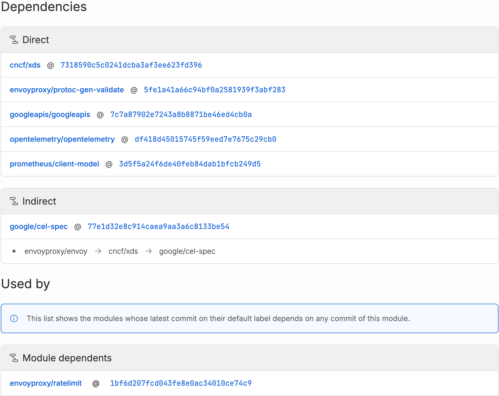

---

head:
  - - link
    - rel: "canonical"
      href: "https://bufbuild.ru/docs/bsr/module/dependency-management/"
  - - link
    - rel: "prev"
      href: "https://bufbuild.ru/docs/bsr/authentication/"
  - - link
    - rel: "next"
      href: "https://bufbuild.ru/docs/bsr/module/publish/"
  - - meta
    - property: "og:title"
      content: "Dependency management - Buf Docs"
  - - meta
    - property: "og:image"
      content: "https://buf.build/docs/assets/images/social/bsr/module/dependency-management.png"
  - - meta
    - property: "og:url"
      content: "https://bufbuild.ru/docs/bsr/module/dependency-management/"
  - - meta
    - property: "og:type"
      content: "website"
  - - meta
    - property: "og:image:type"
      content: "image/png"
  - - meta
    - property: "og:image:width"
      content: "1200"
  - - meta
    - property: "og:image:height"
      content: "630"
  - - meta
    - property: "twitter:title"
      content: "Dependency management - Buf Docs"
  - - meta
    - property: "twitter:image"
      content: "https://buf.build/docs/assets/images/social/bsr/module/dependency-management.png"
  - - meta
    - name: "twitter:card"
      content: "summary_large_image"

---

# Dependency management

Buf modules can depend on other modules that share a [workspace](../../../cli/modules-workspaces/), or on remote modules hosted on the Buf Schema Registry (BSR) that are explicitly configured as workspace dependencies. Remote modules can be community modules such as [`googleapis`](https://buf.build/googleapis/googleapis) or modules owned by your organization that aren't part of the workspace.

## Configuring dependencies

Buf uses two files to manage dependencies: `buf.yaml` and `buf.lock`.The `buf.yaml` file specifies the workspace's configuration and external dependencies. All external dependencies can be imported by modules in the workspace, and are referenced by their module names on the Buf Schema Registry (BSR). All modules contained within the workspace can be dependencies for each other without any further declaration.

::: info Example with internal and external dependencies

```yaml
version: v2
modules:
  - path: proto
    name: buf.build/acme/petapis
  - path: vendor # Path to .proto files for the payment system // [!code highlight]
deps: // [!code highlight]
  - buf.build/googleapis/googleapis // [!code highlight]
```

:::

In the example above, the `petapis` module can depend on the Protobuf schemas in the `vendor` directory with no further configuration, and both modules can depend on `googleapis`.

### Pinning to specific versions

Dependencies default to the latest version available, but you may need to pin a module to a specific version. For example, if a schema you're developing against is also pre-release, you probably want to specify a commit of that module that contains the changes you need. You can do this by specifying a commit ID or a label in your `deps` declaration after the `:` delimiter. Ideally, authors keep modules backwards-compatible and avoid breaking changes, so you can rely on the latest version.

::: info Dependency pinned to a commit ID

```yaml
deps:
  - buf.build/bufbuild/protovalidate:b983156c5e994cc9892e0ce3e64e17e0
```

:::

::: info Dependency pinned to a label

```yaml
deps:
  - buf.build/bufbuild/protovalidate:v0.6.3
```

:::

## Managing dependencies

The Buf CLI's `buf config` and `buf dep` subcommands provide several commands to manage dependencies in your modules:

- [`buf config init`](../../../reference/cli/buf/config/init/): Creates a default `buf.yaml` file in the current directory. It's used to set up a new workspace and provide scaffolding for you to define the modules within it.
- [`buf dep update`](../../../reference/cli/buf/dep/update/): Creates or updates the `buf.lock` file to reflect the exact version, by commit, of all direct and transitive external dependencies specified in the `buf.yaml` file. If you add a new dependency to the `buf.yaml` file, run this command to resolve and lock the new dependency's version in the `buf.lock` file.
- [`buf dep prune`](../../../reference/cli/buf/dep/prune/): Removes any unused dependencies from the `buf.lock` file. This is useful to keep the dependency list clean and up to date.

::: info Example buf.lock file

```yaml
# Generated by buf. DO NOT EDIT.
version: v2
deps:
  - name: buf.build/googleapis/googleapis
    commit: 7a6bc1e3207144b38e9066861e1de0ff
    digest: b5:6d05bde5ed4cd22531d7ca6467feb828d2dc45cc9de12ce3345fbddd64ddb1bf0db756558c32ca49e6bc7de4426ada8960d5590e8446854b81f5f36f0916dc48
```

:::

## Viewing dependencies and dependents

You can view any module's direct and indirect dependencies, and any modules that depend on it, by going to the **Deps** tab in its repository. All entries are clickable, allowing you to navigate to and explore each dependency's codebase.

- **Dependencies** shows only the dependencies of the module _at the specific label or commit that you're currently viewing_.
- **Used by** shows dependents on the module for any of its labels and commits, for each dependent's _latest commit in its default label_. Older commits or other labels within the dependent aren't displayed.

## How Buf resolves imports

Understanding how imports are resolved is essential for properly managing dependencies and avoiding conflicts. When a Protobuf file imports another Protobuf file, the `import` statement refers to the target file by its path. Buf's import resolution process involves locating the target file in the workspace or within its dependencies, and has two steps: resolving local imports and resolving module imports.

### Local imports

The resolution process first checks the workspace's `.proto` files for imports relative to its `buf.yaml` file. If the specified import exists in the specified location, the imported file is resolved locally.For example, consider a workspace with the following structure:

```text
workspace_root
├── buf.yaml
├── bar
│   └── bar.proto
└── foo
    └── foo.proto
    └── foo2.proto
```

A valid import statement in `foo.proto` to import `bar.proto` looks like this:

::: info foo/foo.proto

```protobuf
import "bar/bar.proto";
```

:::

Files that import files in the same directory still need to import relative to the `buf.yaml` file. This means that all `import` statements for a file in the workspace are identical regardless of the importing `.proto` file's location. For example, given the module structure above:

::: info foo/foo2.proto

```protobuf
// This is invalid
import "foo.proto";
// This is correct
import "foo/foo.proto";
```

:::

### Module imports

If the resolution process fails to find a file locally, it checks the `deps` listed in the `buf.yaml` file. It searches through the dependencies in the order they're listed. For example, a `.proto` file might depend on the `buf.build/googleapis/googleapis` module as specified in the `buf.yaml` file:

::: info buf.yaml

```yaml
version: v2
deps:
  - buf.build/googleapis/googleapis
```

:::

If the `.proto` file contains an import statement like:

```protobuf
import "google/type/datetime.proto";
```

The resolution process first searches for the `google/type/datetime.proto` locally, and if it fails, then searches within the `buf.build/googleapis/googleapis` module for the same import path. If the import can't be resolved using local imports or module imports, the resolution process fails and Buf returns an error.

## Tips for managing imports

- Use clear and consistent import paths. Avoid using generic names for your Protobuf files and organize them in a clear directory structure. This helps prevent conflicts and makes imports easier to understand.
- Avoid circular imports. Instead, refactor your Protobuf files to remove circular dependencies.
- Keep your dependencies up to date. Use the `buf config` subcommands to manage your dependencies and ensure they're always up to date, preventing conflicts and ensuring compatibility.
- Adhere to the [Buf style guide](../../../best-practices/style-guide/) and use [`buf breaking`](../../../reference/cli/buf/breaking/), [`buf lint`](../../../reference/cli/buf/lint/), and [`buf format`](../../../reference/cli/buf/format/) to keep your Protobuf files in top-notch shape.

By understanding the import resolution process and following best practices, you can effectively manage Protobuf imports and dependencies, ensuring a well-structured and maintainable project.

### Using Well Known Types from the `google.protobuf` package

As the name implies, Well Known Types are known to the runtime, and in most cases already have generated code in the Protobuf runtime. These files can be imported without declaring any dependency and without having copies of these files in your module. See the [standard imports](https://protobuf.com/docs/descriptors#standard-imports) for a full list and more details.

## Dependency caching and offline use

Buf caches your dependencies locally when you run commands that use them (such as `buf build`, `buf lint`, and `buf breaking`) while connected to the Internet. Once your cache is initially populated, all commands that use module dependencies continue to work, so you can work offline if necessary. By default, your cache lives at `~/.cache/buf` on Mac or Linux, and `%LocalAppData%\buf`on Windows.

## Tamper-proofing dependencies in the BSR

The Buf CLI and the BSR are equipped to keep your workflows secure from tampering attacks, allowing you to trust your dependencies on every module build.

### What does a tampering attack look like?

Tampering means someone has made unauthorized changes in your dependencies—more exactly, in Protobuf schemas you depend upon. Imagine that your application depends on a BSR module that defines messages for moving money between two accounts. A nefarious actor could swap the values of which account is being debited and which is being credited. Making a payment becomes getting paid. And it's visually difficult to detect:

::: info money.proto

```diff
message MoveMoney {
-  string from_email = 1;
+  string from_email = 2;
-  string to_email = 2;
+  string to_email = 1;
  google.type.Money amount = 3;
}
```

:::

Our tamper resistance technique is a typical solution to this problem: use a cryptographic hash and keep a record of the content's digest. If the content changes, so does the digest. And if the CLI detects that a downloaded dependency digest is different than the expected one, it warns loudly that something is wrong, and avoids using that dependency.

### How the BSR protects your dependencies

Every time a module is pushed to a BSR repository, the CLI sends the source files to the BSR as separated blobs with their calculated hash, along with a module's manifest that includes a canonical list of all of the files and the digest that are being pushed. The BSR receives these separated blobs and manifest and stores them as [CAS (Content-Addressable-Storage)](https://en.wikipedia.org/wiki/Content-addressable_storage), making sure that the generated commit points to the manifest, and this manifest links to all of the files that were pushed in the original request.

::: tip NoteFiles that are pushed on a `buf push` run:

- [Configuration file](../../../configuration/v2/buf-yaml/): `buf.yaml`
- [Dependencies lock file](../../../configuration/v1/buf-lock/): `buf.lock`
- [Module's license](../../../cli/modules-workspaces/#module-license): `LICENSE`
- [Module's documentation](../../../cli/modules-workspaces/#module-documentation): `buf.md`, or `README.md`
- All of your `*.proto` files.

For a deep dive on these files, see Buf's [source management](../../../cli/modules-workspaces/#workspace-layout) docs.

:::

After that, when a pushed module is used as a dependency in another repository, the original manifest digest is recorded in the `buf.lock` file, so you can check the cryptographic digest of each dependency into source control. For example:

::: info buf.lock

```yaml
# Generated by buf. DO NOT EDIT.
version: v2
deps:
  - remote: buf.build
    owner: bufbuild
    repository: eliza
    commit: f3801d450ef94549afec851bc73de581
    # Buf CLI watches out for changes in this field
    digest: b5:cd74f1dc4de0c750b7cf43df018b368a565de21a748738967c9a630aec95b5f267731a74a1ba142d7dbd2745300976671f9d90aa0a472b1f5b763fd886c66c12
```

:::

### How do we know if/when a dependency has been tampered with?

Whenever you're building your modules, `buf build` examines your local Buf cache, downloads any missing dependencies, and checks its manifest digest against the one stored in the `buf.lock` file. The CLI warns you if they don't match and fails the build, avoiding use of the offending dependency consumption.Such a scenario means that the dependency had different content than the one defined in the lock file, which could mean a potential [man-in-the-middle (MITM)](https://en.wikipedia.org/wiki/Man-in-the-middle_attack) attack.As long as your `buf.lock` is checked into source control, and you keep your CLI version regularly updated, dependencies consumed from the BSR are protected against tampering.
