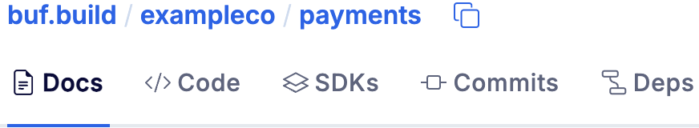
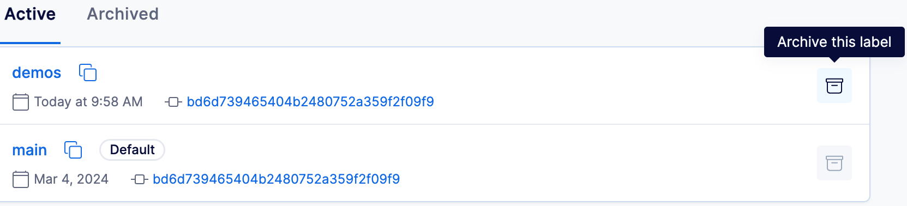
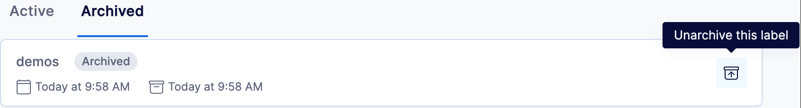

---

head:
  - - link
    - rel: "canonical"
      href: "https://bufbuild.ru/docs/bsr/module/publish/"
  - - link
    - rel: "prev"
      href: "https://bufbuild.ru/docs/bsr/module/dependency-management/"
  - - link
    - rel: "next"
      href: "https://bufbuild.ru/docs/bsr/module/export/"
  - - meta
    - property: "og:title"
      content: "Publish modules to the BSR - Buf Docs"
  - - meta
    - property: "og:image"
      content: "https://buf.build/docs/assets/images/social/bsr/module/publish.png"
  - - meta
    - property: "og:url"
      content: "https://bufbuild.ru/docs/bsr/module/publish/"
  - - meta
    - property: "og:type"
      content: "website"
  - - meta
    - property: "og:image:type"
      content: "image/png"
  - - meta
    - property: "og:image:width"
      content: "1200"
  - - meta
    - property: "og:image:height"
      content: "630"
  - - meta
    - property: "twitter:title"
      content: "Publish modules to the BSR - Buf Docs"
  - - meta
    - property: "twitter:image"
      content: "https://buf.build/docs/assets/images/social/bsr/module/publish.png"
  - - meta
    - name: "twitter:card"
      content: "summary_large_image"

---

# Publish modules to the BSR

When you want to make a module available for other developers, you push it to the Buf Schema Registry (BSR). Once the module is in the BSR, its code, documentation, and generated SDKs can be accessed by anyone with the correct permissions for your repository. This page describes how to push locally, how to archive and unarchive labels, and how pushing works in CI/CD environments.Pushing to the BSR also interacts with the BSR's [policy checks](../../policy-checks/breaking/overview/) and [Confluent Schema Registry integration](../../csr/overview/) features. See their documentation and [Commits and labels](../../commits-labels/#governance-interaction) for more details.

## Module and repository setup

Before you can push to a BSR repository, you need to create the repository and then connect it to your module by specifying the repository in the `modules.name` key of the `buf.yaml` file:



::: info buf.yaml

```yaml
version: v2
modules:
  - path: path/to/local/directory
    name: buf.build/exampleco/payments // [!code highlight]
```

:::

See [Manage repositories](../../admin/manage-repositories/#creating-a-repository) to learn how to create a repository.

## Pushing from a local workspace

When you push from your workspace, the Buf CLI automatically resolves the internal and external dependencies of the workspace and pushes each of the modules in dependency order. Generally, pushing to the BSR is done via CI/CD integration with your version control system (VCS), but you can also push a workspace manually using these steps:

1.  Open a command prompt and change to your workspace root directory.
2.  Run `buf dep update` to fetch the latest digests for the specified `deps` references in the `buf.yaml` file, and write them and any transitive dependencies to the `buf.lock` file.

    ```console
    $ buf dep update
    ```

3.  Run `buf build` to make sure everything is working. This builds the Protobuf files into a Buf image, which is necessary for the modules in the workspace to be accepted into the registry.

    ```console
    $ buf build
    ```

4.  Push your workspace to the BSR. If successful, the Buf CLI outputs the BSR commit hashes for each module in the workspace.

    ```console
    $ buf push

    buf.build/example/module:280bdcbf4b0341d6aefd8bfcafc018eb
    ```

## Pushing with labels

Labels allow you to add a commit to the history of a specific stream of development like a release or a feature, similar to branches and tags in a VCS. If no other label is applied, the commit is added to the history of the [default label](../../repositories/#default-label), which is similar to the default branch in a VCS (for example `main` in Git).As a best practice, we recommend always explicitly specifying the labels you want to push to rather than relying on the current default label in the BSR. See [Commits and labels](../../commits-labels/) for more details about label properties and behavior.To apply a label to a commit, add the `--label` flag—you can add multiple labels in the same push command by adding multiple flags:

::: info Apply the 'v1.0.1' and 'releases' labels to the commit

```console
$ buf push --label v1.0.1 --label releases
```

:::

When a commit is pushed to the BSR, it's appended to the history of each label it was pushed with. Each label begins resolving to this latest commit as long as [policy checks](../../policy-checks/breaking/overview/) are either passing or not enabled. All BSR artifacts for the modules in a commit can be referenced by any of their labels, which are available via a dropdown selector in the BSR UI. This repository has two labels, 'main' and 'demos'. 'main' is the default label:See [BSR commit squashing](#commit-squashing) below for more details about the interaction of labels and policy checks when pushing.

## Archiving and unarchiving labels

You can archive labels if you no longer need them, so that it's easier to find labels in the label dropdown and "all labels" list. Archiving removes labels from the list but doesn't delete them, and you can unarchive them later if necessary.To archive a label:

1.  In your repository, choose **View all labels** from the label dropdown, or go directly in the browser:

    ```text
    https://buf.build/OWNER/REPOSITORY/commits/labels
    ```

2.  Find the label you want to archive and click the icon at the right:

To unarchive a label:

1.  In your repository, choose **View all labels** from the label dropdown and click on **Archived**, or go directly in the browser:

    ```text
    https://buf.build/OWNER/REPOSITORY/commits/labels/archived
    ```

2.  Find the label you want to unarchive and click the icon at the right:

You can also make a commit with the label applied and it automatically unarchives.

## Pushing with CI/CD

As mentioned above, generally you won't be pushing to the BSR directly from a local environment. Instead, most organizations use GitHub Actions or other automation to push to the BSR automatically from their VCS, so that there's a single source of truth and the BSR commit can link back to the context of the original code commit.For more information about CI/CD, see the [General CI/CD setup](../../ci-cd/setup/) and [GitHub Action setup](../../ci-cd/github-actions/) pages.

## BSR commit squashing

When you push a commit to the BSR, it compares it to the existing `HEAD` of each label in the module and attempts to squash it to avoid creating commits with the same content and dependencies. This is especially useful for organizations that have Buf integrated into their Git CI workflows.Because most Git commits don't change your Protobuf files, creating new BSR commits for them adds unwanted noise. Instead, if the commit can be squashed, the BSR does so and returns the ID of the latest BSR commit where the schema actually had changes, which is the commit that it's squashing _into_.

### Interaction with policy checks

The commit that represents the existing `HEAD` of a label differs depending on whether [policy checks](../../policy-checks/breaking/overview/) are enabled. Because policy checks have the concept of a "resolved" commit, the BSR evaluates the commit's state in the policy check workflow when determining which commit is `HEAD`:

- If they're _enabled_, it uses the _true latest_ commit in the label (regardless of review state)
- If they're are _disabled_, it uses the commit that the label _resolves to_ (excludes "pending" and "rejected" commits)

This may seem backwards, but allows the BSR to properly squash if policy checks have been enabled and later disabled. Otherwise, a new commit could match an existing "pending" or "rejected" commit and stay stuck in that state, requiring a content change to move it to "resolved".

### Interaction with labels

The BSR evaluates the incoming commit against all existing module labels, with the following results:

- When all target labels are new:
  - Can't squash—nothing to squash into
  - Creates a single commit and appends it to each label
- When all target labels already exist:
  - Checks if all the labels share the same commit as `HEAD`—if so it compares it against the incoming content
  - If the common `HEAD` matches with the incoming content, the commit is squashed _for those labels_
- When there is a mix of new and existing target labels:
  - Checks if all existing labels share the same commit as `HEAD`—if so it compares it against the incoming content
  - If the common `HEAD` matches with the incoming content, the commit is squashed _for the existing labels_
  - The commit is appended to the _new labels_

## Related docs

- Read about [repositories](../../repositories/) and [commits and labels](../../commits-labels/).
- Learn more about [dependency management](../dependency-management/) in the BSR.
- Read the [`buf.yaml` configuration file](../../../configuration/v2/buf-yaml/) documentation.
