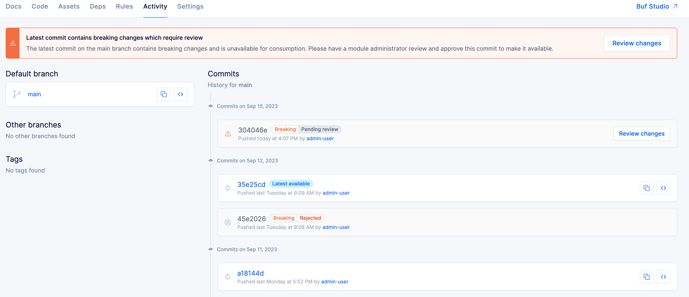
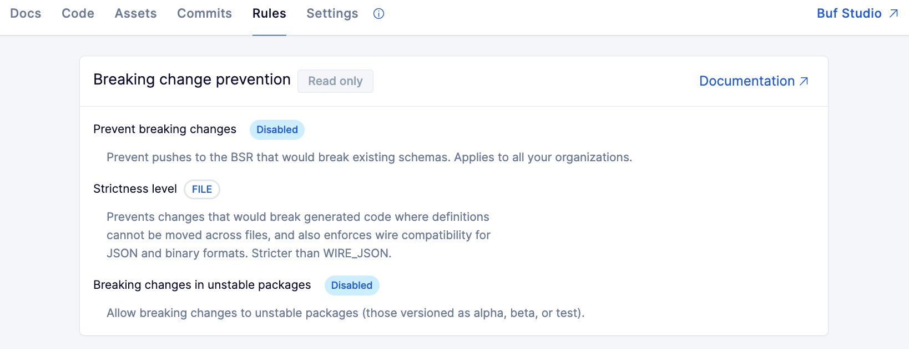

# Breaking change policy check – Overview

::: warning
This feature is only available on the Enterprise plan.
:::

Preventing unintended breaking changes in production is crucial for API and data producers, but often complex to implement across multiple teams. Buf's breaking change policy check allows you to enforce the Buf CLI's [breaking change rules](../../../breaking/rules/) across your entire private BSR instance with minimal configuration. And because breaking changes are sometimes necessary, it also provides module owners the ability to review breaking changes before they enter the BSR and then approve or deny them. This allows for nuance in cases where breaking changes are acceptable.

Buf's breaking change policy check:

- **Blocks breaking changes from reaching consumers:** The BSR puts commits with breaking changes into a "pending" state and they must be approved before they're released to consumers.
- **Ensures that breaking changes are reviewed by the right team members:** Module owners are notified of breaking changes via inbox and email, and can approve or reject the breaking commits via the review flow. All review states and decisions are visible in the BSR, providing a history of schema evolution over time.
- **Works regardless of project configuration:** The server-wide check supersedes any settings in `buf.yaml` files or CI, and works even if they aren't present, so enterprises can rely on stable Protobuf contracts.

## How it works

Organizations can choose to enforce one of two policies for Protobuf files generally: [`FILE`](../../../breaking/rules/#categories) (the default) or [`WIRE_JSON`](../../../breaking/rules/#categories). In addition, if your BSR instance has the [Confluent Schema Registry integration](../../csr/#breaking-changes) enabled, the BSR checks against a subset of breaking change rules related to compatibility for CSR subjects, even if the policy checks feature isn't enabled.

Once enabled, the breaking change policy check is enforced for all modules in the BSR. Non-compliant schemas enter into a review flow, where owners can approve or reject them. These settings take precedence over any breaking change configuration specified in a given workspace's `buf.yaml` file, and work even if `buf.yaml` disables the breaking change configuration completely.

### Ignoring in unstable packages

By default, breaking change rules are enforced for all packages, but it's sometimes useful to allow breaking changes in unstable packages. Enabling the **Unstable packages** setting in the BSR allows breaking changes in any alpha, beta, or test packages. For example:

- `foo.bar.v1alpha1`
- `foo.bar.v1beta1`
- `foo.bar.v1test`

### Review flow

Buf's breaking change policy check includes a review flow, so that when developers attempt to push breaking changes to the BSR, commits can be approved or rejected by code owners instead of being rejected outright. This gives downstream consumers protection from breaking schema changes, but allows for nuance in cases where breaking changes are acceptable.

With the breaking change policy check enabled, when commits that contain breaking changes are pushed to a repository's default label, they're placed into a review flow with a "pending" state and reviewed by the module's admins. This ensures that the code owners have the opportunity to assess the impact of the breaking changes by viewing the diff, and can make an informed decision about whether to accept them. The Buf CLI outputs a warning message to the committer, and sends an in-app notification and email to the owners notifying them that a commit needs to be reviewed.

Commits that require approval are annotated as such in the repository's **Commits** tab, and all users see a prominent banner indicating that the repository requires attention.

See [Reviewing commits](review-commits/) for instructions about how to approve or deny breaking changes.

## Effects on downstream consumers

Any commits pushed after a commit that's pending are _also_ set to pending, whether or not those commits are breaking changes. On the default label, pending commits are unavailable to downstream consumers while the breaking change awaits review, and rejected commits are always unavailable as follows:

- They're not available to install from any generated SDK registry, unless specifically requested by commit
  - The "latest" version of a generated SDK is kept at the latest approved or non-reviewed commit on the default label
- They're not available to use in [Buf Studio](../../studio/)
- They're excluded from the [Reflection API](../../reflection/)
- They don't update schemas in the [Confluent Schema Registry](../../csr/)

## Interaction with local breaking change configurations

When the breaking change policy check is enabled, local setups and CI configurations continue to work, and the instance-wide setting interacts with them in the following ways:

- `buf breaking` still uses the local configuration in the `buf.yaml` files. This allows individual teams to be stricter than the organization.
- When running `buf push`, instance-wide rules configured in the BSR always take precedence over local rules.
  - The Buf CLI shows a warning if the breaking change configuration in the local `buf.yaml` is less strict than what's being enforced by the BSR (for example, if you have `WIRE_JSON` locally and `FILE` in the BSR).
  - It also shows a warning if the local `buf.yaml` specifies excluded files, as exclusions can't be specified in the BSR UI.

You can see the instance-wide policy that's applied for your organization by clicking the **Rules** tab in any module in the BSR.

