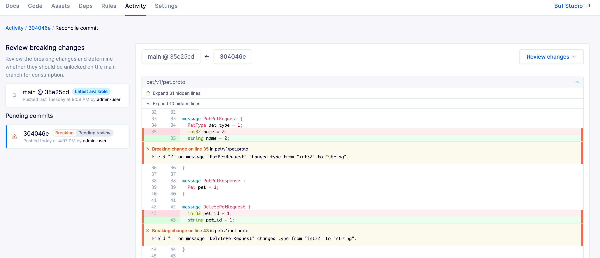
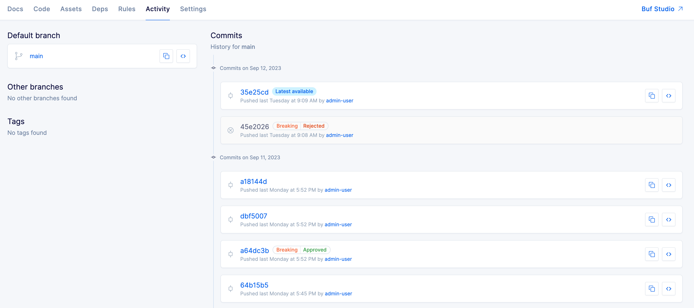
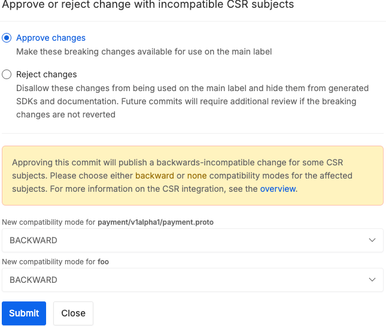

---

head:
  - - link
    - rel: "canonical"
      href: "https://bufbuild.ru/docs/bsr/policy-checks/breaking/review-commits/"
  - - link
    - rel: "prev"
      href: "https://bufbuild.ru/docs/bsr/policy-checks/breaking/setup/"
  - - link
    - rel: "next"
      href: "https://bufbuild.ru/docs/bsr/policy-checks/uniqueness/"
  - - meta
    - property: "og:title"
      content: "Reviewing commits - Buf Docs"
  - - meta
    - property: "og:image"
      content: "https://buf.build/docs/assets/images/social/bsr/policy-checks/breaking/review-commits.png"
  - - meta
    - property: "og:url"
      content: "https://bufbuild.ru/docs/bsr/policy-checks/breaking/review-commits/"
  - - meta
    - property: "og:type"
      content: "website"
  - - meta
    - property: "og:image:type"
      content: "image/png"
  - - meta
    - property: "og:image:width"
      content: "1200"
  - - meta
    - property: "og:image:height"
      content: "630"
  - - meta
    - property: "twitter:title"
      content: "Reviewing commits - Buf Docs"
  - - meta
    - property: "twitter:image"
      content: "https://buf.build/docs/assets/images/social/bsr/policy-checks/breaking/review-commits.png"
  - - meta
    - name: "twitter:card"
      content: "summary_large_image"

---

# Reviewing commits

::: warning
This feature is only available on the Enterprise plan.
:::

This page walks reviewers through the review flow, showing how to review commits that have been placed in the "pending" state due to the instance-wide breaking change policy check. You must be a repository owner or admin to review commits.

As a reviewer, you work through any pending changes one by one, and approve or reject each commit. The result of the review is marked for posterity in the **Commits** tab.

::: warning Warning
Reviewing a commit is a one-way street — once reviewed, the commit stays approved or rejected forever.
:::

## Review commits

1.  Click the **Review changes** button in the notification, or go to the **Commits** tab for your module and click the **Review changes** button for the individual commit.

    The commit with the breaking change and any other commits that may have stacked up behind it are shown in a queue on the left. The first commit's diff is shown in the center of the page, along with inline comments flagging each breaking change.

    

    The diff compares the breaking commit to the latest available commit on the default label. It's important to remember this after rejecting a commit or several — **any future commits won't diff against previously rejected commits, but the latest in the repository**.

2.  For each breaking change, you have two choices:

    - Approve the breaking change, indicating that the change was deliberate and that any breakage with downstream clients is acceptable.
    - Reject the breaking change and continue preventing downstream consumers from accessing the commit, which marks it as **Rejected** on the Commits tab. A follow-up change is usually required from the committer after this, such as reverting the bad commit in Git or patching it another way.

If additional commits require review, you're taken through each one in the order they were pushed. You can exit the flow at any time and come back to it later without losing completed reviews. Once commits have been reviewed, the original committers receive emails notifying them that their commits have been evaluated, and the module's **Commits** tab reflects the review state of each commit.

### Differences for Confluent Schema Registry

When a commit enters the review flow because of a breaking change that affects a [CSR subject](../../../csr/overview/#csr-policy-check), it's resolved differently than one that enters from the standard policy check. To resolve it, you first need to decide whether to approve or not, and then if you approve, you need to set a new backward compatibility mode for each affected subject.

See the [CSR integration overview](../../../csr/overview/#compatibility) for more detailed information about the implications of these options.

## Auto-resolved commits

When a commit has been pushed with a breaking change, additional commits may stack up behind it until the breaking change is resolved. The BSR auto-resolves commits where possible, according to the following rules:

- When you approve a breaking change, either:
  - It becomes available as the latest commit on the default label, and be marked as **Approved** on the **Commits** tab.
  - If there are other pending commits stacked up behind the breaking change, the BSR auto-approves them up to the next breaking change, and the last of those commits becomes available as the latest commit on the default label.
- If you reject a commit and another commit is pushed that fixes the breaking change, any commits between the breaking change and the fix commit are rejected. The fix commit becomes available as the latest commit on the default label.
