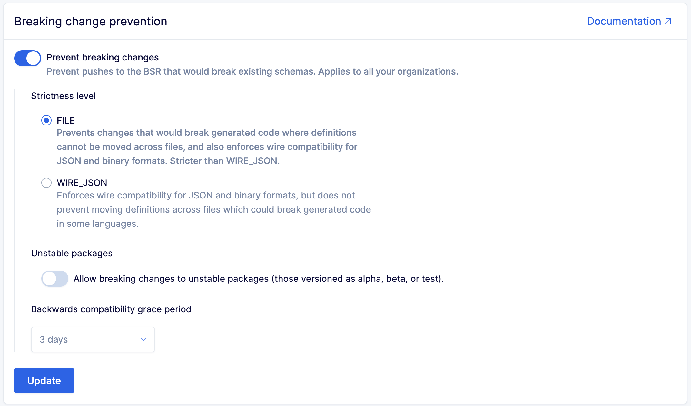

---

head:
  - - link
    - rel: "canonical"
      href: "https://bufbuild.ru/docs/bsr/policy-checks/breaking/setup/"
  - - link
    - rel: "prev"
      href: "https://bufbuild.ru/docs/bsr/policy-checks/breaking/overview/"
  - - link
    - rel: "next"
      href: "https://bufbuild.ru/docs/bsr/policy-checks/breaking/review-commits/"
  - - meta
    - property: "og:title"
      content: "Setup - Buf Docs"
  - - meta
    - property: "og:image"
      content: "https://buf.build/docs/assets/images/social/bsr/policy-checks/breaking/setup.png"
  - - meta
    - property: "og:url"
      content: "https://bufbuild.ru/docs/bsr/policy-checks/breaking/setup/"
  - - meta
    - property: "og:type"
      content: "website"
  - - meta
    - property: "og:image:type"
      content: "image/png"
  - - meta
    - property: "og:image:width"
      content: "1200"
  - - meta
    - property: "og:image:height"
      content: "630"
  - - meta
    - property: "twitter:title"
      content: "Setup - Buf Docs"
  - - meta
    - property: "twitter:image"
      content: "https://buf.build/docs/assets/images/social/bsr/policy-checks/breaking/setup.png"
  - - meta
    - name: "twitter:card"
      content: "summary_large_image"

---

# Breaking change policy check – Setup

::: warning
This feature is only available on the Enterprise plan.
:::

This page describes how to enable and disable the [breaking change policy check](../overview/) on your private BSR instance. You must be a BSR administrator to access these settings.

## Setup

To enable instance-wide breaking change prevention on your BSR instance:

1.  Go to the admin panel and select **Breaking changes** in the **Settings** section of the menu.

    

2.  Click the **Prevent breaking changes** toggle. This enables both the breaking change policy check and the review flow.
3.  Select the strictness level of breaking changes you want to enforce: **FILE** or **WIRE_JSON**.
4.  To ignore breaking changes in unstable packages, click the **Unstable packages** toggle.
5.  Click **Update** to save your settings.

## Disabling the breaking change policy check

If your organization decides to disable this feature, we require that all pending commits be approved or rejected prior to disabling, to prevent you from having "dangling" pending commits. To make this easy, we've added bulk approve and reject functionality to the BSR admin panel. From the admin panel, BSR admins can see all of the repositories with commits still in review. They can choose to bulk approve or reject remaining commits, or click into the repository itself to review the remaining commits more carefully.

When no commits are left pending on the instance, the review flow can be disabled from the admin panel:

1.  Go to the admin panel and select **Breaking changes** in the **Settings** section of the menu.
2.  Turn the **Prevent breaking changes** toggle off.

After disabling the breaking change policy check, any already-rejected commits are still unavailable to downstream consumers.
