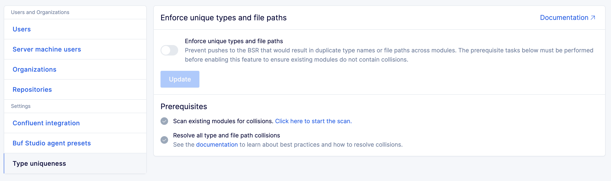
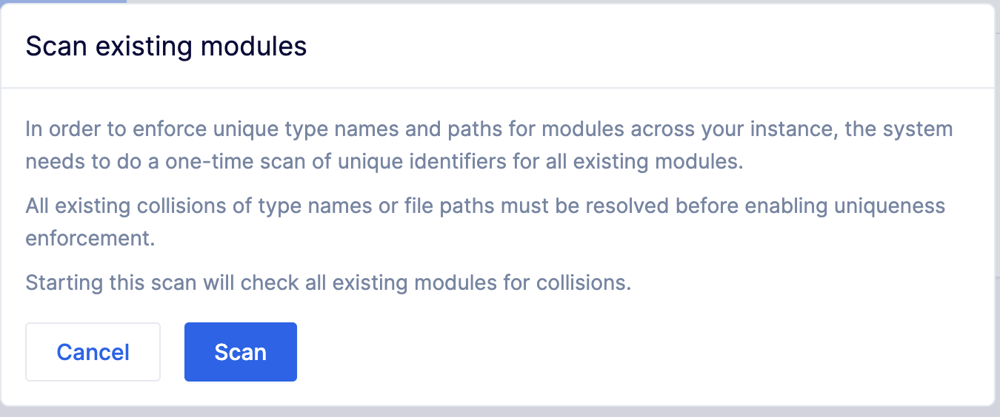
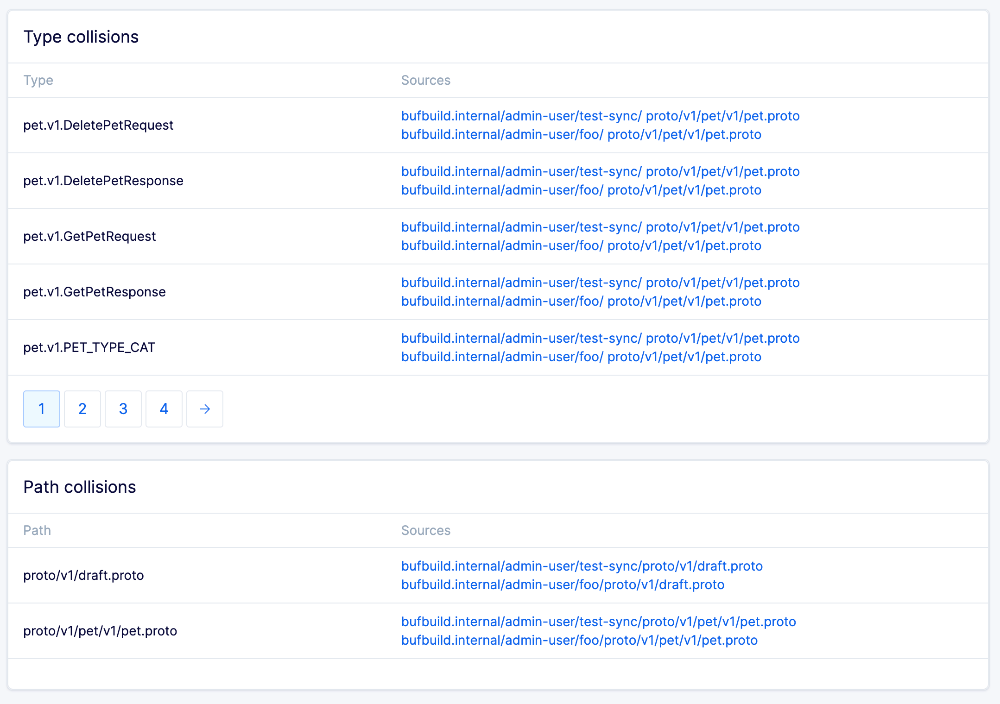
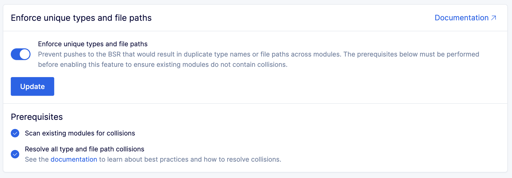

---

head:
  - - link
    - rel: "canonical"
      href: "https://bufbuild.ru/docs/bsr/policy-checks/uniqueness/"
  - - link
    - rel: "prev"
      href: "https://bufbuild.ru/docs/bsr/policy-checks/breaking/review-commits/"
  - - link
    - rel: "next"
      href: "https://bufbuild.ru/docs/bsr/csr/overview/"
  - - meta
    - property: "og:title"
      content: "Uniqueness - Buf Docs"
  - - meta
    - property: "og:image"
      content: "https://buf.build/docs/assets/images/social/bsr/policy-checks/uniqueness.png"
  - - meta
    - property: "og:url"
      content: "https://bufbuild.ru/docs/bsr/policy-checks/uniqueness/"
  - - meta
    - property: "og:type"
      content: "website"
  - - meta
    - property: "og:image:type"
      content: "image/png"
  - - meta
    - property: "og:image:width"
      content: "1200"
  - - meta
    - property: "og:image:height"
      content: "630"
  - - meta
    - property: "twitter:title"
      content: "Uniqueness - Buf Docs"
  - - meta
    - property: "twitter:image"
      content: "https://buf.build/docs/assets/images/social/bsr/policy-checks/uniqueness.png"
  - - meta
    - name: "twitter:card"
      content: "summary_large_image"

---

# Uniqueness check

This feature is only available on the Enterprise plan.

BSR administrators can configure their instances to require that all Protobuf file paths and type names remain unique across modules. Enabling this feature causes the BSR to reject any pushes that introduce violations to this rule.

::: tip NoteWhen checking for unique file paths and type names, the BSR ignores the [Buf-managed modules](../../admin/instance/managed-modules/), given that their sources aren't managed by Buf nor by the BSR administrators or users.This allows BSR users to maintain their own copies of any of those modules, and/or reuse some of those file paths.The BSR does report collisions across 2 or more user-managed modules, even if those file paths or type names are also present in the Buf-managed modules.

:::

Enabling the instance-wide uniqueness check is a three-step process:

1.  Scan your existing modules to check for non-unique identifiers (collisions).
2.  Resolve the collisions and re-push modules to the BSR.
3.  Once there are no remaining collisions, enable the uniqueness check in the Admin panel to prevent new collisions from occurring.

## Scan for collisions

The scan checks all modules in your BSR instance.

1.  Go to the Admin panel and select **Type uniqueness** in the **Settings** section of the menu. If your BSR instance is `https://buf.example.com`, it's available at `https://buf.example.com/admin/uniqueness`.
2.  Click the link in the **Prerequisites** section to start the scan, then confirm in the prompt window that appears.

The BSR then scans all modules in your BSR instance to create a list of all fully qualified names and `.proto` file paths. When the scan is complete, you’ll see separate lists of any type and path collisions that exist in your schemas. Each of these needs to be resolved and then re-pushed to the BSR before uniqueness can be enforced across your instance.

## Resolve collisions

To resolve these collisions, you need to adjust the colliding type names or paths and make new commits. Our [style guide](../../../best-practices/style-guide/) and recommendations on [package](../../../reference/protobuf-files-and-packages/#packages) and [file naming](../../../reference/protobuf-files-and-packages/#file-paths) can help you determine how to resolve these collisions.In brief, there are two common ways to resolve collisions:

1.  **Rename the package**. The best place to start is to ensure that packages are uniquely named. This should resolve almost every collision. To paraphrase our documentation, follow a basic package naming convention of `{organization/user}.{purpose}.{version}`. So even if there are many instances of `Address`, `User`, or other common names, they’ll be uniquely identifiable by the package they’re in, such as `company.inventory.v1.Address` or `company.register.v1.Address`.
2.  **Rename files to follow package naming**. If you've followed the first step, the next most organic change is to align file names/paths with the packages. For example, if you have a `company.inventory.v1.Address` message in a file `address.proto`, move this to the path `company/inventory/v1/address.proto`.

For more in-depth recommendations, **refer to the [style guide](../../../best-practices/style-guide/).**

## Enable uniqueness check

Once the prerequisites are met, the feature toggle is enabled.

1.  Go to the Admin panel and select **Type uniqueness** in the **Settings** section of the menu.
2.  Click the **Enforce unique types and file paths** toggle, and press the **Update** button to apply the change.

The uniqueness check is now enabled for your instance, and the BSR blocks any attempted commits that include collisions.
