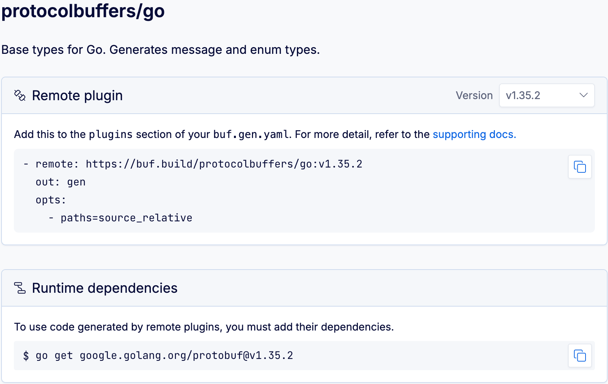

# Remote plugins – Overview

Buf's remote plugins remove a key obstacle to generating code from Protobuf files — `protoc` plugins are developed across many languages, and manual installation is inconsistent as a result. Managing and maintaining a stable environment on a single machine is hard enough, and the problem is compounded as you scale out code generation across many developers.

Instead of maintaining plugins locally, remote plugins enable you to reference `protoc` plugins hosted in the Buf Schema Registry (BSR) in your `buf.gen.yaml` files. Buf verifies and maintains these copies of the plugins commonly used across the Protobuf ecosystem.

Remote plugins can't be used offline because they're run in Docker containers on our servers. When you run `buf generate`, we copy your `.proto` files to the BSR, then run a Docker container to execute the plugin and send back generated code. This means that remote plugins require you to be connected to the BSR.

## Finding remote plugins

To discover all publicly available plugins, go to [buf.build/plugins](https://buf.build/plugins):

1.  Choose a collection or language:

    

    Plugins without an associated language or collection appear in the **Other** category at the bottom of the filter panel.

2.  Click through to the group you want, and all available plugins display:

    

3.  Choose the plugin you want to use, and it provides the reference to add to `buf.gen.yaml` and installation instructions for any dependencies:

    

Use the dropdown to change the version if needed. To use the latest version, remove the version number from the reference.

## Using remote plugins

Using a plugin is as simple as referencing it in your `buf.gen.yaml` config file. Copy the YAML reference provided by the BSR and add it into the `plugins` key of your `buf.gen.yaml` file — for example:

::: info buf.gen.yaml

```yaml{4,8}
version: v2
plugins:
  # Use protoc-gen-go at v1.35.2
  - remote: buf.build/protocolbuffers/go:v1.35.2
    out: gen/go
    opt: paths=source_relative
  # Use the latest version of protoc-gen-go-grpc
  - remote: buf.build/grpc/go
    out: gen/go
    opt: paths=source_relative
```

:::

Then invoke `buf generate` and you're done — no maintaining these plugins, no worrying about how to download or install them. You've generated your stubs and can get back to solving real problems.

See the [`buf.gen.yaml` reference](../../configuration/v2/buf-gen-yaml/) for more information about the other keys under `plugin`.

If you don't specify a plugin version, the latest version is used to generate. To avoid unexpected updates and possible breaking changes, pin to a specific version.

## Request a public plugin

If you'd like a Protobuf plugin to be added to the Buf Schema Registry, [open an issue](https://github.com/bufbuild/plugins/issues/new?assignees=&labels=Feature&template=plugin-request-for-buf-schema-registry.md&title=Plugin+request+for+Buf+Schema+Registry).
