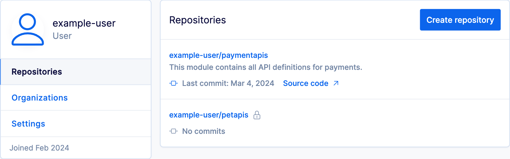

---

head:
  - - link
    - rel: "canonical"
      href: "https://bufbuild.ru/docs/bsr/repositories/"
  - - link
    - rel: "prev"
      href: "https://bufbuild.ru/docs/bsr/quickstart/"
  - - link
    - rel: "next"
      href: "https://bufbuild.ru/docs/bsr/commits-labels/"
  - - meta
    - property: "og:title"
      content: "Repositories - Buf Docs"
  - - meta
    - property: "og:image"
      content: "https://buf.build/docs/assets/images/social/bsr/repositories.png"
  - - meta
    - property: "og:url"
      content: "https://bufbuild.ru/docs/bsr/repositories/"
  - - meta
    - property: "og:type"
      content: "website"
  - - meta
    - property: "og:image:type"
      content: "image/png"
  - - meta
    - property: "og:image:width"
      content: "1200"
  - - meta
    - property: "og:image:height"
      content: "630"
  - - meta
    - property: "twitter:title"
      content: "Repositories - Buf Docs"
  - - meta
    - property: "twitter:image"
      content: "https://buf.build/docs/assets/images/social/bsr/repositories.png"
  - - meta
    - name: "twitter:card"
      content: "summary_large_image"

---

# Repositories

Buf Schema Registry (BSR) _repositories_ allow you to share your Protobuf schemas with your team, customers, or the wider Buf community, and are the basis of all of the BSR's features and shareable artifacts. This page describes the relationship between repositories, [modules](../../cli/modules-workspaces/), and [labels](../commits-labels/), and how repositories interact with the BSR's governance features.A BSR repository is a remote location representing a module's commits, labels, and label histories. Repositories are similar to a version control system (VCS) in that you can see the commits, labels, and diffs for your modules, but they only exist in the BSR. You can't clone or fork them, and they're meant to be used alongside your VCS. Each repository has a 1:1 relationship with a Buf module, represented by the module's `name` key. The `name` shows the module's BSR location and ownership:

::: info Module/repository name syntax

```text
https://BSR_INSTANCE/OWNER/REPOSITORY

# Examples
https://buf.build/acme/petapis       # Teams or community member on the public BSR
https://example.buf.dev/acme/petapis # Pro subscription with custom subdomain on 'buf.dev'
https://buf.example.com/acme/petapis # Enterprise subscription with custom domain
```

:::

The URL contains these elements:

- _BSR_INSTANCE_ is the DNS name for the server hosting the BSR. This is the public BSR instance at `buf.build` unless you're on the Pro or Enterprise plan, in which case it's your private BSR instance's custom domain.
- _OWNER_ is either a user or organization within the BSR ecosystem.
- _REPOSITORY_ is storage for all versions of a single module.

## Access and ownership

Repositories can be owned by either _users_ or _organizations_. Organizations often represent teams within a company that own the schemas contained in the repository and control access to them, both within the BSR and in their VCS. See [Roles](../admin/roles/) for more detail about access controls in the BSR.Repositories can be updated by two types of users: _admins_ and _contributors_. Contributors have write access and can push commits to the repository. Admins can additionally change the settings of the repository itself. See [Manage repositories](../admin/manage-repositories/) for more detail about these settings.

## Visibility

Repositories are either public or private with respect to your BSR instance (either the public BSR instance at [https://buf.build](https://buf.build) or a private server at a custom domain owned by your organization). Visibility maps out as follows:

| Repository | Public BSR                                                                                                          | Private BSR                                                                                                                  |
| ---------- | ------------------------------------------------------------------------------------------------------------------- | ---------------------------------------------------------------------------------------------------------------------------- |
| Public     | All users with access to buf.build can view and import this repository; only repo owners and contributors can edit. | All users with access to the private server can view and import this repository; only repo owners and contributors can edit. |
| Private    | Only repo owners and contributors can view, import, and/or edit.                                                    | Only repo owners and contributors can view, import, and/or edit.                                                             |

::: tip NoteIf you want to share modules with the wider Buf community, push them to the public BSR with public visibility.

:::

## Metadata

Each repository has an optional source code URL and description that you can add from the settings page. Adding this information helps others understand the purpose of the repository and navigate to the source code in the VCS if needed. Both fields appear in a user's list of repositories they have access to:

## Default label

Each BSR repository has a default label that's used by default in BSR web UI and CLI operations for a repository unless another label or commit is explicitly selected or specified.

- [References to a module](../../cli/modules-workspaces/#referencing-a-module) that don't specify a particular commit or label resolve to the latest commit on the default label.
- New commits pushed to the BSR are automatically assigned to the default label if no other label is provided. However, we recommend explicitly associating labels when pushing instead of relying on the default label.
- A commit made to a label that's the default label at the time of push becomes the latest released commit for [generated SDKs](../generated-sdks/overview/).

The initial default label for a repository is `main`.**We recommend [setting the default label name](../admin/manage-repositories/#change-default-label) to match the name of the branch in your VCS that you release from.** For companies doing continuous deployment, this is usually the default branch in your VCS. This is so that:

- Dependency references resolve by default to what's released.
- Users browsing docs on the BSR see what's released.
- Dependency automation tools (for example [Dependabot](https://github.com/dependabot), [Renovate](https://github.com/renovatebot/renovate)) automatically keep clients updated with the latest released version of [generated SDKs](../generated-sdks/overview/).

### Name change restrictions

There are some restrictions on changing the default label.

- You can only change the default label to point to a label that exists and isn't [archived](../commits-labels/#archived-labels).
- You can't change the default label if [policy checks](../policy-checks/breaking/overview/) are enabled.
- If [Confluent Schema Registry (CSR)](../csr/overview/) integration is enabled, you can't update the default label to another label if the latest commit on the other label doesn't pass CSR compatibility checks relative to the latest commit on the current default label.

## Related docs

- Learn how to [create and manage repositories](../admin/manage-repositories/).
- Find out how to [push modules to the BSR](../module/publish/).
- Read about how the BSR handles [commits and labels](../commits-labels/).
