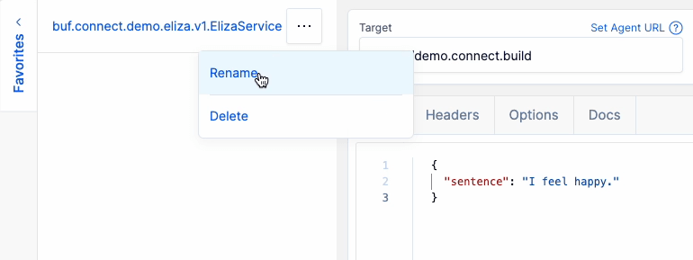

# Explore your APIs in Buf Studio

[Buf Studio](https://buf.build/studio) is an interactive web UI for all your gRPC and Protobuf services stored on the Buf Schema Registry. With Buf Studio you can:

- Select an endpoint from any BSR module to send requests to either gRPC or [Connect](https://connectrpc.com) APIs.
- Use the editor with schema-based autocompletion, validation and documentation to draft JSON based request messages.
- Configure headers to further customize outgoing requests.
- Optionally include cookies in outgoing request to send authenticated requests to private APIs (or Buf Studio Agent instances).
- Create shareable links for requests defined on Buf Studio to team members with access.

## Composing requests

Start by selecting the Protobuf method you want to make a request with. With the **Select Method** menu you can choose a BSR module and use Buf Studio's fuzzy search to select the desired service and method for you request:


Note that the streaming endpoints are currently greyed out as Buf Studio currently only supports unary RPC. We intend to support streaming RPC in the future.

Once you've selected your RPC, declare the **target URL** of the Protobuf API that you're looking to make a request to. This shouldn't include the service or RPC path, which Buf Studio wills append based on your selected RPC definition.


Once you've configured your RPC and target URL, create the payload of your request using the Buf Studio's built-in editor. Based on the schema for your RPC's request message, the editor gives you:

- Autocompletion: use Ctrl+Space to trigger suggestions.
- Validation: invalid field types, invalid JSON, etc. The editor underlines the invalid region.
- Documentation: hover over fields, or use the "Docs" tab above the editor to view documentation for the Protobuf definition.


You can also set the headers for your request. This can be useful for any metadata you want to send through, authorization headers, etc.


## Sending requests

Once you've composed the request and are ready to call the API, Buf Studio can send it in two ways:

1.  Directly from your browser to the target API, or
2.  From your browser through a Buf Studio Agent proxy to the target API.

By making requests directly from the browser your requests stay private to you, in neither case the request is routed through Buf servers.

### Request from browser

Without Buf Studio Agent, requests are made directly from the browser using the standard `fetch()` API. This works great in combination with browser compatible Protobuf servers such as [Connect](https://connectrpc.com/).

```
sequenceDiagram
    participant St as Studio
    participant S as Server (Target URL)
    St->>S: fetch({request headers and body})
    S->>St: {response headers and body}
```

The server should be setup with a [CORS (Cross-Origin Resource Sharing)](https://developer.mozilla.org/en-US/docs/Web/HTTP/CORS) policy permitting requests from `https://buf.build`. CORS is a standard HTTP mechanism used to indicate to browsers which origins are allowed to request a resource. CORS has a variety of options and can be configured easily in most popular server libraries and reverse proxies, it requires servers to respond with the following header to make studio be able to receive a response:

```text
Access-Control-Allow-Origin: https://buf.build
```

::: tip Private BSR instances
If you are on a Pro or Enterprise plan, your server needs to be configured to respond with an `Access-Control-Allow-Origin` header that points to the instance of Buf Studio on your private BSR instance instead of the public BSR.
:::

This enables it to make requests directly to your private production environment using the Connect protocol. For example:

```text
Access-Control-Allow-Origin: https://buf.example.com
```

For a more specific implementation example, see the [Connect RPC CORS documentation](https://connectrpc.com/docs/cors/).

### Request via Buf Studio Agent

Buf Studio agent is tool that can be used to expand the use of Buf Studio to protocols and servers normally out of reach for browsers. It's OSS that ships as part of the Buf CLI and uses [Connect-Go](https://github.com/connectrpc/connect-go) to implement a small proxy to unlock this extra functionality.

With Buf Studio Agent, the request flow is as follows:

```
sequenceDiagram
    participant St as Studio
    participant Sa as Studio Agent
    participant S as Service (Target URL)
    St->>Sa: fetch({request headers and body})
    Sa->>S: {request headers and body}
    S->>Sa: {response headers and body}
    Sa->>St: {response headers and body}
```

When using Buf Studio Agent, Buf Studio can now also reach:

- **gRPC servers:** The gRPC protocol can't be used with any major browser, but Buf Studio Agent can. Communication between Buf Studio Agent and Buf Studio is handled with a protocol understandable by browsers, which Buf Studio Agent dynamically reframes to communicate with the target server.
- **Servers without the required CORS configuration:** Because CORS is a browser-specific limitation, Buf Studio Agent can issue requests to any server. The required CORS config is built into Buf Studio Agent by default, so the browser can reach Buf Studio Agent which forwards your request to the target server.

To use Buf Studio Agent, configure the Buf Studio Agent URL in the UI with a URL to a running instance of Buf Studio Agent:


For more information on running Buf Studio Agent, see the [reference section](#reference-studio-agent-flags) below.

## Saving requests

Depending on request complexity, composing a well-formed and complete payload can take time and effort. To avoid repeatedly composing requests, you can save them to your profile for later reuse.

To save requests to your Favorites, first make sure you are logged in. All requests in the History section have a star icon, and clicking on it allows you to preserve the target url, request body, headers, and protocol.


All Favorites appear on the left side of the editor, where you can rename, delete, or populate them back into the editor.



Once you load a Favorite back to the editor, you can modify it before sending it again.


And as with any other request in-editor, you can share it with anyone using the “Share” button.


## Advanced setup

### Cookies

Some APIs use cookies to authenticate requests. You can configure Buf Studio to include cookies with your requests by checking the following option:


Cookies for the target URL need to contain `SameSite=None; Secure` to be included in requests from Buf Studio. Servers that accept cross-origin cookies for authentication should also use CORS to indicate to the browser that Studio requests may include credentials by using the `Access-Control-Allow-Credentials` header:

```text
Access-Control-Allow-Origin: https://buf.build
Access-Control-Allow-Credentials: true
```

Note: allowing credentials puts limitations on other CORS features such as using a wildcard for allowable response headers. Refer to the [CORS](https://developer.mozilla.org/en-US/docs/Web/HTTP/CORS) documentation on to understand the requirements.

### Buf Studio Agent presets

::: warning
This feature is only available on the Pro and Enterprise plans.
:::

In your private BSR instance, admins can create preset URLs for Studio Agents. This is done through the admin panel.


Presets have an optional “Name” that can be set to alias the URL.


Presets are then presented to users on your BSR in the dropdown menu. They can select from the presets or provide their own Buf Studio Agent URL.


### Long-running Buf Studio Agent instances

::: warning
This feature is only available on the Pro and Enterprise plans.
:::

At Buf we deploy long-running Buf Studio Agent instances within our internal infrastructure. Their endpoints are protected by SSO and combined with the Cookies option described above this allows us to reach any public or internal Protobuf endpoint from Buf Studio. Together with our public and private APIs on the BSR, this setup allows us to test and debug any endpoint with ease.

This section describes how to set up your Buf Studio and Buf Studio Agent instances to be long-running for your auth setup and make authenticated requests.

For example, you'd like to allow a request from an authenticated user, however, you want to restrict the user's ability to set custom authentication headers:


The user can forward their cookies from Buf Studio with the following setting:


The following is an example of a Dockerfile for a long running Buf Studio Agent instance:

```dockerfile
FROM bufbuild/buf:latest

ENTRYPOINT /usr/local/bin/buf beta studio-agent --timeout=0s \
  --bind=${BUFSTUDIOAGENTD_BIND} \
  --port=${BUFSTUDIOAGENTD_PORT} \
  --origin=${BUFSTUDIOAGENTD_ORIGIN} \
  --log-format=json
  --forward-header=authorization=authorization \
  --disallowed-header authorization
```

- `--forward-header=${auth-header}=${auth-header}`: This takes the `${auth-header};` from the originating request, in this case, set by the edge after validating the user's cookies, and forward it on the request made by Buf Studio Agent.
- `--disallowed-header ${auth-header}`: This strips `${auth-header}` if the user attempts to configure a custom value for `${auth-header}` in their request configuration.

With both configurations, the user won't be able to set their own `${auth-header}` value, but Buf Studio Agent validates and forwards the value from their cookies.

This results in the following flow:

```
sequenceDiagram
    actor U as User (Studio)
    participant E as Edge to Production Env
    participant Sa as Buf Studio Agent
    participant PS as Production Service (Target URL)
    Note over E: Handles ingress to Production and populates ${auth-header}
    U->>E: {request body and headers};
    rect rgb(191, 223, 255)
        Note right of E: Production Environment
        E->>Sa: {request body and headers + ${auth-header}};
        Sa->>PS: {request body and headers + ${auth-header}};
        PS->>Sa: {response body and headers};
        Sa->>E: {response body and headers};
    end
    E->>U: {response body and headers};
```

## Reference: Buf Studio Agent flags

Buf Studio agent is included in the Buf CLI under `buf beta studio-agent`. This runs an HTTP(S) server that forwards requests from the Buf Studio to the target URL.

`buf beta studio-agent` is available in CLI versions v1.5.0+

#### `buf beta studio-agent`

- Buf Studio Agent starts HTTP(S) server on the host and port provided:
  - `bind` - the hostname to bind to, defaults to `127.0.0.1`
  - `port` - the port to bind to, defaults to `8080`
- Buf Studio Agent can be configured to make TLS requests
  - `ca-cert` - The CA cert used in the client and server TLS configuration.
  - `client-cert` - The cert used in the client TLS configuration.
  - `client-key` - The key used in the client TLS configuration.
  - `server-cert` - The cert used in the server TLS configuration.
  - `server-key` - The key used in the server TLS configuration.
- Buf Studio Agent can be configured to trim disallowed headers from an incoming Buf Studio request (for example authorization headers, etc.)
  - `disallowed-header` - Disallowed header keys. Multiple headers are appended if specified multiple times.
- Buf Studio Agent can be configured to forward specific headers
  - `forward-header` - Forward headers are set in the format of `--forward-header=fromHeader=toHeader`. Multiple headers are append if specified multiple times.
- Buf Studio Agent can be configured to set specific accepted origins for CORS policies
  - `origin` - Allowed origin for CORS, defaults to "buf.build"
- For a long-running instance of Buf Studio Agent, an indefinite timeout needs to be set with `--timeout=0s`.

## FAQs

### How do I encode a bytes field in Studio?

The text area in Studio accepts the Protobuf JSON format. To set a `bytes` field, encode the data into a string using Base64.
