# Network architecture

Bufstream runs entirely air-gapped within your VPC, including object storage and your preferred metadata service. Bufstream doesn't reach out beyond the boundaries of the VPC for any purpose, including to report metrics or calculate billing and usage data.

## Overview

In a typical Bufstream cluster, each broker connects to the cluster’s object and metadata storage. Brokers within the same zone only interconnect with other brokers within the local availability zone, sharing work such as [sequencing](../kafka-flow/#produce-data-flow), [cashiering](../kafka-flow/#produce-data-flow), and [cleaning](../kafka-flow/#vacuum). Kafka clients configured with an availability zone only try to connect to zone-local brokers. This zone-aware routing ensures inter-zone network traffic is minimized to control for costs.



## Bootstrap servers and advertised listeners

Kafka client applications discover Kafka brokers via metadata requests to "bootstrap servers," then make direct calls to servers based on which partition leaders the client is targeting. The metadata is periodically (or on exception) refreshed from the bootstrap servers and includes what are known as the "advertised listeners" representing the externally resolvable and routable names or IPs used by clients. A similar request is made for Kafka consumers to find the coordinator of consumer groups. Unlike Kafka, Bufstream has neither partition leaders nor specific consumer group coordinators — any broker can handle any request.

In Bufstream, the advertised listener value can all be the same or different, depending on how traffic is routed from the client. Largely speaking, there are two scenarios:

1.  Client applications inside of the same Kubernetes where Bufstream is deployed
2.  Client applications outside of the Kubernetes (or the Kubernetes where Bufstream is deployed)

There is a variation of both these scenarios where clients should only talk to their zone-specific Bufstream brokers or zone-specific load balancers.

## Client applications inside the same Kubernetes

In the simplest scenario, client applications run within the same Kubernetes cluster as the Bufstream service and can connect to any of the Bufstream brokers directly via the pod names. The bootstrap server can be any of the Bufstream pods’ names or a cluster IP service fronting those pods.

### Deployment architecture

```
---
config:
  layout: dagre
---
graph LR
      subgraph S1["Kubernetes Cluster"]
      direction LR
      A["Client Application"] -->|Metadata Request| B["Cluster IP Service"]
      B --> C["Bufstream Broker 1"]
      B --> D["Bufstream Broker 2"]
      B --> E["Bufstream Broker 3"]

      C -- Metadata Response --> B
      B -- Metadata Response --> A
      A -- Produce --> D
      A -- Fetch --> E
      end
```

### Deployment steps

The steps below show how to deploy the Bufstream brokers with or without a Kubernetes Cluster IP service and how to configure the client applications to talk to the brokers correctly.

1.  **Deploy Bufstream in Kubernetes:** Deploy Bufstream using Helm or your preferred method.
2.  **Utilize Kubernetes service discovery:** Client applications within the cluster can connect to the Bufstream pods directly or via a Cluster IP service as required.
3.  **Configure client applications:** Client applications running within the same Kubernetes namespace as Bufstream can use Bufstream's service name as the bootstrap server (e.g., bufstream-cluster-ip-service:9092) and will receive some version of the bootstrap servers. There will be one for each broker and may be slightly modified (changing the case of certain letters) in order to trick the clients into opening new connections to them.

## Client applications outside the same Kubernetes

In this scenario, client applications reside outside the Kubernetes cluster where Bufstream is deployed. This could mean applications in a separate Kubernetes cluster, on virtual machines, or in other environments.

### Deployment architecture

```
---
config:
  layout: dagre
---
flowchart LR
    A["Client Application"] -->|Metadata Request| B["Load Balancer"]
    B -->|Metadata Request| D["Bufstream Broker 1"]
    B -- Produce --> E["Bufstream Broker 2"]
    B -- Fetch --> F["Bufstream Broker 3"]

    D -->|Metadata Response| B
    B -->|Metadata Response: bufservice.example.com:9092 bufservice.example.com:9092 bufservice.example.com:9092 | A

    subgraph C["Kubernetes Cluster"]
      direction TB
      D
      E
      F

    end
```

### Deployment steps

The steps below show how to deploy Bufstream brokers behind a load balancer, configuring the correct advertised host name, and also how to configure the client applications to talk to the brokers via the advertised host name.

1.  **Deploy Bufstream in Kubernetes:** Deploy Bufstream using Helm or your preferred method.
2.  **Configure a load balancer:** Set up headless service name for Bufstream pods or an external load balancer (e.g., AWS Network Load Balancer, Google Cloud Load Balancer, or Azure Load Balancer) that points to the the pods within the Kubernetes cluster. For cloud-specific examples, follow the instructions from the [deployment guides](../../deployment/).
3.  **Set `publicAddress` in `bufstream-values.yaml` and run helm update:** The Bufstream cluster needs to advertise its public address to clients. Make sure the address advertised is the same as the one that the clients are connecting to by adding the following configuration to `bufstream-values.yaml`, using the DNS name of the load balancer fronting the Bufstream pods:

    ::: info bufstream-values.yaml

    ```yaml
    kafka:
      publicAddress:
        host: <DNS name of the load balancer>
        port: 9092
    ```

    :::

    A variation of this for zone-aware routing, where a client only communicates with brokers in its zone, could use a Helm values file per zone where the host would be its zone-specific advertised host. For a detailed example, refer to the [zonal deployment docs](../../deployment/aws/deploy-postgres/#zonal-deployment).

4.  **Apply configuration:** Run the Helm upgrade command for Bufstream to update the public address:

    ```console
    helm upgrade bufstream oci://us-docker.pkg.dev/buf-images-1/bufstream/charts/bufstream \
      --version "<version>" \
      --namespace=bufstream \
      --values bufstream-values.yaml
    ```

5.  **Configure client applications:** Configure the Kafka client libraries in your external applications to connect to the load balancer’s DNS name and port 9092.

### Key considerations

- **Load balancers:** While not always required for internal traffic, load balancers can still be used for internal routing or to expose Bufstream services to other namespaces.
- **Security:** Implement appropriate security measures, such as network policies within Kubernetes and secure communication protocols (TLS) where necessary.
- **Monitoring:** Set up monitoring for Bufstream brokers and the load balancer to ensure proper functioning and identify potential issues.
- **Helm chart:** Ensure you use the most recent Helm chart by specifying `--version` or by letting the chart deploy the latest version.
- **`<version>`:** Replace the `<version>` with the version you want to deploy. Replace the `<DNS name of the NLB address>` with your load balancer DNS name.
