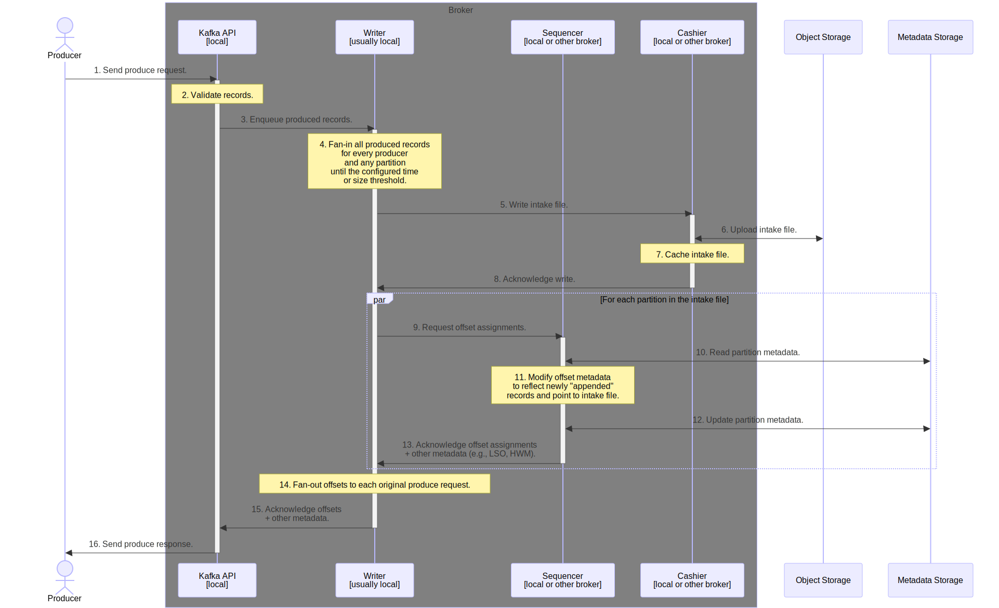
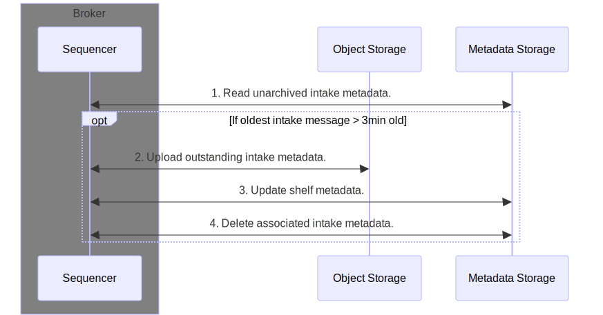
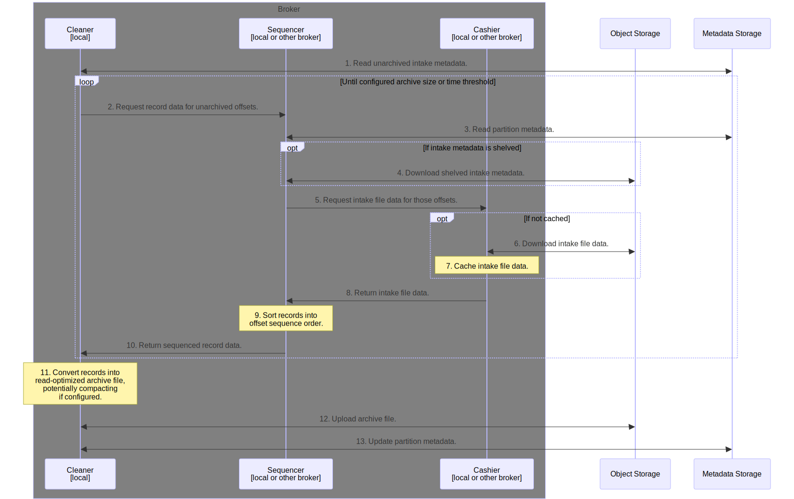
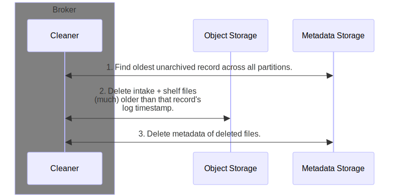
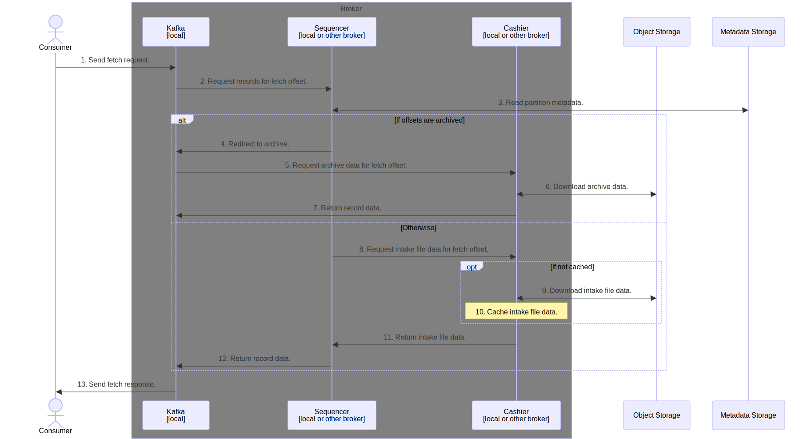

# Kafka data flow

This page describes how Bufstream combines object storage (for example, AWS S3 or Google Cloud Storage) and a metadata coordination service such as PostgreSQL to support Kafka's produce and consume data flows.

## Produce data flow

From a client’s perspective, producing to Bufstream is identical to producing to Apache Kafka. The key difference is that in a Bufstream cluster any broker can take a produce request for any topic and partition; there are no partition leaders. Brokers fan-in all produce requests regardless of topic and partition into a single, heterogeneous, write-optimized intake file. This file is uploaded to object storage, and information about its contents are added to the metadata storage. The produce isn't acknowledged to the client until both writes succeed, guaranteeing no data is lost.

### Shelf

Tracking record offsets requires an entry in the metadata storage for each partition included within each intake file. If archiving is lagging behind the produce rate, metadata growth is unbound. Some metadata storage options have a hard cap on how much data they can contain. For example, etcd has an explicit ceiling of 8GiB of data. To prevent this, intake files that haven't been archived in a configurable amount of time are "shelved." Shelving effectively moves their partition metadata to an archive-like log format in object storage. The information related to shelves is constant per partition, eliminating the risk of unbounded metadata storage growth.

### Archive

Bufstream's intake files are write-optimized and not intended as long-term storage of record data. The system expects for the data to be split out by partition and sequenced into an archival format such as flat Kafka-like log files or Parquet files with Iceberg table metadata. When the configured unarchived intake size or time threshold is reached per partition, the broker begins the archival process. This process never deletes intake or shelf data. This allows for recovery in the face of any errors during archiving.

### Vacuum

As noted above, archiving doesn't delete any data from object storage. To garbage collect unused data, Bufstream regularly performs sweeps to find the oldest unarchived record, and then deletes any intake or shelf files significantly older than that (including metadata). Vacuuming also removes expired archive files older than the retention period of a topic.

## Fetch Data Flow

From a client’s perspective, fetching from Bufstream is identical to fetching from Apache Kafka. Brokers attempt to lookup the fetched offsets in the sequencer, which is most common for clients following the latest records on a topic. The fetch flow is similar to the archiving process. However, if the offset has been archived the broker instead reads the record data from the archive file.

