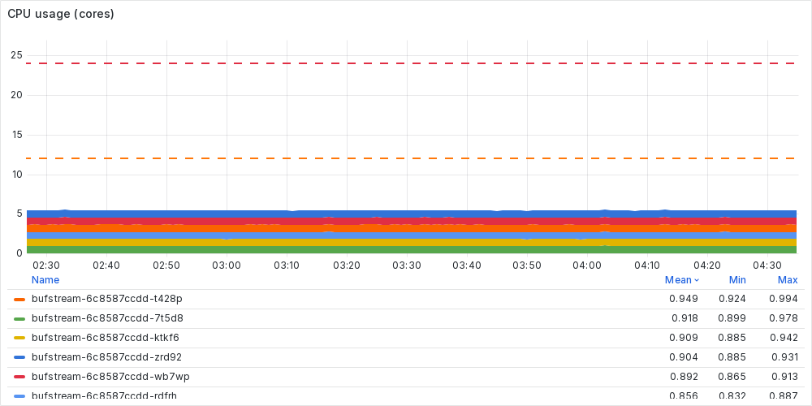
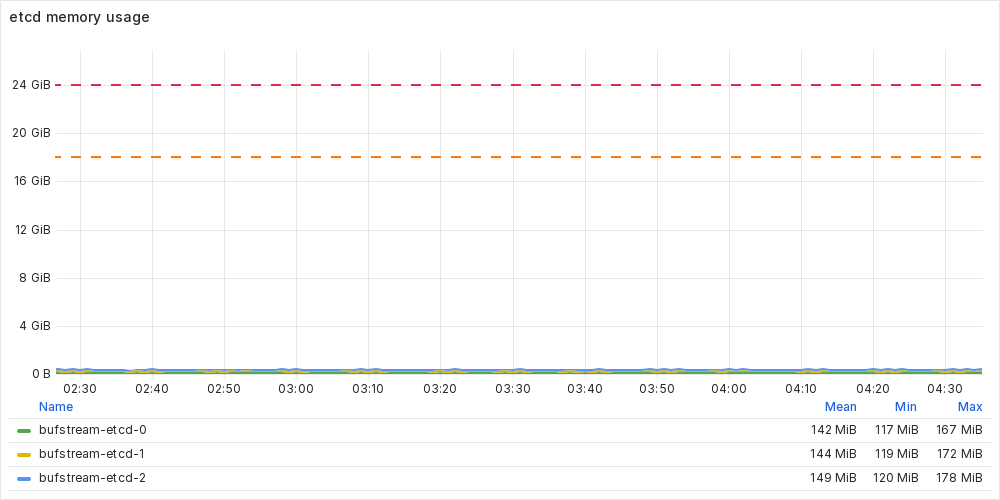
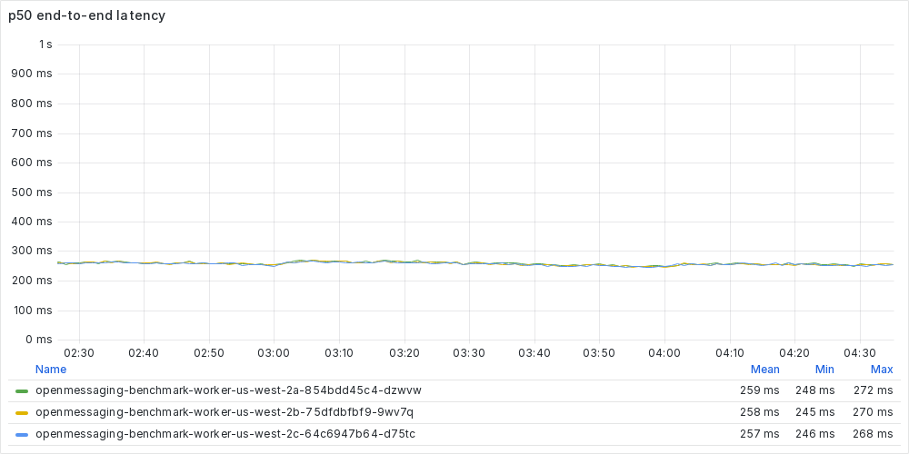

---

title: "Benchmarks and cost - Buf Docs"

head:
  - - link
    - rel: "canonical"
      href: "https://bufbuild.ru/docs/bufstream/cost/"
  - - meta
    - property: "og:title"
      content: "Benchmarks and cost - Buf Docs"
  - - meta
    - property: "og:url"
      content: "https://bufbuild.ru/docs/bufstream/cost/"
  - - meta
    - property: "twitter:title"
      content: "Benchmarks and cost - Buf Docs"

---

# Benchmarks and cost

Bufstream is a Kafka-compatible message queue with built-in support for data governance and quality enforcement. But Bufstream isn't just adding features to Apache Kafka—by building from the ground up on cloud object storage, Bufstream is dramatically more cost-efficient to operate. As measured by the [OpenMessaging Benchmark Framework](https://openmessaging.cloud/docs/benchmarks/kafka), **Bufstream is 8x less expensive than Apache Kafka** while remaining fully compatible with existing Kafka clients, tools, and applications.

## The benchmark setup

Bufstream handles a wide variety of workloads with ease, but for this benchmark we chose an industry standard scenario: a single topic with 288 partitions and 1 GiB/s of symmetric reads and writes. This setup doesn't match every real-world workload, but it's the best way to make an apples-to-apples comparison between different message queues and vendors. Using the Open Messaging Benchmark Framework, our workload configuration looked like this:

```yaml
name: bufstream
topics: 1
partitionsPerTopic: 288

messageSize: 1024 # 1 KiB
producerRate: 1048576 # 2^20
producersPerTopic: 64
useRandomizedPayloads: true
randomBytesRatio: 0.25
randomizedPayloadPoolSize: 1024

subscriptionsPerTopic: 1
consumerPerSubscription: 64
consumerBacklogSizeGB: 0

testDurationMinutes: 600
warmupDurationMinutes: 5
```

With this configuration, the benchmarking harness starts 64 producers. In aggregate, they produce 1,048,576 (or 2^20) messages per second, each 1 KiB in size and partially randomized to simulate real-world compressibility. In total, then, the producers send 1 GiB/s of uncompressed data. The consumer configuration is similar, with a single consumer group and 64 consumers.Like most high-throughput benchmarks, we configured the Kafka producers and consumers to send fewer, larger batches:

```yaml
name: bufstream
driverClass: io.openmessaging.benchmark.driver.kafka.KafkaBenchmarkDriver
replicationFactor: 3
reset: false

commonConfig: |
  client.id=zone=${BUFSTREAM_ZONE_HINT},${HOSTNAME}
  bootstrap.servers=bufstream:9092
  request.timeout.ms=120000

producerConfig: |
  linger.ms=100
  # 1 MiB
  batch.size=1048576
  # 128 MiB
  buffer.memory=134217728
  # 64 MiB
  max.request.size=67108864
  compression.type=lz4

consumerConfig: |
  auto.offset.reset=earliest
  enable.auto.commit=true
  # 100 MiB
  max.partition.fetch.bytes=104857600
  fetch.max.bytes=104857600
```

We also configured the clients with an ID that includes their availability zone, allowing Bufstream to minimize inter-zone networking. Off-the-shelf Kafka clients support setting the client ID, but we did have to patch the Open Messaging Benchmark Framework to expose this knob in configuration.

## Predictable performance

We ran this workload against a cluster of 6 Bufstream brokers running on AWS's `m6in.xlarge` instances, which have 4 vCPUs and 16 GiB of memory each. We distributed the cluster evenly across three availability zones, placing two brokers in each zone. With a standard AWS S3 bucket as its primary storage backend, the cluster kept up easily: between our configured workload and some overhead from the Kafka protocol, the cluster handled a sustained write throughput of a bit over 1 GiB/s uncompressed and 256 MiB/s compressed (a 4:1 compression ratio).


Each Bufstream broker used less than 1 of the 4 vCPUs available. Memory usage—mostly driven by an in-memory cache—was less than 75%. We view this as a realistic production configuration, with enough headroom to handle load spikes, poorly configured clients, and opt-in features like [schema enforcement](../data-governance/schema-enforcement/) and [semantic validation](../data-governance/semantic-validation/).



Bufstream uses [etcd](https://etcd.io) as a strongly consistent, distributed metadata store for recently written messages. For this benchmark, we used a 3-node etcd cluster of `m6in.large` instances, which have 2 vCPUs and 8 GiB of memory each. We placed one etcd node in each availability zone. The cluster remained lightly loaded, with each etcd node using less than 0.25 vCPUs and 150 MiB of memory.



Because metadata is shuffled out of etcd and into object storage within a few minutes, the etcd total database size stayed constant at 35 MiB.


Of course, there's no free lunch. Object storage is durable, scalable, and cost-efficient, but it's not as low-latency as local disk. For this benchmark, we used Bufstream's default configuration, which strikes a balance between end-to-end message delivery latency and cost. With that configuration, median end-to-end latency was 260 milliseconds and p99 latency was 500 milliseconds.



For the high-volume analytic workloads that drive most Kafka usage, we think that this latency is more than acceptable—especially because it comes with dramatic cost savings.

## Optimized for cloud economics

**With a 7 day retention period, the Bufstream cluster used in this benchmark costs just $11,147 per month.** That figure assumes deployment in AWS's `us-east` region and includes all costs: compute, storage, inter-zone networking, and Buf's fees.Calculating compute costs is simple. Assuming a 1 year commitment and no up-front payments, AWS charges $890 for the 6 `m6in.xlarge` Bufstream instances and $222 for the 3 `m6in.large` etcd instances, for a total of $1,112 per month.Storage costs are also straightforward. Bufstream brokers don't need EBS volumes and the tiny etcd volumes are effectively free, so S3 costs dominate. To handle the benchmark workload, Bufstream performed approximately 200 S3 operations per second: 125 reads and 75 writes.


This rate and mixture of S3 operations costs $1,127 per month. 1 GiB/s of write throughput with a retention period of 7 days works out to a total of about 591 TiB of uncompressed data at rest. With a 4:1 compression ratio, this should shrink to 148 TiB, plus a bit of extra metadata and expired data that hasn't yet been purged. In practice, the benchmark cluster used 153 TiB of S3 storage at a monthly cost of $3,498. Summing the cost of data and operations, storage costs $4,625 per month.Networking costs are more complex. Nearly all Bufstream traffic stays within a single availability zone and is therefore free. However, Bufstream nodes do communicate with etcd nodes in different zones, and the etcd nodes must communicate with each other. This inter-zone traffic is just metadata, so it's a tiny fraction of the total—approximately 4.5 MiB/s. AWS charges $0.02 per GiB for this traffic ($0.01 for egress, and another $0.01 for ingress), so the monthly networking cost works out to $226.Adding compute, storage, and networking, the total infrastructure cost of the cluster comes to $5,963 per month. To use Bufstream in production, Buf charges a fee of $0.002 per GiB of uncompressed writes. For the benchmark workload, this comes to $5,184 per month, bringing the total cost of ownership to $11,147 per month.

## 8x less expensive than Apache Kafka

How much does it cost to run the same workload on Apache Kafka?Let's start at the deep end and consider networking costs. Cost-conscious engineers enable Kafka's fetch-from-follower functionality, so consumers read from a broker in the same availability zone. However, producers must always write to the partition leader. Two thirds of the time, this leader is in a different availability zone. Our benchmark producers write 1 GiB/s of uncompressed data, so 0.67 GiB/s of this traffic crosses availability zones. But we're not done! The partition leader must also replicate the data to brokers in the other two availability zones. This introduces another 2 GiB/s of inter-zone traffic, for a total of 2.67 GiB/s uncompressed. Assuming the same 4:1 compression ratio we saw in our benchmark, our actual inter-zone traffic drops to 0.67 GiB/s. Over a month, that adds up to 1.66 PiB. At $0.02 per GiB, inter-zone networking costs a whopping $34,732 per month. **Apache Kafka's inter-zone networking _alone_ costs three times as much as a Bufstream cluster.**Unfortunately, we haven't even gotten to the expensive part: persistent volumes. With 1 GiB/s of writes and a 7 day retention period, our data set is 605 TiB uncompressed. Again assuming 4:1 compression, each replica is 151 TiB. We'll need three replicas for durability, so the cluster stores 453 TiB of data. Using the 50% utilization target that [AWS recommends](https://docs.aws.amazon.com/msk/latest/developerguide/msk-autoexpand.html#msk-autoexpand-details), our Kafka cluster needs 906 TiB of EBS storage. To keep broker restarts and partition rebalancing manageable, we don't want each volume to be too large. AWS Managed Streaming for Apache Kafka (MSK) caps EBS volumes at 16 TiB, so we'll do the same and budget for 57 volumes. Since we're assuming a latency-tolerant workload and we're spreading our I/O over so many volumes, we can save money by using spinning disks instead of SSDs. Using `st1` volumes with snapshots disabled, our cluster's EBS volumes cost $42,025 per month.For this workload, storage also drives Kafka's compute footprint. To use our 57 volumes, we'll need 57 brokers. But what instance type should we use? Spread across so many brokers, our benchmark workload isn't particularly demanding. For argument's sake, let's use the `r4.xlarge` instances [commonly recommended](https://www.confluent.io/blog/design-and-deployment-considerations-for-deploying-apache-kafka-on-aws/#choosing-instance-types) as the minimum for production Kafka deployments. Again assuming a 1 year commitment and no up-front payments, we'll pay $8,039 per month.**In total, a comparable Kafka cluster costs $84,796 per month—7.6x the cost of Bufstream.**

## Conclusion

Bufstream supports the full Kafka protocol—including transactions and exactly-once semantics—so it works with off-the-shelf Kafka clients, connectors, and tools. But because it's built to take full advantage of cloud object stores, Bufstream is dramatically more cost-efficient than Apache Kafka. For most workloads, these cost savings are well worth the small increase in latency. And for organizations using Protobuf schemas with Kafka, Bufstream is a powerful lever for improving data quality and governance.
