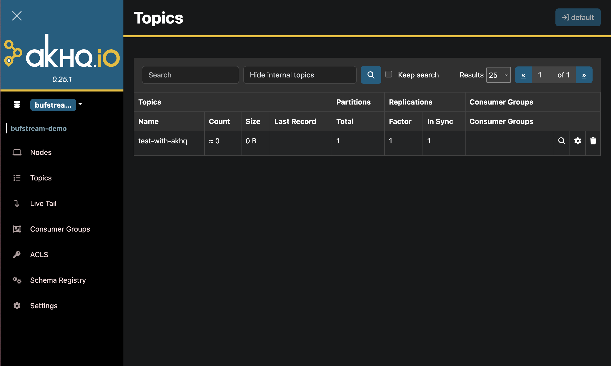

# AKHQ

[AKHQ](https://akhq.io/) is an open source web application that helps you manage, inspect, and debug Kafka-compatible workloads.

## Deploy AKHQ with a production Bufstream cluster

### Prerequisites

- A live Bufstream cluster
- An enterprise deployment of the Buf Schema Registry, with the [Confluent integration](../../../bsr/csr/manage-instances/) enabled (optional)
- A Buf [bot user](../../../bsr/admin/instance/bot-users/) and token (optional)

### Basic configuration

Configuring AKHQ to work with Bufstream requires setting the cluster's bootstrap address and specifying a client ID. The simplest way to do so is by setting `client.id` and `bootstrap.servers` in the AKHQ configuration file (`/app/application.yml` by default).

- Set `bootstrap.servers` to the bootstrap address of your Bufstream cluster.
- Set `client.id` by choosing a unique identifier for AKHQ, then appending `;broker_count=1`. For example, you might choose `akhq;broker_count=1`. This instructs the Bufstream cluster to present itself as a single Kafka broker, allowing AKHQ to display statistics for each topic correctly.

::: info /app/application.yml

```yaml
akhq:
  connections:
    bufstream:
      properties:
        client.id: "akhq;broker_count=1"
        bootstrap.servers: "localhost:9092" # your cluster's bootstrap address
        metadata.recovery.strategy: REBOOTSTRAP
```

:::

### Connecting to the Buf Schema Registry

To display binary Protobuf messages as human-readable JSON, AKHQ can integrate with the [Buf Schema Registry](../../../bsr/). Add the following configuration block to your AKHQ configuration to enable the schema registry:

::: info Add schema registry to /app/application.yml

```yaml
akhq:
  connections:
    bufstream:
      properties:
        client.id: "akhq;broker_count=1"
        bootstrap.servers: "localhost:9092" # your cluster's bootstrap address
        metadata.recovery.strategy: REBOOTSTRAP
    // [!code ++]
    schema-registry:
        // [!code ++]
        type: "confluent"
        // [!code ++]
        # The URL for your instance of the Confluent Schema Registry within the Buf Schema Registry
        // [!code ++]
        url: "https://buf.example.com/integrations/confluent/my-registry"
        // [!code ++]
        # The username of the Buf bot user that will manage the connections for your schema registry
        // [!code ++]
        basic-auth-username: "example-bot-user"
        // [!code ++]
        # The token generated for the above bot user
        // [!code ++]
        basic-auth-password: "example-bot-token"
```

:::

For complete documentation of all the available configuration options, refer to the [AKHQ configuration documentation](https://akhq.io/docs/configuration/brokers.html) and the [Java schema registry client documentation](https://docs.confluent.io/platform/current/schema-registry/sr-client-configs.html).

## Try AKHQ with a local Bufstream instance

To try AKHQ with Bufstream on your local machine, you'll need [Docker](https://docs.docker.com/engine/install/) installed.

First, start an in-memory Bufstream instance listening on the default Kafka port:

```bash
docker run -p 9092:9092 \
  --env BUFSTREAM_KAFKA_HOST=0.0.0.0 \
  --env BUFSTREAM_KAFKA_PUBLIC_HOST=host.docker.internal \
  --env BUFSTREAM_KAFKA_PUBLIC_PORT=9092 \
  bufbuild/bufstream:latest \
  --inmemory
```

In a separate terminal, add the following configuration to `akhq.yaml` in your current working directory:

::: info akhq.yaml

```yaml
akhq:
  connections:
    bufstream-demo:
      properties:
        client.id: "akhq;broker_count=1"
        bootstrap.servers: "host.docker.internal:9092"
```

:::

Then run AKHQ with Docker:

```bash
docker run -p 8080:8080 \
  -v ./akhq.yaml:/app/application.yml \
  tchiotludo/akhq:latest
```

Once both Bufstream and AKHQ are running, navigate to `localhost:8080` in your browser.



You can now use AKHQ to create new topics, view and publish messages, view detailed statistics for each topic, and more.
