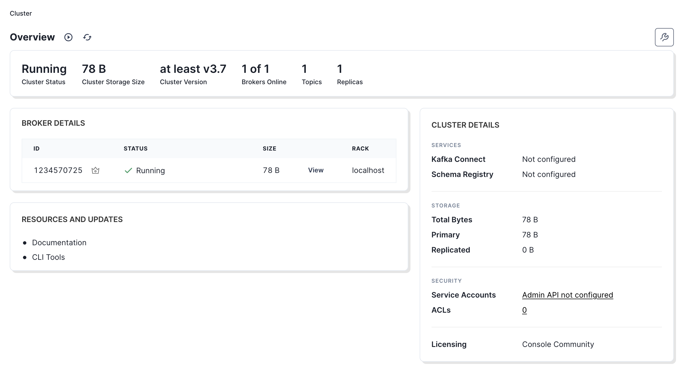
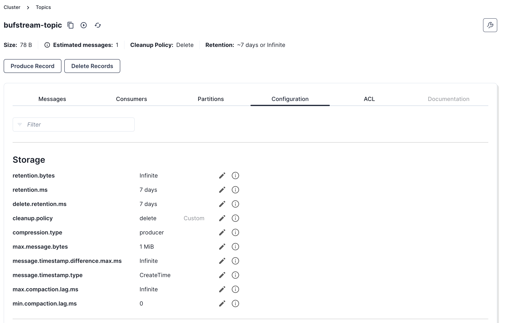

# Redpanda Console

Redpanda Console™ is a web application that helps you manage, inspect, and debug Kafka-compatible workloads.

## Deploy Redpanda Console™ with a production Bufstream cluster

### Prerequisites

- A live Bufstream cluster
- An enterprise deployment of the Buf Schema Registry, with the [Confluent integration](../../../bsr/kafka/manage-instances/) enabled (optional)
- A Buf [bot user](../../../bsr/admin/instance/bot-users/) and token (optional)

### Basic configuration

Configuring Redpanda Console™ to work with Bufstream requires setting the cluster's bootstrap address and specifying a client ID. The simplest way to do so is by setting the `KAFKA_BROKER` and `KAFKA_CLIENTID` environment variables.Set `KAFKA_BROKER` to the bootstrap address of your Bufstream cluster. Set `KAFKA_CLIENTID` by choosing a unique identifier for Redpanda Console™, then appending `;broker_count=1`. For example, you might choose `rpconsole;broker_count=1`. This instructs the Bufstream cluster to present itself as a single Kafka broker, which allows Redpanda Console™ to correctly display statistics for each topic.

### Connecting to the Buf Schema Registry

To display binary Protobuf messages as human-readable JSON, Redpanda Console™ can integrate with the [Buf Schema Registry](../../../bsr/). Add the following configuration block to your Redpanda Console™ YAML configuration to enable the schema registry:

```yaml
kafka:
  schemaRegistry:
    enabled: true
    # The URL for your instance of the Confluent Schema Registry within the Buf Schema Registry
    urls: ["https://buf.example.com/integrations/confluent/my-registry"]
    # The username of the Buf bot user that will manage the connections for your schema registry
    username: example-bot-user
    # The token generated for the above bot user
    password: example-bot-token
    tls:
      # Enables or disables TLS. If using commonly trusted certificates, you can enable TLS without specifying a CA.
      enabled: false
      # Path to the custom CA certificate file, if required.
      caFilepath: /path/to/ca
      # Path to the client certificate file for mutual TLS.
      certFilepath: /path/to/cert
      # Path to the client key file. The key should not be passphrase-protected.
      keyFilepath: /path/to/key
  protobuf:
    # Enables Protobuf deserialization
    enabled: true
    schemaRegistry:
      # Instructs the console to use the Schema Registry rather than the local filesystem for deserialization
      enabled: true
      # Provides an interval to refresh schemas from the schema registry.
      refreshInterval: 5m
```

For complete documentation of all the available configuration options, refer to [Redpanda's documentation](https://docs.redpanda.com/current/console/config/configure-console/).

## Try Redpanda Console™ with a local Bufstream instance

To try Redpanda Console™ with Bufstream on your local machine, you'll need [Docker](https://docs.docker.com/engine/install/) installed.First, start an in-memory Bufstream instance listening on the default Kafka port:

```bash
docker run -p 9092:9092 \
  --env BUFSTREAM_KAFKA_HOST=0.0.0.0 \
  --env BUFSTREAM_KAFKA_PUBLIC_HOST=host.docker.internal \
  --env BUFSTREAM_KAFKA_PUBLIC_PORT=9092 \
  bufbuild/bufstream:latest \
  --inmemory
```

In a separate terminal, start Redpanda Console™:

```bash
docker run -p 8080:8080 \
  -e KAFKA_BROKERS=host.docker.internal:9092 \
  -e KAFKA_CLIENTID="rpconsole;broker_count=1" \
  docker.redpanda.com/redpandadata/console:latest
```

Once both Bufstream and Redpanda Console™ are running, navigate to `localhost:8080` in your browser.You are now ready to begin managing and debugging Bufstream workloads with Redpanda Console™. Navigate to the topics view in Redpanda Console™ and click on the topic you'd like to inspect.In the individual topic view, you'll be able to see all messages produced to the topic as well as update topic configuration.

 
