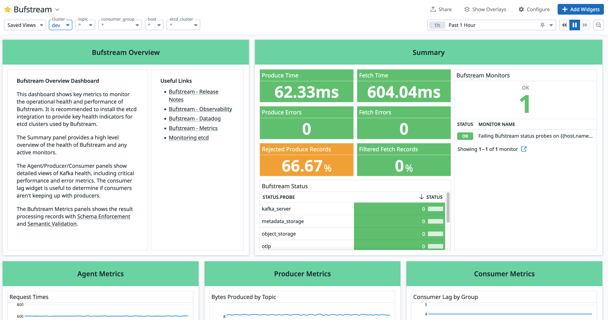

---

head:
  - - link
    - rel: "canonical"
      href: "https://bufbuild.ru/docs/bufstream/observability/datadog/"
  - - link
    - rel: "prev"
      href: "https://bufbuild.ru/docs/bufstream/observability/status-endpoint/"
  - - link
    - rel: "next"
      href: "https://bufbuild.ru/docs/bufstream/observability/grafana/"
  - - meta
    - property: "og:title"
      content: "Datadog - Buf Docs"
  - - meta
    - property: "og:image"
      content: "https://buf.build/docs/assets/images/social/bufstream/observability/datadog.png"
  - - meta
    - property: "og:url"
      content: "https://bufbuild.ru/docs/bufstream/observability/datadog/"
  - - meta
    - property: "og:type"
      content: "website"
  - - meta
    - property: "og:image:type"
      content: "image/png"
  - - meta
    - property: "og:image:width"
      content: "1200"
  - - meta
    - property: "og:image:height"
      content: "630"
  - - meta
    - property: "twitter:title"
      content: "Datadog - Buf Docs"
  - - meta
    - property: "twitter:image"
      content: "https://buf.build/docs/assets/images/social/bufstream/observability/datadog.png"
  - - meta
    - name: "twitter:card"
      content: "summary_large_image"

---

# Datadog configuration

## Downloads

| Dashboard                                                                                            | Description                                            |
| ---------------------------------------------------------------------------------------------------- | ------------------------------------------------------ |
| [bufstream-datadog-v0.3.6.zip](../../../assets/bufstream/observability/bufstream-datadog-v0.3.6.zip) | Bufstream dashboard and monitor JSON files for Datadog |

## Release Notes

### v0.3.6

**_Release Date:_** 2025-01-14

- Update dashboards to use new fetch and produce request metrics instead of previous errors metrics.

### v0.3.3

**_Release Date:_** 2024-12-19

- Initial release of Datadog dashboard and monitor for Bufstream.

## Installation

### Dashboard

- Navigate to **Dashboards** > **New Dashboard**.
- Specify a name for the dashboard (such as "Bufstream").
- Go to **Configure** > **Import dashboard JSON**.
- Click **Yes, Replace** to replace the current empty dashboard with the contents of `dashboard-overview.json`.

### Monitor

- Navigate to **Monitors** > **New Monitor**.
- Copy and paste the contents of `monitor-status.json` and click **Save**.
- Make any desired customizations to the monitor. For example, add a [mention](https://docs.datadoghq.com/monitors/notify/#notifications) to the notification.

## Configuration

When configuring Datadog for [OTLP](../overview/#otlp), we recommend [reporting metrics with Delta temporality](https://docs.datadoghq.com/opentelemetry/guide/otlp_delta_temporality/). In the Bufstream helm values, specify the following to enable Delta temporality:

```yaml
observability:
  metrics:
    otlpTemporalityPreference: "delta"
```

Additionally, depending on your monitoring needs, you can enable [Percentiles](https://docs.datadoghq.com/metrics/distributions/#enabling-advanced-query-functionality) for any of the following [histogram metrics](../metrics/#available-metrics):

- bufstream.kafka.produce.delay.duration
- bufstream.kafka.request.bytes
- bufstream.kafka.request.latency
- bufstream.kafka.response.bytes

Enabling percentiles provides p50, p75, p90, p95, and p99 aggregations.

## Bufstream overview dashboard

The overview dashboard (dashboard-overview.json) provides a Summary group for high-level Bufstream status as well as groups of panels for Bufstream brokers, Kafka Producers/Consumers, Bufstream metrics (including [data governance](../../data-governance/schema-enforcement/)), and etcd metrics. To report etcd metrics, configure the [etcd integration](https://docs.datadoghq.com/integrations/etcd/).Top-level label drop-downs allow filtering by the Bufstream cluster, topic, consumer group, host (for Go metrics), and etcd cluster.

## Bufstream status monitor

The status monitor (monitor-status.json) warns when any Bufstream broker's [status probes](../status-endpoint/) report warnings and alerts if any are in error status. This monitor is based on the [`bufstream.status` metric](../metrics/#available-metrics).
