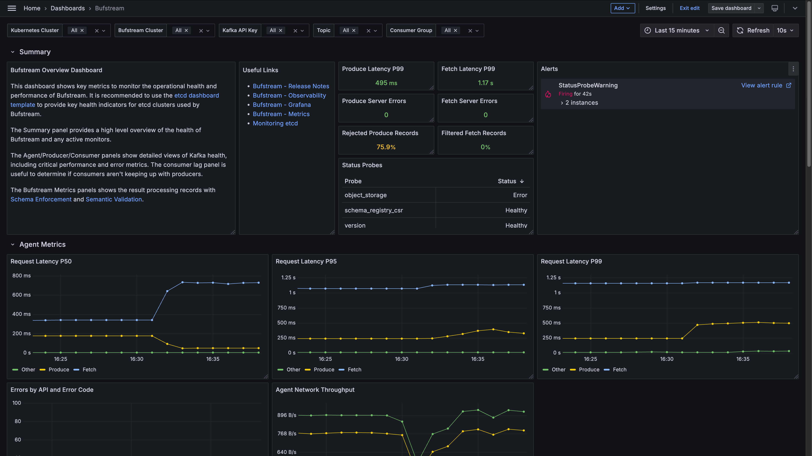

---

head:
  - - link
    - rel: "canonical"
      href: "https://bufbuild.ru/docs/bufstream/observability/grafana/"
  - - link
    - rel: "prev"
      href: "https://bufbuild.ru/docs/bufstream/observability/datadog/"
  - - link
    - rel: "next"
      href: "https://bufbuild.ru/docs/bufstream/integrations/akhq/"
  - - meta
    - property: "og:title"
      content: "Grafana - Buf Docs"
  - - meta
    - property: "og:image"
      content: "https://buf.build/docs/assets/images/social/bufstream/observability/grafana.png"
  - - meta
    - property: "og:url"
      content: "https://bufbuild.ru/docs/bufstream/observability/grafana/"
  - - meta
    - property: "og:type"
      content: "website"
  - - meta
    - property: "og:image:type"
      content: "image/png"
  - - meta
    - property: "og:image:width"
      content: "1200"
  - - meta
    - property: "og:image:height"
      content: "630"
  - - meta
    - property: "twitter:title"
      content: "Grafana - Buf Docs"
  - - meta
    - property: "twitter:image"
      content: "https://buf.build/docs/assets/images/social/bufstream/observability/grafana.png"
  - - meta
    - name: "twitter:card"
      content: "summary_large_image"

---

# Grafana

## Downloads

| Dashboard                                                                                            | Description                                                 |
| ---------------------------------------------------------------------------------------------------- | ----------------------------------------------------------- |
| [bufstream-grafana-v0.3.6.zip](../../../assets/bufstream/observability/bufstream-grafana-v0.3.6.zip) | Bufstream dashboard .json and alert .yaml files for Grafana |

## Release notes

### v0.3.6

**_Release Date:_** 2025-01-14

- Update dashboards to use new fetch and produce request metrics instead of previous errors metrics.

### v0.3.3

**_Release Date:_** 2024-12-19

- Initial release of Grafana dashboard and alerts for Bufstream.

## Installation

### Dashboard

To import the dashboard, follow [Grafana's instructions](https://grafana.com/docs/grafana/latest/dashboards/build-dashboards/import-dashboards/), using `dashboard-overview.json`.

The dashboard exposes its overall health status to aid in identifying and diagnosing operational issues.

### Alerts

Add the rules in `prometheus-status-rules.yaml` to your deployment, which should look something like this:

```yaml
serverFiles:
  alerting_rules.yml:
    # rules from prometheus-status-rules.yaml
```

## Configuration

When using Grafana, Bufstream metrics can either be scraped at a Prometheus endpoint or pushed to a collector.

### Prometheus

If Bufstream is configured to expose a [Prometheus](../overview/#prometheus) endpoint, metrics can be scraped at `https://0.0.0.0:9090/metrics/`.

We recommend setting pod annotations for the Bufstream pods. Specify the annotations in your Helm values file:

```yaml
bufstream:
  deployment:
    podAnnotations:
      prometheus.io/scrape: "true"
      prometheus.io/path: "/metrics"
      prometheus.io/port: "9090"
```

### OTLP

If you've configured metrics to be exported in [OTLP](../overview/#otlp), an OLTP-compatible collector such as Alloy is also needed.

### etcd

To monitor etcd, you may need to enable metrics for your etcd deployment. For etcd dashboards, see [etcd's recommended template](https://etcd.io/docs/v3.5/op-guide/monitoring/#grafana).

## Bufstream overview dashboard



The overview dashboard (grafana-overview-dashboard.json) provides a Overview row for high-level Bufstream status as well as rows of panels for Bufstream brokers, Kafka Producers/Consumers, Bufstream metrics (including [data governance](../../data-governance/schema-enforcement/)), and etcd metrics.

Top-level label drop-downs allow filtering by the Kubernetes cluster, Bufstream cluster, Kafka API key, topic, and consumer group.

## Bufstream status alerting rule

The status alert (prometheus-status-rules.yaml) fires when any Bufstream broker's [status probes](../status-endpoint/) report alerts. If any Bufstream broker is in an unhealthy status, it will report an alert to the status probe. This monitor is based on the [`bufstream.status` metric](../metrics/#available-metrics).
