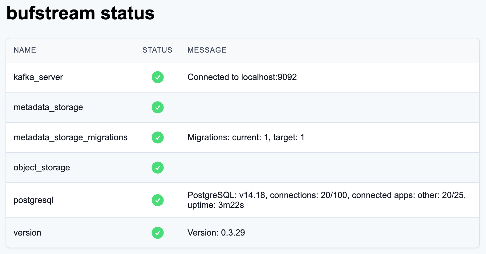

# Status endpoint

## Status endpoint

To help verify that the Bufstream cluster is up, running, and working correctly, we expose a status endpoint for cluster administrators. The status endpoint is accessible on the admin port `9089` on each Bufstream broker without authentication, at `http://{bufstream-broker}:9089/-/status`.Bufstream also exposes a CLI command to interact with the status endpoint.

## Status CLI

The Bufstream status CLI outputs a table using the following command:

```console
bufstream admin status --url http://{bufstream-broker}:9089
```

The `status` command displays the following cluster information:

```console
Name                 Status   Message
etcd                 healthy  3/3 member(s) healthy
kafka_server         healthy  Connected to {bufstream-broker}.bufstream.svc.cluster.local:9092
metadata_storage     healthy
object_storage       healthy
version              healthy  Version: v0.2.0
```

Bufstream status information is also available as JSON, and can be displayed using the `--output json` CLI flag.For a list of all available status CLI flags, consult the [Bufstream CLI reference documentation](../../reference/cli/admin/status/).
