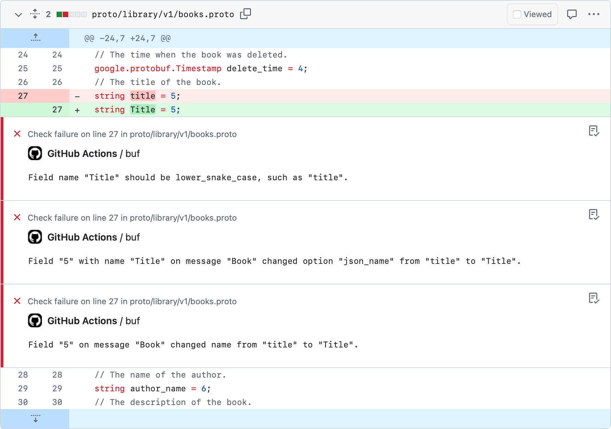

# GitHub Action

::: tip NoteThis page covers usage for Buf's unified v1.0 GitHub Action and instructions for migrating from the individual Actions. We'll be deprecating them soon. See the [previous usage instructions](../gh-actions/) if you're still using them, or the [Migration](#migrate-gh-actions) section below for migration instructions.

:::

The [buf-action](https://github.com/bufbuild/buf-action) GitHub Action makes it easy to run the [Buf CLI](https://buf.build) within a workflow to check for [build](../../reference/cli/buf/build/), [lint](../../lint/overview/), [format](../../format/style/), and [breaking change](../../breaking/overview/) errors, and automatically [publish schema changes](../../bsr/module/publish/) to the [Buf Schema Registry (BSR)](https://buf.build/product/bsr).

## Prerequisites

If you're publishing schema changes, the Buf GitHub Action requires a BSR [authentication token](../../bsr/authentication/#create-a-token). Authenticating with the BSR is required for both the "push" and "archive label" steps.To authenticate with the BSR, set the `token` parameter to the [BSR token](../../bsr/authentication/#create-a-token). We recommend storing the `token` value as a [GitHub secret](https://docs.github.com/en/actions/security-guides/encrypted-secrets).

## Setup

To use the Buf GitHub Action, create a new `.github/workflows/buf-ci.yaml` file in your repository with the following content:

::: info .github/workflows/buf-ci.yaml

```yaml
name: Buf CI
on:
  push:
  pull_request:
    types: [opened, synchronize, reopened, labeled, unlabeled]
  delete:
permissions:
  contents: read
  pull-requests: write
jobs:
  buf:
    runs-on: ubuntu-latest
    steps:
      - uses: actions/checkout@v4
      - uses: bufbuild/buf-action@v1
        with:
          token: ${{ secrets.BUF_TOKEN }}
          # Change setup_only to true if you only want to set up the Action and not execute other commands.
          # Otherwise, you can delete this line--the default is false.
          setup_only: false
          # Optional GitHub token for API requests. Ensures requests aren't rate limited.
          github_token: ${{ secrets.GITHUB_TOKEN }}
```

:::

## Default behavior

With the default configuration above, the Action does the following:

- On a pull request, it runs all checks (`buf build`, `buf lint`, `buf format`, and `buf breaking`) and posts a summary comment on the PR.
- When you push a Git commit, tag, or branch to GitHub, it [pushes named modules to the BSR](../../bsr/module/publish/) using `buf push`.
- When you delete a Git branch or tag, it archives the corresponding label on the BSR.

### Summary comment

The Action reports the status of the most recent checks in a comment on each pull request.To disable the comment, set the `comment` parameter to `false` and remove the `pull_request: write` permission because it's no longer required.

```diff
name: Buf CI
on:
  push:
  pull_request:
    types: [opened, synchronize, reopened, labeled, unlabeled]
  delete:
permissions:
  contents: read
- pull-requests: write
jobs:
  buf:
    runs-on: ubuntu-latest
    steps:
      - uses: actions/checkout@v4
      - uses: bufbuild/buf-action@v1
        with:
          token: ${{ secrets.BUF_TOKEN }}
+         pr_comment: false
```

## Configuration

You can further configure the Action (including skipping checks, pointing to a custom BSR domain, pinning to a specific Buf CLI version, and more) by adding additional parameters to the `buf-ci.yaml` file:

```yaml
- uses: bufbuild/buf-action@v1
  with:
    <Parameter>: <value>
```

See the unified Action's GitHub Repository for the [complete list of parameters](https://github.com/bufbuild/buf-action?tab=readme-ov-file#configuration) and [example files](https://github.com/bufbuild/buf-action/tree/main/examples) for the most common use cases.

## Migrating from individual Buf GitHub Actions

If you're currently using any of our individual GitHub Actions ([buf-setup-action](https://github.com/marketplace/actions/buf-setup), [buf-breaking-action](https://github.com/marketplace/actions/buf-breaking), [buf-lint-action](https://github.com/marketplace/actions/buf-lint), or [buf-push-action](https://github.com/marketplace/actions/buf-push)), we recommend migrating to the unified Action. We'll be deprecating the individual Actions soon and the unified Action significantly simplifies using the Buf CLI and BSR in your CI workflows.The unified Action is a superset of the individual actions that combines all of your Buf CI configuration into a single `buf-ci.yaml` file, as noted above in the [Setup](#setup) section. It also includes some additional capabilities:

- Can limit each operation to specific types of pull requests
- Adds a summary comment to pull requests
- Can specify permissions for reading and writing to the Git repository
- Automatically archives BSR labels when their corresponding GitHub branches or tags are deleted
- Enables more complex workflows—change the order of steps, add checks to additional steps, and disable steps as needed

Some of the previous Actions' parameter names have changed. The table below maps the old values to the new ones:

| Old Action          | Old name                   | New name           | Notes    |
| ------------------- | -------------------------- | ------------------ | -------- |
| buf-setup-action    | `buf_api_token`            | `token`            |          |
|                     | `buf_user`                 | —                  | Not used |
|                     | `buf_domain`               | `domain`           |          |
| buf-breaking-action | `against`                  | `breaking_against` |          |
|                     | `buf_input_https_username` | `github_actor`     |          |
|                     | `buf_input_https_password` | `github_token`     |          |
|                     | `buf_token`                | `token`            |          |
| buf-lint-action     | `buf_token`                | `token`            |          |

The unified Action also introduces several new parameters. See the [complete list of parameters](https://github.com/bufbuild/buf-action?tab=readme-ov-file#configuration) in its GitHub repository.

### Configuration comparison

The example below compares the configs for the previous Actions to the unified Actions, for the same set of tasks:

- Set up the Action: define tokens, set Buf CLI version
- Run breaking change and lint checks on the `proto` subdirectory for all pull requests
- Run breaking change and lint checks on the `proto` subdirectory, then push to the BSR
- The unified Action adds a `buf format` check to both sets of checks

#### Individual Actions

::: info .github/workflows/pull-request.yaml

```yaml
on:
  # Apply to all pull requests
  pull_request:
jobs:
  build:
    runs-on: ubuntu-latest
    steps:
      # Run `git checkout`
      - uses: actions/checkout@v4
      # Install the Buf CLI
      - uses: bufbuild/buf-setup-action@v1
      # Check for breaking changes in the 'proto' directory on all pull requests
      - uses: bufbuild/buf-breaking-action@v1
        with:
          input: proto
          against: "https://github.com/acme/weather.git#branch=main,ref=HEAD~1,subdir=proto"
        # Check for lint errors in the 'proto' directory on all pull requests
      - uses: bufbuild/buf-lint-action@v1
        with:
          input: proto
```

:::

::: info .github/workflows/push.yaml

```yaml
on:
  # Apply to all pushes on 'main' branch
  push:
    branches:
      - main
jobs:
  build:
    runs-on: ubuntu-latest
    steps:
      - uses: actions/checkout@v4
      - uses: bufbuild/buf-setup-action@v1
        with:
          buf_api_token: ${{ secrets.BUF_API_TOKEN }}
          github_token: ${{ secrets.GITHUB_TOKEN }}
          version: "1.51.0"
      # Run a lint check on Protobuf sources
      - uses: bufbuild/buf-lint-action@v1
      # Run breaking change detection for Protobuf sources against the current
      # `main` branch, 'proto' subdirectory
      - uses: bufbuild/buf-breaking-action@v1
        with:
          against: https://github.com/acme/weather.git#branch=main,ref=HEAD~1,subdir=proto
      # Push the validated module to the BSR
      - uses: bufbuild/buf-push-action@v1
        with:
          buf_token: ${{ secrets.BUF_TOKEN }}
```

:::

#### Unified Action

::: info .github/workflows/buf-ci.yaml

```yaml
name: Buf CI
on:
  # Apply to all pushes on 'main' branch
  push:
    branches:
      - main
  # Apply to all pull requests
  pull_request:
  delete:
permissions:
  contents: read
  pull-requests: write
jobs:
  buf:
    runs-on: ubuntu-latest
    steps:
      # Run `git checkout`
      - uses: actions/checkout@v4
      - uses: bufbuild/buf-action@v1
        with:
          token: ${{ secrets.BUF_TOKEN }}
          input: "proto"
          breaking-against: "https://github.com/acme/weather.git#branch=main,ref=HEAD~1,subdir=proto"
          # Run breaking change, lint, and format checks for Protobuf sources against all branches,
          # 'proto' # subdirectory, then push to the BSR once validated
          lint: ${{ github.event_name == 'push' }}
          format: ${{ github.event_name == 'push' }}
          breaking: ${{ github.event_name == 'push' }}
```

:::

## Related docs

- See the [complete list of parameters](https://github.com/bufbuild/buf-action?tab=readme-ov-file#configuration) and [example files](https://github.com/bufbuild/buf-action/tree/main/examples) in the `buf-action` GitHub repository
