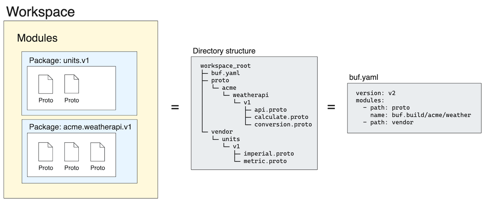

# Modules and workspaces

All Buf operations and features work with collections of Protobuf files that you configure, rather than specifying file paths on the command line. This page describes how to define these collections for both your local environment and for pushing to the Buf Schema Registry (BSR) to share with your team, customers, or the wider Buf community.A _module_ is the key primitive in the Buf ecosystem, and represents a collection of Protobuf files that are configured, built, and versioned as a logical unit. Modules simplify file discovery and eliminate the need for complex `protoc` build scripts that define your Protobuf sources with `-I`. Instead, you configure a module in the `buf.yaml` file, which specifies the location of the files, any exclusions, and its linting and breaking change detection rule sets if they're different from the workspace defaults._Workspaces_ are collections of modules that are defined together in the same `buf.yaml` file to create a local working environment. They can contain a single module or multiple modules. All modules in a workspace can import each other without specific dependency declarations, and also share any dependencies that are defined for the workspace (for example, on an external module such as [`googleapis`](https://buf.build/googleapis/googleapis)).Workspaces are also the default input for Buf CLI commands, and are the unit used to push content to the BSR. Pushing the workspace means that all modules in the workspace are pushed to their respective BSR [repositories](../../bsr/repositories/).

## Workspace layout

Though each module in the workspace is already a versioned entity composed of Protobuf files, we recommend implementing some level of versioning in the workspace's directory and package structure, even if it only contains a single module. Structuring the files this way decreases the likelihood of API collisions with other user-defined schemas. For more details, see [Files and packages](../../reference/protobuf-files-and-packages/).For example, suppose you want to create a workspace with two modules, `vendor/units/v1` and `acme/weatherapi/v1`. It would ideally have a directory structure that mirrors the packages, with the `.proto` files nested by package in a separate folder. All Buf config files should be at the root of the workspace.

```text
workspace_root
├── buf.gen.yaml
├── buf.lock
├── buf.yaml
├── proto
│   └── acme
│       └── weatherapi
│           └── v1
│               ├── api.proto
│               ├── calculate.proto
│               └── conversion.proto
├── vendor
│   └── units
│       └── v1
│           ├── imperial.proto
│           └── metric.proto
├── LICENSE
└── README.md
```

### Module documentation

In addition to comments associated with your Protobuf definitions, we recommend adding a `README.md` file at the module root to describe the module's overall function. The module `README.md` file is similar to a GitHub repository's `README.md` and currently supports all CommonMark syntax.Because the `README.md` is displayed as the primary user documentation for modules, we consider it an integral part of the module. Any changes made to it trigger a new commit in the BSR. See [Adding documentation](../../bsr/documentation/create-docs/) for more information.

### Module license

Public repositories on the public BSR are often used to share open source software. For your repository to truly be open source, you need to license it so that others are free to use, change, and distribute the software.As a best practice, we encourage you to include the license file with your module. To do this, simply include a `LICENSE` file at the module root and push it to the BSR.

::: tip NoteYou need to have a LICENSE file (or at least a symlink to one) in your module directory for its Go package to display on pkg.go.dev, per the [Go license policy](https://pkg.go.dev/license-policy).

:::

#### Disclaimer

We aim to provide users with open source license information to help them make informed decisions. However, we aren't legal experts and don't guarantee the accuracy of the information provided. We recommend consulting with a professional for any legal issues related to open source licenses.

## Workspace and module configuration

You define workspaces and modules by creating a `buf.yaml` configuration file at the root directory of the workspace. Generally, this should be the root of your source control repository. It specifies the workspace properties and those of the modules it contains, and all module paths must be contained within the workspace directory. Given the directory shown above, the `buf.yaml` file would look like this:

```yaml
# Buf configuration version.
version: v2

# A list of modules included in the local workspace. Each module
# defines the path to the directory where the Protobuf files are, and optionally
# its name (which corresponds to a repository on the BSR), files or directories to
# exclude, and module-level lint and breaking change settings.
#
# Both the path and any includes/excludes fields are relative to the root of the
# workspace.
modules:
  - path: proto
    name: buf.build/acme/weatherapi
  - path: vendor
    # Lint and breaking change detection settings within a module completely
    # replace the workspace-level defaults for that module. There's no rule
    # merging or de-duping.
    lint:
      use:
        - MINIMAL
    breaking:
      use:
        - PACKAGE

# A list of dependencies on modules outside of the workspace. They're
# shared by all modules, and the manifest is stored in the buf.lock file.
#
# Dependencies between the modules in the workspace are automatically handled
# by Buf and shouldn't be declared here.
deps:
  - buf.build/google/googleapis
  - buf.build/grpc/grpc

# Workspace-level lint and breaking change detection settings. These settings
# are the default for all modules in the workspace unless specifically
# replaced in the module declarations.
lint:
  use:
    - STANDARD
breaking:
  use:
    - PACKAGE
```

### Unique file path requirement

The Buf CLI imposes one additional requirement on your `.proto` file structure for compilation to succeed that's essential to successful modern Protobuf development across a number of languages. It requires all `.proto` file paths to be unique relative to each workspace module. Consider this configuration:

::: info buf.yaml

```yaml
version: v2
modules:
  - path: foo
  - path: bar
```

:::

Given the above configuration, it's invalid to have these two files:

- `foo/baz/baz.proto`
- `bar/baz/baz.proto`

because it results in two files having the path `baz/baz.proto`. If you add the following file to the mix, the issue becomes apparent:

::: info bar/baz/bat.proto

```protobuf
// THIS IS DEMONSTRATING SOMETHING BAD
syntax = "proto3";

package bar.baz;

import "baz/baz.proto";
```

:::

Which file is being imported, `foo/baz/baz.proto` or `bar/baz/baz.proto`? With `protoc` the answer depends on the order of the `-I` flags. The Buf CLI errors out pre-compilation instead, alerting you to the issue. Though the above example is relatively contrived, vendoring `.proto` files is a common practice that can cause this situation.

### Single-module workspaces

**We recommend defining module paths explicitly**, but for workspaces that:

- contain only one module, _and_
- have a module root equal to the root of their source-control repositories

you can use a simplified version of `buf.yaml`. In this case, the only required field is `version`.

```yaml
version: v2
```

This is logically equivalent to:

```yaml
version: v2
modules:
  - path: .
```

You can also specify a `name` for this single module at the top-level to connect it to its repository on the BSR, and specify its `lint`, `breaking`, and `deps` values:

```yaml
version: v2
name: buf.build/foo/bar
lint:
  use:
    - STANDARD
breaking:
  use:
    - FILE
deps:
  - buf.build/googleapis/googleapis
```

Because it's a common use case to have a 1:1 correspondence between a module and a source control repository, we special-cased this behavior to simplify workspace setup. For all other cases, you should always specify a `modules` key, including when you have a single module that's contained in a subdirectory of the source control repository (such as a `proto` directory).

### Module and repository relationship

If the module has a corresponding repository in the BSR, that location is stored in the optional `name` field, which is composed of three parts: the BSR instance, the owner, and the repository:

::: info Module/repository name syntax

```console
https://BSR_INSTANCE/OWNER/REPOSITORY

# Examples
https://buf.build/acme/petapis       # Teams or community member on the public BSR
https://example.buf.dev/acme/petapis # Pro subscription with custom subdomain on 'buf.dev'
https://buf.example.com/acme/petapis # Enterprise subscription with custom domain
```

:::

The URL contains these elements:

- _BSR_INSTANCE_ is the DNS name for the BSR. This is the public BSR instance at `buf.build` unless you're on the Pro or Enterprise plan, in which case it's your private BSR instance's custom domain.
- _OWNER_ is either a user or organization within the BSR ecosystem.
- _REPOSITORY_ is storage for all versions of a single module.

The module's `name` uniquely identifies it in the BSR, which allows it to be referenced as a dependency, consumed as an SDK, and much more.See the [`buf.yaml` documentation](../../configuration/v2/buf-yaml/) for full descriptions of its configuration options, and the [lint](../../lint/overview/) and [breaking change detection](../../breaking/overview/) documentation for full descriptions of their options and rules.

## Buf operations in the workspace

Although modules are the main primitive for Buf, the workspace is the primary [input](../../reference/inputs/) for Buf operations, both locally and within CI/CD setups. This enables Buf to resolve the workspace's internal dependencies and lint/breaking change detection rules across all of its modules before building the modules and executing the requested command.

### Pushing modules from workspaces

When pushing to the BSR, the workspace is the unit being pushed, as long as all of its internal dependencies have `name` keys that can resolve to the BSR. All modules within it are pushed to their corresponding repositories (if they exist) in dependency order. See [Pushing to the BSR](../../bsr/module/publish/) for more details.

### Dependency management

When resolving imports, Buf looks within the workspace first—if it finds the dependency locally, it resolves it there. Otherwise, it attempts to find it in the BSR based on the declarations in the `deps` field. This makes it easier to iterate on related modules at the same time before pushing to the BSR.In the workspace, imports are resolved relative to the root of the module being imported (the value of its `path` field), which is an assumed prefix for the import value. For example, using the same directory structure as above, assume that `proto/acme/weatherapi/v1/api.proto` imports both of the Protobuf files in the `vendor` module and `calculate.proto` from its own module. Its import statements would look like this:

::: info proto/acme/weatherapi/v1/api.proto

```protobuf
syntax = "proto3";

package acme.weatherapi.v1;

import "units/v1/imperial.proto";
import "units/v1/metric.proto";
import "acme/weatherapi/v1/calculate.proto";
```

:::

```text
workspace_root
├── buf.gen.yaml
├── buf.lock
├── buf.yaml
├── proto
│   └── acme
│       └── weatherapi
│           └── v1
│               ├── api.proto
│               ├── calculate.proto
│               └── conversion.proto
├── vendor
│   └── units
│       └── v1
│           ├── imperial.proto
│           └── metric.proto
├── LICENSE
└── README.md
```

See [Dependency management](../../bsr/module/dependency-management/) for more details.

### Module cache

The Buf CLI caches files it downloads as part of module resolution in a folder on the local file system to avoid incurring the cost of downloading modules repeatedly. To choose where to cache the files, it checks these, in order:

- The value of `$BUF_CACHE_DIR`, if set.
- The value of `$XDG_CACHE_HOME`, falling back to `$HOME/.cache` on Linux and Mac and `%LocalAppData%` for Windows.

The module cache is only used for dependencies declared in the `deps` field. For all modules that have a value for the `name` field, the workspace overrides the module cache and allows you to use any new local changes. If the `name` either doesn't match the importing module's dependency or doesn't exist, the Buf CLI uses the module cache instead.

## Referencing a module

A _reference_ is the string used to refer to a specific version of the module stored in the BSR. It includes the module's name and can optionally include either a [commit or a label](../../bsr/commits-labels/).

- If no commit or label is explicitly referenced, then the reference resolves to the latest approved commit on the [repository's default label](../../bsr/repositories/#default-label).
- If the reference includes a label, it resolves to the latest approved commit associated with that label. Referencing modules by labels other than the default label is helpful when working across teams or workspaces on multiple modules so that you can depend on pre-release code while working in parallel.

The examples below show how to reference a module in the `deps` declaration of a `buf.yaml` file, but the format usually applies.

::: info Point to latest commit on the default label

```yaml
version: v2
deps:
  - buf.build/bufbuild/protovalidate
```

:::

::: info Point to latest commit on 'demo' label

```yaml
version: v2
deps:
  - buf.build/bufbuild/protovalidate:demo
```

:::

::: info Point to specific commit by ID

```yaml
version: v2
deps:
  - buf.build/bufbuild/protovalidate:f05a6f4403ce4327bae4f50f281c3ed0
```

:::

## Related docs

- Read about [repositories](../../bsr/repositories/) and [commits and labels](../../bsr/commits-labels/)
- Learn more about [dependency management](../../bsr/module/dependency-management/) in the BSR
- Read the [`buf.yaml` configuration file](../../configuration/v2/buf-yaml/) documentation
