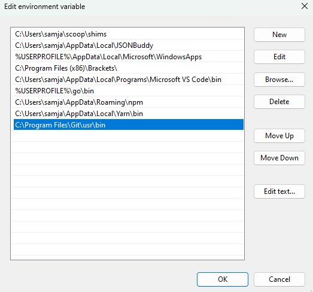

---

title: "Overview - Buf Docs"

head:
  - - link
    - rel: "canonical"
      href: "https://bufbuild.ru/docs/format/style/"
  - - meta
    - property: "og:title"
      content: "Overview - Buf Docs"
  - - meta
    - property: "og:url"
      content: "https://bufbuild.ru/docs/format/style/"
  - - meta
    - property: "twitter:title"
      content: "Overview - Buf Docs"

---

# Code formatting – Overview

One of Buf's primary goals is to enforce consistency across all of Protobuf. The [linter](../../lint/overview/) ensures that the APIs themselves conform to a strong set of standards, but those have nothing to do with the structure of the `.proto` source file itself. That's where `buf format` comes in. It reformats your Protobuf files according to the following best practices for file layout and style, so you can focus on more business-critical problems.

::: tip NoteUnlike `buf breaking` and `buf lint`, `buf format` isn't configurable in the `buf.yaml` file. However, you can exclude a subset of your `.proto` files by using the [`--exclude-path`](../../reference/cli/buf/format/#exclude-path) flag.

:::

### Structure

Every `.proto` file is formatted in the following order:

- Syntax
- Package
- Imports (sorted)
- Options (sorted)
- Types

Each of these categories are separated by a single newline like so:

```protobuf
// -- Syntax --
syntax = "proto3";

// -- Package --
package acme.pet.v1;

// -- Imports --
import "acme/payment/v1alpha1/payment.proto";
import "google/protobuf/timestamp.proto";
import "google/type/datetime.proto";

// -- Options --
option cc_enable_arenas = true;
option deprecated = true;

// -- Types --
enum PetType {
  PET_TYPE_UNSPECIFIED = 0;
  PET_TYPE_CAT = 1;
  PET_TYPE_DOG = 2;
  PET_TYPE_SNAKE = 3;
  PET_TYPE_HAMSTER = 4;
}

message Pet {
  PetType pet_type = 1;
  string pet_id = 2;
  string name = 3;
  google.type.DateTime created_at = 4;
  google.protobuf.Timestamp timestamp = 5;
}
```

## Indentation

When necessary, lines are indented by 2 spaces. The level of indentation increases whenever the line moves from a type to its children (for example, moving from a message declaration to its fields).

```protobuf
syntax = "proto3";

package object.v1;

message Object {
  // The fields are indented two spaces from its parent message declaration.
  string id = 1;

  // Nested messages are indented at the same level.
  message Nested {
    // The nested message's field is indented an additional two spaces.
    string id = 1;
  }
}
```

## Comments and newlines

All comments are preserved, and multiple adjacent newlines are consolidated into a single line.

```protobuf
syntax = "proto3";

package object.v1;

// Object is a generic message type.
message Object {
  // id uniquely identifies the object.
  string id = 1; // It has field number '1'.

  // value can be set to any arbitrary set of bytes.
  bytes value = 2; // It has field number '2'.
}
```

## Custom options

Comments are preserved in custom options, too.

```protobuf
syntax = "proto2";

package list.v1;

// Leading comment on (list).
option (list) = {
  names: [
    // This list only has one value.
    "Name"
  ],

  values: [
    // Leading comment on '-42'.
    -42, // Trailing on '-42'.

    // Leading comment on '-43'.
    -43 // Trailing on '43'.
  ],

  recursive: [
    {
      // Leading comment on values key.
      values: [
        -44,
        45
      ]
    }
  ]
};

extend google.protobuf.FieldOptions {
  optional List list = 80000;
}

message List {
  repeated string names = 1;
  repeated sint32 values = 2;
  repeated List recursive = 3;
}
```

## Composite types

There are several elements that are always written across multiple lines. Aside from the ones we see most frequently (messages, enums, etc), this includes arrays, message literals, and adjacent strings.

```protobuf
syntax = "proto3";

package object.v1;

import "custom/v1/custom.proto";

option (custom.description) =
"This is an example of a single string that can be written across multiple"
    "lines. Like comments, this helps to write long descriptions in a single string."

option (custom.object) = {
  id: "123",
  value: "456
}

option (custom.list) = {
  values: [
    1,
    2
  ]
}
```

### Empty composite types

If a composite type (for example, a `message`) is empty, it's consolidated into a single line. However, if the message has comments within it, they're preserved.

```protobuf
message Empty {} // This message is written in a single line.

message Foo {
  // This message has a single comment.
}

message Bar {
  // This message has comments spread
  // across multiple lines.
}
```

## Compact options

If a type has a single compact option, it's formatted inline. Otherwise, the compact options spans multiple lines.

```protobuf
syntax = "proto3";

package object.v1;

message Object {
  string id = 1 [deprecated = true];

  bytes value = 2 [
    deprecated = true,
    ctype = CORD
  ];
}
```

## Troubleshooting

### Windows

The PowerShell alias for `diff` sometimes doesn't work, resulting in an error when running `buf format`:

```console
Failure: exec: "diff": executable file not found in %PATH%
```

The solution for this is to add the path of `diff.exe` (`C:\Program Files\Git\usr\bin` by default) in the Control Panel.

## Related docs

- [`buf format` command reference](../../reference/cli/buf/format/)
