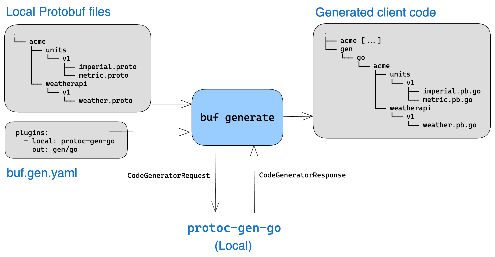
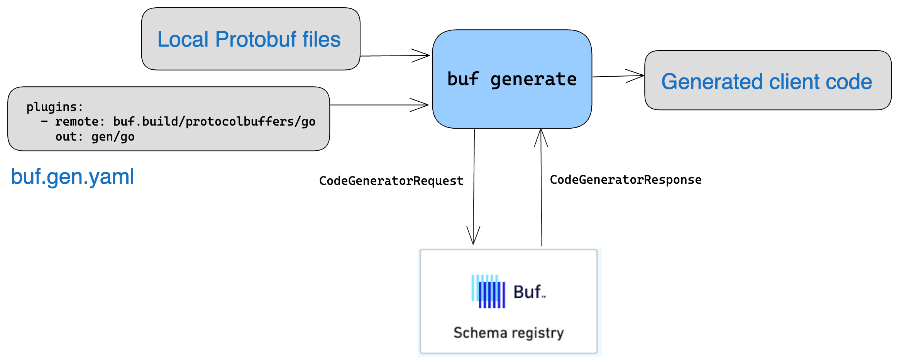

---

head:
  - - link
    - rel: "canonical"
      href: "https://bufbuild.ru/docs/generate/overview/"
  - - link
    - rel: "prev"
      href: "https://bufbuild.ru/docs/cli/modules-workspaces/"
  - - link
    - rel: "next"
      href: "https://bufbuild.ru/docs/generate/tutorial/"
  - - meta
    - property: "og:title"
      content: "Overview - Buf Docs"
  - - meta
    - property: "og:image"
      content: "https://buf.build/docs/assets/images/social/generate/overview.png"
  - - meta
    - property: "og:url"
      content: "https://bufbuild.ru/docs/generate/overview/"
  - - meta
    - property: "og:type"
      content: "website"
  - - meta
    - property: "og:image:type"
      content: "image/png"
  - - meta
    - property: "og:image:width"
      content: "1200"
  - - meta
    - property: "og:image:height"
      content: "630"
  - - meta
    - property: "twitter:title"
      content: "Overview - Buf Docs"
  - - meta
    - property: "twitter:image"
      content: "https://buf.build/docs/assets/images/social/generate/overview.png"
  - - meta
    - name: "twitter:card"
      content: "summary_large_image"

---

# Code generation – Overview

This overview provides information about generating code from your Protobuf files using the Buf CLI, ranging from local generation to generated SDKs hosted in the Buf Schema Registry (BSR).One of the challenges with Protobuf code generation is the complexity of working with `protoc` and plugins. Managing and maintaining a stable environment locally on a single machine is hard enough given the complex web of different compiler and plugin versions. The problem is compounded as you scale out code generation across many developers, and often results in a series of ugly bash scripts shared between team members.Buf's code generation streamlines all of that and is designed to work with whatever your Protobuf setup might be. It has the following advantages over `protoc`:

- **Speed:** Compiles 2x faster than `protoc`.
- **Clarity:** Allows you to configure your build once and easily edit or reference as needed from source control, instead of memorizing strings of flags.
- **Flexibility:** Accepts more types of input (`protoc` only accepts raw `.proto` files) and the input doesn't have to be local.

In addition, Buf offers several features that ease many of the frustrations of generating client code from Protobuf files, especially in larger organizations:

- **[Remote plugins](../../bsr/remote-plugins/overview/):** Avoid installing and maintaining `protoc` plugins locally. Specify our hosted versions instead, right down to the version number, so it's easy to standardize across teams or use different versions for different projects as needed.
- **[Managed mode](../managed-mode/):** Produce universal APIs by removing user and language specific Protobuf options from `.proto` files. API consumers can then enable smart defaults for these options in the config file with two lines of code and never think about them again.
- **[Generated SDKs](../../bsr/generated-sdks/overview/):** Skip the entire code generation process and consume your APIs via NPM, Maven, and other common dependency management tools. They're created automatically when modules are pushed to the BSR.

The sections below discuss key concepts, local generation (with and without remote plugins), managed mode, and specific invocations of the `buf generate` command.

::: tip NoteSee the [tutorial](../tutorial/) for a step-by-step walkthrough of setting up code generation, basic usage, and using remote plugins and managed mode.

:::

## Key concepts

`protoc`

`protoc` is the compiler included with [Protocol Buffers](https://protobuf.dev/)—it invokes a set of plugins to generate code or perform other custom tasks.

input

To the Buf CLI, an input is the representation of the Protobuf files you want to manage. It can take many forms, such as a local directory of `.proto` files, a module hosted in the Buf Schema Registry, or a `.zip` file. See the [Inputs reference](../../reference/inputs/) for a full list of inputs that the Buf CLI accepts.

plugins

Plugins are external programs that implement a specific Protobuf interface. They're used by `protoc` and Buf to generate code or perform other custom processing on Protobuf files. With the Buf CLI, you can either install and use plugins locally, or save time and improve consistency by referencing the [remote plugins](../../bsr/remote-plugins/overview/) that we host in the Buf Schema Registry (BSR). They're the same as the ones you locally install.

`buf.gen.yaml`

This is the Buf config file specifically related to code generation. It's usually placed at the root of your workspace and specifies the plugin to be used for each output, the output path, and set of options that enables you to customize the generated code further.

::: tip NoteTo see all of the available configuration options, go to the [`buf.gen.yaml` reference](../../configuration/v2/buf-gen-yaml/).

:::

## Generating with local plugins

Generating client code with locally installed plugins works similar to `protoc`, but faster. In the diagram below, the `plugins.local` key specifies a local version of `protoc-gen-go`.For plugins that are built into `protoc`, use the `plugins.protoc_builtin` key and specify the language as the value:

::: info buf.gen.yaml – Generate code using the built-in protoc C++ plugin

```yaml
version: v2
plugins:
  - protoc_builtin: cpp
    out: gen/cpp
```

:::

The `protoc_builtin` key accepts these values: `cpp`, `csharp`, `java`, `objectivec`, `php`, `python`, or `ruby`. Otherwise, use the `plugins.local` key and provide the name of a plugin on your `PATH`:

::: info buf.gen.yaml – Generate code using a locally-installed protoc-gen-go plugin

```yaml
version: v2
plugins:
  - local: protoc-gen-go
    out: gen/go
```

:::

## Generating with remote plugins

As noted above, managing a set of local plugins can complicate your workflow, especially if you're trying to be consistent across teams. A common solution is to rely on custom tooling, which frequently leads to "works on my machine" reproducibility problems. With Buf, you can standardize code generation by specifying the mirrors of the `protoc` plugins that we host in the BSR. Just point the `plugins.remote` key to the BSR, and it generates the code.

::: info buf.gen.yaml – Generate code using a remote plugin

```yaml
version: v2
plugins:
  - remote: buf.build/protocolbuffers/go
    out: gen/go
```

:::

For more information, see the [remote plugins overview](../../bsr/remote-plugins/overview/).

## Using managed mode

Another issue with code generation is the need define output options that aren't part of the schema. These include fields like package prefixes, namespace information, and so on that aren't part of your API definition but need to be passed to the generator to render the client code correctly.Normally, API producers hard-code these options in their Protobuf files, but they're actually API _consumer_ concerns. Using managed mode allows consumers to easily use smart defaults for these options or override them in the `buf.gen.yaml` file, freeing the producers to provide a universal API. Using managed mode across an entire project or organization gives you a clear separation of concerns while still providing necessary flexibility to consumers.The example below demonstrates using managed mode to generate Java code using remote plugins.

**Before\*\***After\*\*

::: info Protobuf file without managed mode

```protobuf
syntax = "proto3";

package acme.weather.v1;

option java_multiple_files = true; // [!code highlight]
option java_outer_classname = "WeatherProto"; // [!code highlight]
option java_package = “com.acme.weather.v1”; // [!code highlight]
```

:::

::: info Protobuf file with managed mode set

```protobuf
syntax = "proto3";

package acme.weather.v1;
```

:::

::: info buf.gen.yaml without managed mode

```yaml
version: v2
plugins:
  - remote: buf.build/protocolbuffers/java
    out: gen/proto/java
```

:::

::: info buf.gen.yaml with managed mode set

```yaml
version: v2
managed: // [!code highlight]
  enabled: true // [!code highlight]
plugins:
  - remote: buf.build/protocolbuffers/java
    out: gen/proto/java
```

:::

::: tip NoteFor more information, see the [Managed mode](../managed-mode/) and [`buf.gen.yaml` reference](../../configuration/v2/buf-gen-yaml/) pages.

:::

## Referencing imports

If `buf generate` can't find a file in an `import` statement, it's usually because of a mismatch between the relative locations of the input to the `buf generate` command and the location specified in the `import` path. The `buf generate` command uses the location of your workspace's `buf.yaml` file as the root by default, so given this directory structure:

```text
.
├── buf.gen.yaml
├── buf.yaml
└── proto
    ├── foo
    │   └── foo.proto
    └── bar
        └── bar.proto
```

If you run `buf generate` from the root, then your `import` paths should be an absolute path from that location. For example, if you wanted `bar.proto` to import `foo.proto`, the statement should be:

::: info proto/bar/bar.proto

```protobuf
import "proto/foo/foo.proto";
```

:::

However, if you specify an input to `buf generate` other than the module's root, the input is prepended to the `import` path when looking for the file. For example, if you pass the `proto` directory as the input:

```console
$ buf generate proto
```

then the Buf CLI looks for `foo.proto` at `proto/proto/foo/foo.proto`, which doesn't exist. You would need to change your import path to be:

::: info proto/bar/bar.proto

```protobuf
import "foo/foo.proto";
```

:::

If you get an "unknown type" error when trying to use imported types, it's because you need to reference your types using the full package name when importing from another package. Using the above directory structure, importing `Foo` into your `bar.proto` file looks like this:

::: info proto/bar/bar.proto

```protobuf
syntax = "proto3";

package proto.bar;

import "proto/foo/foo.proto";

message Bar {
  proto.foo.Foo myFoo = 1;  // Note the full package name
}
```

:::

## Command-line input examples

The examples below show ways of invoking `buf generate` for different inputs or subsets of inputs. Generally, you should specify all inputs in the `buf.gen.yaml` file, but they can also be passed to `buf generate` at the command line as in the examples below. If you specify an input in `buf.gen.yaml` and in the command, the command takes precedence and only that input is generated.See the [`buf.gen.yaml`](../../configuration/v2/buf-gen-yaml/) configuration file documentation to learn how to specify inputs there.

::: info Generate from the current workspace root

```console
$ buf generate
```

:::

::: info Generate from a BSR module

```console
$ buf generate buf.build/acme/petapis
```

:::

::: info Generate from a GitHub repository

```console
$ buf generate https://github.com/foo/bar.git
```

:::

### Generate with dependencies or Well-Known Types

By default, code generation doesn't include your imports or the Well-Known Types (WKT). To include them, pass the appropriate flags:

::: info Include dependencies, without WKT

```console
$ buf generate --include-imports
```

:::

::: info Include WKT

```console
# The --include imports flag is required
$ buf generate --include-imports --include-wkt
```

:::

### Limit to specific files

By default, the Buf CLI builds all files in the workspace. You can instead manually specify the file or directory paths to build. This is an advanced feature intended to be used for editor or [Bazel](../../cli/build-systems/bazel/) integration. It's better to let the Buf CLI discover all files under management and handle this for you.If you only want to generate code for a subset of your input, you can do so via the `--path` flag:

::: info Only generate for the files in the directories proto/foo and proto/bar

```console
$ buf generate --path proto/foo --path proto/bar
```

:::

::: info Only generate for the files proto/foo/foo.proto and proto/foo/bar.proto

```console
$ buf generate --path proto/foo/foo.proto --path proto/foo/bar.proto
```

:::

::: info Only generate for the files in the directory proto/foo in your GitHub repository

```console
$ buf generate https://github.com/foo/bar.git --template data/generate.yaml --path proto/foo
```

:::

You can also exclude paths by using the `--exclude-path` flag:

::: info Exclude the files in the directory proto/foo

```console
$ buf generate --exclude-path proto/baz
```

:::

These flags can be combined to include and exclude files as needed.This is equivalent to specifying the paths and exclude_paths for an input in the `buf.gen.yaml` file:

::: info buf.gen.yaml

```yaml
version: v2
inputs:
  - directory: .
    path: // [!code highlight]
      - proto/foo/ // [!code highlight]
    exclude_path: // [!code highlight]
      - proto/foo/baz.proto // [!code highlight]
plugins:
  - local: protoc-gen-go
    out: gen/go
    opt: paths=source_relative
```

:::

Setting the flag `--path` and `--exclude-path` overrides the paths and exclude paths specified in the inputs in the `buf.gen.yaml` file.

### Limit to specific types

By default, the Buf CLI generates code for all types in your source files. However, you can request that it only generate a subset by specifying a list of types in `buf.gen.yaml`. A common use case is to output a single service for use in mobile and web apps, where shipping unused code is expensive. The resulting schema contains only the types you specify and their dependencies, according to the following principles:

- All type names must be fully qualified. If any name is unknown, the request fails and no output is returned.
- When a message is included, any type references therein (like fields that refer to other message or enum types) are also included. If any included message is extendable (a `proto2`\-only feature), its known extensions are included.
- If a particular method is included, its request and response message types are also included, but other methods that belong to the same service won't (unless they're also included).
- If a service is included, all of its methods (and their request and response types) are included.
- If any included types have custom options, the definitions for those custom options are included.
- You can use this for any type of input.

To generate code for a subset of your types, specify it as a list of the types:

::: info buf.gen.yaml

```yaml
version: v2
inputs:
  - module: MODULE_NAME
    types:
      - "foo.v1.User"
      - "foo.v1.UserService"
```

:::

You can also use the `--type` flag, which gets precedence over whatever is configured in `buf.gen.yaml`.

::: info Only generate the type with a fully qualified name of foo.v1.User

```console
$ buf generate --type foo.v1.User
```

:::

### Generate to a specific directory

You can generate to a specific output directory using the `--output` or `-o` flag. This command generates to the `bar/` directory while prepending `bar/` to the `out` directives in the `buf.gen.yaml` file:

```console
$ buf generate https://github.com/foo/bar.git -o bar
```

The paths in the config file and the `-o` flag are interpreted as relative to your **current directory**, so you can place your config files anywhere.

### Generate with a configuration file in another directory

The config file doesn't have to be named `buf.gen.yaml`, nor does it have to be in the directory where you're invoking `buf generate`. To specify a config file elsewhere, use the `--template` flag:

```console
$ buf generate buf.build/acme/petapis --template templates/generation.yaml
```

### Generate using multiple configuration files

If you want to use different plugin options for the same input, we recommend creating separate, uniquely-named `buf.gen.yaml` files for each configuration. You can then run `buf generate` once for each configuration file with the `--template` flag. For example, to use one file for Go and a different file for Java, you could create `buf.gen.go.yaml` and`buf.gen.java.yaml` file and then run these commands:

```console
$ buf generate --template buf.gen.go.yaml
$ buf generate --template buf.gen.java.yaml
```

### Generate without a configuration file

Although we recommend using a configuration file, without one `buf generate` assumes the input is the current directory. You can also specify the config file as JSON in the invocation. This can be useful when configuring CI/CD builds for an organization when you want to centralize the configuration for all teams.

```console
$ buf generate --template '{"version":"v2","plugins":[{"protoc_builtin":"go","out":"gen/go"}]}'
```

## Related docs

- Try out code generation with the [`buf generate` tutorial](../tutorial/)
- Learn more about consuming [generated SDKs](../../bsr/generated-sdks/overview/) instead of generating code
- Browse the [`buf generate` command reference](../../reference/cli/buf/generate/)
- Find out how to create [custom plugins](../../bsr/remote-plugins/custom-plugins/) for your organization
