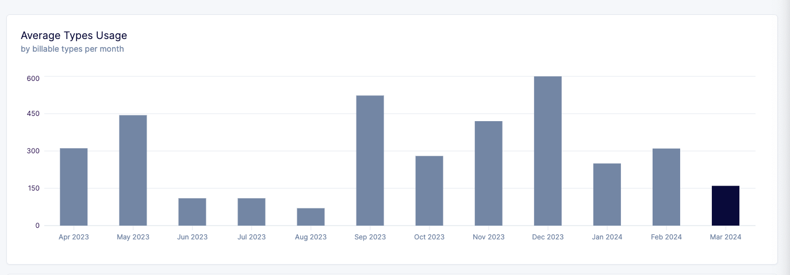

# Manage subscription costs

Under the Community plan, your organization may have 1 private repository with up to 100 types. On the Teams plan you are charged for the number of types (messages, rpcs, and enums) that you push into private repositories. The Pro plan also charges by number of types, but since your Pro BSR instance is private to your organization, the visibility of repositories isn't relevant to pricing.This page describes some best practices for managing the cost of your subscription by right-sizing the number of private types in your organization.For more information on pricing, read our [pricing FAQ](../faq/).

## Make dependencies public

Your Protobuf files likely have dependencies on third-party types, most commonly something like [googleapis](https://buf.build/googleapis/googleapis). Before the BSR, it was normal to vendor dependencies in the same version control repository that contained your Protobuf files, to allow for easy linking when using `protoc`. With the BSR, you don't need to locally vendor dependencies, and can instead rely on its remote dependency management. See the [Dependency management](../../bsr/module/dependency-management/) page for more information.If you don't find an official repository for your dependency in the BSR, then create a new public repository in your organization. We don't charge for public types.

## Open source your APIs

Because Buf doesn't charge for public types, one of the easiest methods to manage costs is to move types that don't need to be private into a public repository. This can also lead to better API discovery for your customers, and encourage an open source community to emerge around your services. This way, you can limit the paid types in your subscription to the much smaller number of business-sensitive types stored in your organization's private repositories.The BSR itself is a good example of this principle, as it exposes a large public API at [https://buf.build/bufbuild/buf](https://buf.build/bufbuild/buf), and also has a handful of private types.

## Types usage dashboard

Organization admins can view a dashboard that shows Average Types Usage by billable types per month.

- For organizations on the public BSR, go to the organization's side menu, then **Account > Usage**.
- For organizations on a private BSR, go to your profile menu, then **Admin panel > Types usage**.

As the name implies, usage is calculated based on the average number of types over the billing period.

### Example dashboard

