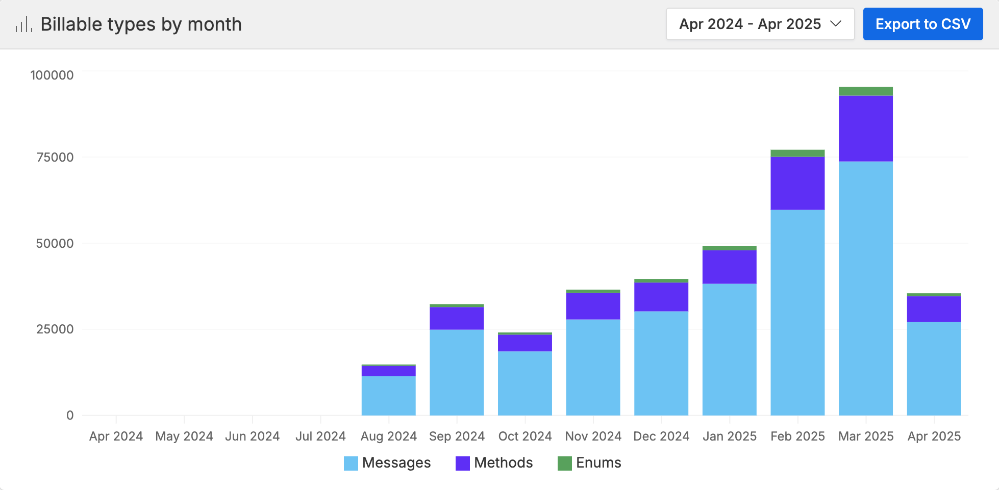

---

title: "Manage costs - Buf Docs"

head:
  - - link
    - rel: "canonical"
      href: "https://bufbuild.ru/docs/subscription/manage-costs/"
  - - meta
    - property: "og:title"
      content: "Manage costs - Buf Docs"
  - - meta
    - property: "og:url"
      content: "https://bufbuild.ru/docs/subscription/manage-costs/"
  - - meta
    - property: "twitter:title"
      content: "Manage costs - Buf Docs"

---

# Manage subscription costs

Under the Community plan, your organization may have 1 private repository with up to 100 types. On the Teams plan you are charged for the number of types (messages, rpcs, and enums) that you push into private repositories. The Pro plan also charges by number of types, but since your Pro BSR instance is private to your organization, the visibility of repositories isn't relevant to pricing.This page describes some best practices for managing the cost of your subscription by right-sizing the number of private types in your organization.For more information on pricing, read our [pricing FAQ](../faq/).

## Make dependencies public

Your Protobuf files likely have dependencies on third-party types, most commonly something like [googleapis](https://buf.build/googleapis/googleapis). Before the BSR, it was normal to vendor dependencies in the same version control repository that contained your Protobuf files, to allow for easy linking when using `protoc`. With the BSR, you don't need to locally vendor dependencies, and can instead rely on its remote dependency management. See the [Dependency management](../../bsr/module/dependency-management/) page for more information.If you don't find an official repository for your dependency in the BSR, then create a new public repository in your organization. We don't charge for public types.

## Open source your APIs

Because Buf doesn't charge for public types, one of the easiest methods to manage costs is to move types that don't need to be private into a public repository. This can also lead to better API discovery for your customers, and encourage an open source community to emerge around your services. This way, you can limit the paid types in your subscription to the much smaller number of business-sensitive types stored in your organization's private repositories.The BSR itself is a good example of this principle, as it exposes a large public API at [https://buf.build/bufbuild/buf](https://buf.build/bufbuild/buf), and also has a handful of private types.

## Track types usage

To help you track usage costs, the BSR provides a dashboard to organization admins on `buf.build` that shows monthly average type usage for the organization. Go to the organization's side menu, then **Account > Usage** to view it.

### Types usage by instance, owner, and repository

This feature is only available on the Enterprise plan.

The BSR provides more detailed reporting for private instances: current type usage and historical data for billable types. Instance admins have access to both dashboards, and they can be exported to CSV to easily share usage information with others. Both dashboards can also be filtered on specific organizations and repos in addition to viewing for the entire instance.

#### Current types usage

Instance admins can view this dashboard at `https://buf.build/admin/current-usage`. It shows the current type usage at that moment, broken out by repository and each type.You can sort the table by any column, and click through to view usage down to the repository level in addition to using the filter.

#### Billable types history

Instance admins can view this dashboard at `https://buf.build/admin/billable-history`. It shows the maximum types billed by month for up to a year of data, with each month further broken out by type.You can change the data range as needed.
